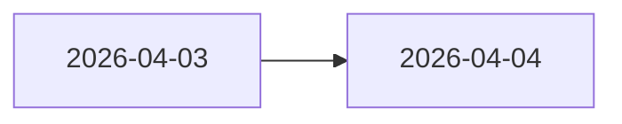

# Changelog {#changelog}

This page records only changes that alter project boundaries. Small wording edits, scattered copy fixes, and temporary experiments do not belong here.

## 2026-04-04 {#2026-04-04}

### Permanent documentation formalization {#documentation-formalization}

The permanent documentation pages went through a full consolidation pass on this date. Page count wasn't the point. The goal was getting rules out of temporary planning files, showcase-style writing, and local notes and back into permanent pages.

The main pages consolidated in this pass include:

- the home page and top-level catalogue pages,
- the main-loop, pseudo-instance, civilization-shell, and catalogue pages under `Design`,
- the survey, activation, site-runtime, resonance, and recovery design and implementation pages under `ModdingDeveloping`,
- the catalogue or rule pages under `Developing`, `Grouping`, `Modpacking`, and `Contribute`.

### Documentation rules locked {#documentation-rules-locked}

This date also locked the current documentation standard:

1. Headings use explicit English anchors.
2. Mermaid no longer uses `
` or showcase-style line-break tricks.
3. Body text focuses on objects, phases, data structures, and boundaries instead of showing thought process.
4. `ModdingDeveloping` is Forge-side runtime only; pack work, KubeJS, and datapacks belong in `Modpacking`.
5. The docs keep a direct project voice instead of presentation-copy phrasing.

### First-version direction clarified {#first-version-direction}

By this point, the first-version direction was fixed as follows:

- the main loop is early discovery, formal survey, activation, site runtime, resonance, and recovery,
- the site model stays with a local pseudo-instance instead of a separate dungeon dimension,
- activation is centered on `ActivationService` rather than a single hard-coded right-click path,
- resonance performs evaluation only, and tooltip layers read saved snapshots only,
- The project keeps using `TaCZ` and its current extensions instead of splitting into multiple weapon systems.

## 2026-04-03 {#2026-04-03}

### Documentation foundation {#documentation-foundation}

The project established the current documentation tree on this date:

- `Developing`
- `Grouping`
- `Modpacking`
- `ModdingDeveloping`
- `Design`
- `Contribute`
- `Changelog`

Showcase, development, integration, runtime, and contributor rules each got a fixed subtree — separated from the start.

### Core loop consolidation {#core-loop-consolidation}

The project main line was also reduced to one explicit chain on the same day:

- archaeology brings the player into a ruin,
- the local pseudo-instance creates the site scene,
- resonance shapes how the site is handled,
- recovery and identification leave the long-term result behind.

From this date onward, archaeology stopped carrying the full encounter expression by itself, and resonance stopped being treated as a side system.
