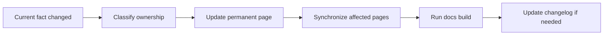

# Docs Workflow {#docs-workflow}

The workflow exists for one reason: project truth must land in permanent pages instead of staying in chat, scratch notes, or one-off plans.

## Fixed Order {#fixed-order}

Any stable change enters the docs in this order:

1. Confirm that the underlying fact has actually changed.
2. Decide which subtree owns the change.
3. Update the owning permanent page.
4. Check whether other pages are affected.
5. Run the docs build.
6. Update `Changelog` if the change affects project boundaries or long-term rules.

This order does not run in reverse. In particular, the changelog does not come first.

## Change Routing {#change-routing}

| If the change is mainly about... | Update this subtree first |
| --- | --- |
| loop meaning, object boundaries, or system rules | `Design` |
| Forge lifecycle, data structures, or state ownership | `ModdingDeveloping` |
| workspace structure, delivery order, or responsibility lines | `Developing` |
| KubeJS, datapacks, config, or mod assembly | `Modpacking` |
| environment rules, writing rules, or contributor discipline | `Contribute` |
| project-level historical shifts | `Changelog` |

If one change spans more than one layer, update the primary owner first, then the secondary pages.

## Synchronization Rules {#synchronization-rules}

These changes always require a second pass:

| Primary change | Also check at least |
| --- | --- |
| design boundary changed | the matching implementation page and the relevant catalogue page |
| implementation object or state ownership changed | the matching design page and the relevant catalogue page |
| pack-side ownership changed | workspace rules in `Developing` or `Contribute` |
| top-level reading order or responsibility lines changed | the relevant `Catalogue` pages and `Changelog` |

## Disallowed Patterns {#disallowed-patterns}

1. Updating only a leaf page while leaving the entry page stale.
2. Leaving stable conclusions inside notes, specs, or plans.
3. Writing "this will exist later" as if it were current workspace truth.
4. Declaring the docs done before running a build.
