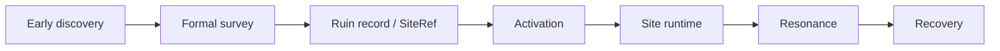

# Archaeology Loop {#archaeology-loop}

This page defines the formal boundary of the ruin loop. It answers only three things: when a ruin becomes a formal instance, how the stages hand off to one another, and which data must enter the world ledger. The detailed split between early discovery and formal survey lives in `ModdingDeveloping/Design/Survey`; this page keeps only whole-loop rules.



## Phase Contract {#phase-contract}

| Phase | Input | Output | Boundary |
| --- | --- | --- | --- |
| early discovery | environmental carriers, brush interaction, clue nodes | clues, materials, hint information | does not create `SiteRef`, does not write the formal ledger |
| formal survey | host structure, author marker, or explicit host | `DiscoveredSiteRecord`, pending activation reference | does not create live runtime directly |
| activation | recorded ruin, activation submit surface | activation context, instance ownership relation | does not re-evaluate ruin type |
| site runtime | activation context, runtime parameters | pressure, guardians, objective state, local sync | does not write long-term knowledge |
| resonance | current site state, relic state, doctrine | state modifiers, resolution modifiers | does not replace recovery writeback |
| recovery | site resolution, resonance result | relic result, records, long-term knowledge | does not rewrite location truth |

## Phase Transition Rules {#phase-transition-rules}

1. Early discovery and formal survey must stay separate. Early discovery teaches, clues, and feeds materials. It does not formalize ruin instances.
2. Formal survey must generate the formal record before activation. Activation, runtime, resonance, and recovery all need the same stable instance reference.
3. Activation only submits and takes ownership. It does not re-evaluate ruin type. Ruin type and anchor must be resolved during survey or entry points will diverge.
4. Site runtime stores only short-lived state. Pressure, guardians, stage progression, and local sync belong there. Ruin identity, anchor, and lifecycle truth belong to the ledger.
5. Resonance sits after runtime and before recovery. It reads the current site and relic state, then returns state and resolution modifiers. If moved earlier, it collapses into a static perk layer.
6. Recovery writes one expedition back into the long-term layers. Relic results, fragments, records, and tooltip or codex progress all land here. Without that, the loop never closes.

## Site Location And Recording {#site-location-and-recording}

On `1.20.1`, this chain can already map to verified APIs in the following fixed order:

| Step | Verified API | Role | Why the order matters |
| --- | --- | --- | --- |
| coarse location | `ServerLevel.findNearestMapStructure(TagKey<Structure>, BlockPos, int, boolean)` | finds the nearest host candidate | host range comes first; biome is not the instance entry point |
| structure-piece validation | `StructureManager.getStructureWithPieceAt(BlockPos, TagKey<Structure>)` | confirms the hit point is really inside a structure piece | without this, anchor and instance resolution are not trustworthy |
| biome read | `LevelReader.getBiome(BlockPos)` | reads `Holder<Biome>` for type adjustment | biome adjusts only; it does not create the instance |
| chunk index | `ChunkPos.asLong(BlockPos)` | creates the coverage index | one chunk key model supports sync and cache uniformly |
| ledger entry | `ServerLevel.getDataStorage()` + `DimensionDataStorage.computeIfAbsent(...)` | creates or loads level-scoped `SavedData` | formal records need stable persistence |

Structure provides host space and boundary. Biome provides type bias. The ledger turns the resolved result into a trackable record. Those three layers cannot replace each other.

## Site Ledger {#site-ledger}

The site ledger is not optional decoration. We need an authority record that can answer:

- which dimension and anchor this ruin belongs to,
- which ruin type it resolved to,
- whether it is discovered, pending activation, active, completed, or invalidated,
- which player or activation context currently occupies it.

A minimum record can start like this:

```java
public record SiteCoordinate(
        ResourceKey<Level> dimension,
        BlockPos anchor
) {}

public record DiscoveredSiteRecord(
        String siteTypeId,
        SiteCoordinate coordinate,
        long discoveredGameTime,
        DiscoveryState state
) {}
```

## Ledger Structure {#ledger-structure}

The ledger should split truth tables from index tables:

```java
public final class SiteLedgerSavedData extends SavedData {
    private final Map<SiteCoordinate, DiscoveredSiteRecord> recordsByCoordinate = new HashMap<>();
    private final Map<Long, Set<SiteCoordinate>> coordinatesByChunk = new HashMap<>();
    private final Map<UUID, SiteCoordinate> activeSiteByOwner = new HashMap<>();
}
```

| Field | Role |
| --- | --- |
| `recordsByCoordinate` | truth table for one ruin anchor |
| `coordinatesByChunk` | query index for chunk sync, local cache, and coverage checks |
| `activeSiteByOwner` | occupancy index for player or activation context |

These three maps correspond to truth, lookup, and live binding. Collapse them into one map and the system either becomes slow to query or starts overwriting itself.

## Invariants {#invariants}

| Invariant | Meaning |
| --- | --- |
| one anchor in one dimension resolves to one record only | survey, activation, and recovery must point at the same ruin |
| ledger truth does not disappear on chunk unload | chunk lifecycle is not ruin lifecycle |
| runtime must always be able to resolve back to the ledger record | recovery has to know which ruin just ended |
| short markers are transition-only | long-term models always resolve back to formal records and coordinates |

## Biome And Structure Priority {#biome-structure-priority}

Priority stays fixed:

1. host structure decides whether the location can qualify as a ruin,
2. structure-piece validation decides whether the point is inside the valid boundary,
3. biome tags only adjust type, weights, and civilization-shell bias,
4. the final instance key always comes from `dimension + anchor`, not from a soft combination like `structure name + biome name`.

That order is deliberate. Structure gives us stable host space and boundaries. Biome gives us environmental semantics only. If biome comes first, the instance key becomes too soft for the ledger, sync, and registration layers to trust.

## Minimum Requirements For New Ruin Types {#minimum-requirements-for-new-ruin-types}

New ruin types must declare a complete definition in one place instead of scattering logic across scripts, resolver code, and tooltips.

| Item | Minimum requirement |
| --- | --- |
| stable id | for example `lost_civilization:contaminated_ruin` |
| host rule | structure tag, author marker, or explicit host |
| anchor rule | search radius, anchor resolution, and final verification |
| runtime parameters | pressure, guardians, objective nodes, coverage radius |
| recovery rules | relic family, record type, and minimum resolution result |
| resonance difference | at least one meaningful branch that changes handling or resolution |

Without every one of these, the type is still only a concept draft.

## Failure And Partial Success {#failure-and-partial-success}

- retreat may still return fragments, samples, or partial records, but not a full resolution,
- site collapse should reduce result quality rather than matching a clean success,
- failure must still write back a learnable result such as pressure traits, resonance response, or ruin tendency.

Otherwise failure adds no value to the next expedition.

## Version-One Scope {#first-version-scope}

Version one needs only one believable vertical slice:

- one host structure and one biome sample,
- one formal survey path that writes into the ledger,
- one activation path and one site-runtime parameter set,
- one relic family affected by resonance and one recovery writeback path.

If that slice can reliably run through `discover -> record -> activate -> runtime -> resonance -> recovery`, the ruin loop is established.
