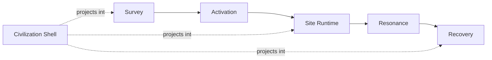

# Design Catalogue {#design-catalogue}

This subtree defines objects, phases, and constraints. Implementation location and current status belong in implementation pages, not here.

## Scope {#scope}

`Design` covers four kinds of questions:

| Page | Defines | Does not define |
| --- | --- | --- |
| `ArchaeologyLoop` | stage boundaries, record chain, and ledger structure | specific early node interactions |
| `PseudoInstance` | version-one site runtime model, coverage, and lifecycle | dimension-instance solutions |
| `CivilizationShell` | how civilization identity projects into clues, activation, pressure, and recovery | a separate combat system |
| `ModdingDeveloping/Design/Survey` | the split between early discovery and formal survey, node rules, and formal entry order | internal site runtime logic |

## Locked Decisions {#locked-decisions}

Version one already locks the following:

1. Archaeology brings the player into the ruin. It does not replace runtime, resonance, or recovery.
2. Formal survey must create a formal record before activation starts.
3. Version one uses a pseudo-instance model instead of a separate dimension.
4. The civilization shell projects identity. It does not rewrite the main loop state machine.
5. Civilization difference is built on a shared firearm base, not on two incompatible combat stacks.

These decisions are shared assumptions for the rest of the design pages. They are not reopened in each page.

## Reading Order {#reading-order}

Read this subtree in the following order:

1. `ArchaeologyLoop`
2. `ModdingDeveloping/Design/Survey`
3. `PseudoInstance`
4. `CivilizationShell`

That order matches object dependency, not site navigation order. Earlier pages provide stable input for later pages. Reading backward makes it easy to mistake result objects for prerequisite objects.

## Non-Goals {#non-goals}

`Design` does not take on the following:

- It does not track implementation status. That belongs under `ModdingDeveloping/Implementation`.
- It does not describe pack recipes, mod lists, or resource-side organization. That belongs under `Modpacking`.
- It does not use showcase cards or decorative blocks instead of body content.
- It does not keep paragraphs that cannot answer an object, phase, or index question.
