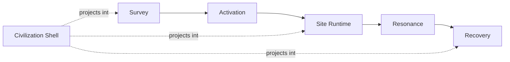

# Design catalogue {#design-catalogue}

Version-one design is anchored by the main loop, the site model, and the civilization shell.

## Key pages {#scope}

| Page | Core content |
| --- | --- |
| `ArchaeologyLoop` | stage boundaries, record chain, and saved-data structure |
| `PseudoInstance` | version-one site runtime model, coverage, and lifecycle |
| `CivilizationShell` | how civilization identity projects into clues, activation, pressure, and recovery |
| `ModdingDeveloping/Design/Survey` | the split between early discovery and formal survey, node rules, and formal entry order |

## Fixed assumptions {#locked-decisions}

1. Archaeology brings the player into the ruin. It does not replace runtime, resonance, or recovery.
2. Formal survey must create a formal record before activation starts.
3. Version one uses a pseudo-instance model instead of a separate dimension.
4. The civilization shell projects identity. It does not rewrite the main loop state machine.
5. Civilization difference keeps using TaCZ as the gun system instead of splitting into incompatible combat stacks.
