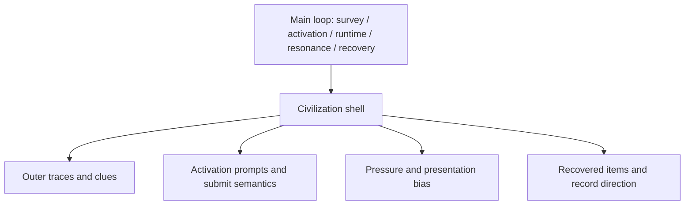

# Civilization Shell {#civilization-shell}

The civilization shell is the visible layer of a ruin. It lets the player read "who left this place," then projects that identity into clues, activation prompts, runtime pressure bias, and recovery direction. It does not replace survey, activation, runtime, resonance, or recovery themselves.

## Framework And Shell Split {#framework-and-shell-split}

| Layer | Owns | Does not own |
| --- | --- | --- |
| main-loop framework | survey, activation, runtime, resonance, recovery, identification | civilization identity by itself |
| civilization shell | outer traces, clue items, activation prompts, pressure presentation, recovery direction | rewriting the main-loop state machine |

The shell must sit on top of the main loop rather than next to it. If a civilization idea only contributes art or lore terms and cannot project into the rule layer, it is not a shell definition yet. It is only narrative material.

## Preserved And Trace-Based Civilizations {#preserved-and-trace-based-civilizations}

Civilization shells fall into two visibility types:

| Type | Presentation traits | Design use |
| --- | --- | --- |
| preserved civilization | more complete landmarks, denser traces, clearer signals | strongest fit for first samples and onboarding ruins |
| trace-based civilization | weaker signals, more fragmented materials, more distributed anomalies, stronger reliance on experience | stronger fit for later expansion and advanced survey targets |

This split is about information density, not power ranking. Preserved shells fit version one better because they make it easier to verify clueing, activation prompts, and recovery direction.

## Version-One Template {#first-version-template}

Version one should use one shell sample that is singular, clear, and testable instead of pursuing multiple civilizations at once.

| Item | Version-one requirement |
| --- | --- |
| shell type | preserved |
| identity lean | mechanical sample |
| host environment | dry badlands edge or weathered plateau |
| host structure | tagged `trail_ruins` or a reused watch-post host |
| outer traces | brass stakes, broken survey pylons, collapsed watch platforms |
| clue items | inscribed tablet fragments, calibration plates, damaged filter parts |
| activation prompts | should express calibration, alignment, filtering, or verification semantics |
| pressure bias | mostly `Contamination`, with a smaller layer of `Instability` |
| recovery direction | filter relic fragments, corrosion samples, logistics record tablets |

The job of this first shell sample is not to tell a complete civilization history. Its job is to prove that one shell can map consistently into location, identification, activation, runtime, and recovery.

## Data Projection Points {#data-persistence-points}

At minimum, a civilization shell has to project into the following rule layers:

| Layer | What belongs there |
| --- | --- |
| structure layer | structure tags or author markers that are more likely to host the shell |
| biome layer | biome tags where the shell's traces appear more often |
| clue layer | fragments, stakes, debris, tablets, and other readable signals before activation |
| activation layer | prompts, submit semantics, and common interaction objects |
| runtime layer | pressure distribution, guardian style, and presentation tone |
| recovery layer | record types, fragment types, and identification-text direction |

If a shell definition cannot project into these layers together, it will not stay coherent inside the main loop.

## Shared Gun Base {#shared-gun-base}

`TaCZ` remains the shared firearm base. Civilization difference should not be expressed by separate weapon systems. It should be expressed by the following parameters:

| Dimension | Mechanical sample expression |
| --- | --- |
| pressure handling | emphasizes control, suppression, and site stabilization |
| activation semantics | emphasizes calibration, alignment, filtering, and verification |
| resonance tendency | leans toward stabilization, redirection, and suppression |
| failure form | leans toward leakage, breakdown, and structural collapse |
| recovery result | leans toward sortable parts, records, and contamination samples |

The point of the shared base is to keep civilization difference inside the ruin loop instead of splitting the project into incompatible combat stacks.

## Inspiration Boundary {#inspiration-boundary}

Allowed inspiration is limited to scale, doctrinal weight, dangerous machinery, and high-pressure combat atmosphere. It does not include direct reuse of names, factions, emblems, or setting structures from existing IP.

If a civilization idea needs large structure art production, complete lore writing, and major exclusive assets before the loop becomes playable, it does not belong ahead of the first vertical slice.

## Acceptance Criteria {#acceptance-criteria}

- outer clues improve ruin recognition and feed players toward formal survey,
- the same main loop presents readable activation, pressure, and recovery differences under different shells,
- shells can be authored through tags, clue items, and a small number of explicit nodes instead of large exclusive art pipelines,
- adding a new shell costs substantially less than the readability and gameplay difference it adds.
