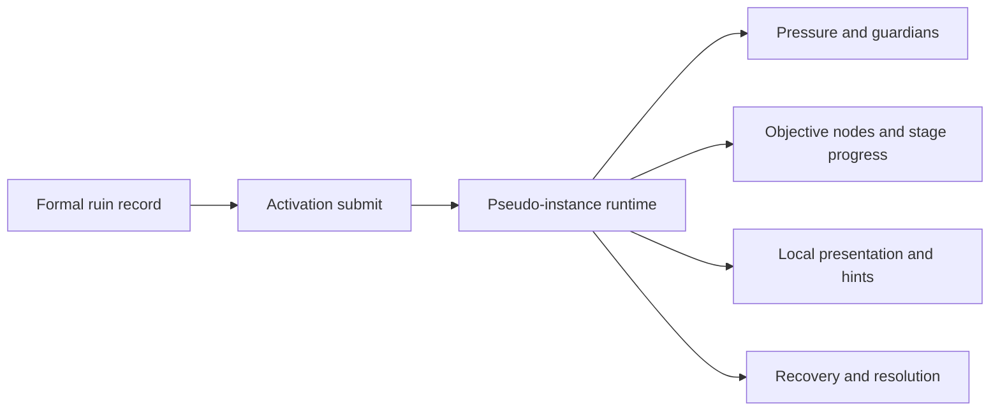

# Pseudo Instance {#pseudo-instance}

This page defines the runtime model for version-one site events. We use `pseudo instance` to mean a controlled, recoverable, cleanable site runtime built on top of a formal ruin record inside the original world. It is not a separate dimension, and it is not a larger version of a right-click interaction.



## Adoption Boundary {#adoption-boundary}

Version one adopts a pseudo-instance instead of a separate dimension for only three reasons:

1. We already have reusable host structures and do not need a brand-new dungeon map first.
2. The first slice needs to prove activation, site pressure, objective progress, and recovery, not teleportation and isolated world space.
3. A pseudo-instance is enough to support a ten-to-twenty-minute field action at much lower cost than a dimension solution.

That gives us the following boundary:

| Option | Used in version one | Conclusion |
| --- | --- | --- |
| local pseudo-instance | yes | first formal vertical slice |
| local sealed ruin | no | add later if the pseudo-instance proves itself |
| separate dungeon dimension | no | expansion work, not version-one scope |

## Ledger And Runtime Split {#ledger-and-runtime-split}

Pseudo-instance state must stay separate from the world ledger. `SavedData` carries long-term truth. The pseudo-instance carries short-lived runtime state.

| Layer | Key | Stores |
| --- | --- | --- |
| cross-stage handoff | `SiteRef` | unified reference shared by formal survey, activation, and recovery |
| ruin ledger | `SiteCoordinate` | ruin identity, anchor, lifecycle, formal record |
| runtime registry | `SiteCoordinate` | active state, owner, current phase, local caches |
| chunk side index | `long chunkKey` | which chunks are currently covered by the site |

`ActivationService` resolves `SiteRef` back into the ledger record, then normalizes it to one `SiteCoordinate`. If long-term records and runtime state collapse into one layer, chunk unload, retreat resolution, and duplicate activation start corrupting each other.

Recommended runtime registry:

```java
public final class SiteRuntimeRegistry {
    private final Map<SiteCoordinate, ActiveSiteRuntime> runtimeBySite = new HashMap<>();
    private final Map<Long, Set<SiteCoordinate>> sitesByChunk = new HashMap<>();
    private final Map<UUID, SiteCoordinate> siteByOwner = new HashMap<>();
}
```

- `runtimeBySite` answers whether one ruin is active now.
- `sitesByChunk` supports local sync, cache cleanup, and coverage lookup.
- `siteByOwner` prevents one player or team from occupying multiple formal ruins at once.

## Coverage And Chunk Index {#coverage-and-chunk-index}

In gameplay, a pseudo-instance feels like one field event. In implementation, it is a set of covered chunks. Version one can build that directly on verified APIs:

| Use | Verified API | Role |
| --- | --- | --- |
| primary chunk key | `ChunkPos.asLong(BlockPos)` | creates a stable `chunkKey` from the anchor |
| coverage expansion | `ChunkPos.rangeClosed(ChunkPos, int)` | expands chunk coverage from a chunk radius |
| unload cleanup | `ChunkEvent.Unload` | clears local caches only; does not delete the formal ruin |

Recommended order:

1. Compute `primaryChunkKey` from the ruin anchor.
2. Convert event radius into `chunkRadius`.
3. Expand `coveredChunkKeys` from `new ChunkPos(anchor)` with `ChunkPos.rangeClosed(centerChunk, chunkRadius)`.
4. Register `coveredChunkKeys` into `sitesByChunk` for sync and cleanup.

`ChunkEvent.Unload` should only clear temporary cache, local spawn indexes, and rendering hooks in that chunk. It should not delete the ruin and it should not rewrite ledger truth.

## Activation Entry And Runtime Services {#activation-entry-and-runtime-services}

Activation can come from items, machines, or site devices, but those entry points should not each implement their own startup path. Version one routes all of them through `ActivationService`.

| Service | Owns | Does not own |
| --- | --- | --- |
| `ActivationService` | validates `SiteRef`, ownership, and activation conditions; creates runtime | does not re-evaluate ruin type |
| `PressureRuntimeService` | pressure, guardians, and phase danger | does not write long-term records |
| `ObjectiveRuntimeService` | objective nodes, progress conditions, completion checks | does not own recovery resolution |
| `SiteFeedbackService` | fog, sound, hints, and local presentation | does not hold authority state |
| `RecoveryService` | resolution, ledger write-back, runtime teardown | does not drive in-site phase progress |

This split fixes two rules:

1. Activation sources can grow, but the runtime startup path stays singular.
2. Runtime services operate on the same `ActiveSiteRuntime` instead of maintaining second copies of the site state.

## Lifecycle {#lifecycle}

The pseudo-instance lifecycle stays fixed at five steps:

1. Formal survey writes `DiscoveredSiteRecord` and returns `SiteRef`.
2. Activation hands `SiteRef` to `ActivationService`, which validates ownership and site conditions.
3. The runtime registry creates `ActiveSiteRuntime` and registers `runtimeBySite`, `sitesByChunk`, and `siteByOwner`.
4. Runtime services advance pressure, objectives, and feedback inside the coverage area until completion, retreat, or collapse.
5. `RecoveryService` resolves results, writes back to the ledger, unregisters runtime state, and clears local indexes.

When the runtime ends, we delete the runtime registration, not the ruin truth. Whether the ruin is completed, invalidated, or available again is still a ledger decision.

## Out Of Scope {#out-of-scope}

Version one explicitly excludes:

- teleporting into a separate dimension,
- world copying or temporary map instances,
- letting activation entry points decide ruin type,
- letting chunk events rewrite the formal ledger,
- mixing early discovery nodes into the formal site lifecycle.

## Acceptance Criteria {#acceptance-criteria}

- We can start one formal field event on an existing host structure without teleporting into a new dimension.
- Activation, runtime, and recovery stay anchored to the same `SiteRef` and `SiteCoordinate`.
- Coverage, sync, and cache cleanup are supported by chunk-side indexes instead of repeated world scans.
- When the event ends, runtime state is removed and the ledger record remains.
