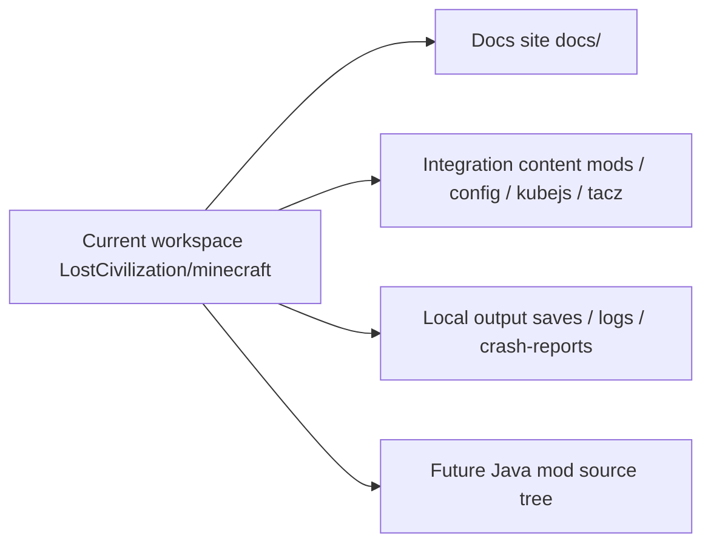

# Architecture {#architecture}

Lost Civilization is still being developed inside a single PrismLauncher instance directory. `docs/`, integration content, and local playtest output all live together. That is the real structure today. We should write that down first, then talk about later extraction.

## Current Workspace Baseline {#current-workspace-baseline}

| Path | Current role | Notes |
| --- | --- | --- |
| `docs/` | long-lived documentation site | design, implementation, workflow, and change records |
| `mods/` | runtime mod list | used to verify current pack dependencies |
| `config/` | pack configuration | part of the playable integration layer |
| `kubejs/` | scripts, datapacks, and integration glue | pack-side work, not Forge runtime |
| `local/kubejs/` | local export and cache work area | not a formal project entry point |
| `tacz/` | TaCZ work directory | pack-side assets and config |
| `tacz_backup/` | local backup surface | historical only, not current truth |
| `docs/notes`, `docs/specs`, `docs/plans` | drafts and transition material | acceptable as input, not as long-term truth |
| `saves/`, `logs/`, `crash-reports/` | local playtest output | evidence only, not a rules source |
| future Java source tree | custom runtime | no separate source directory exists yet |

This table distinguishes two things only: whether a directory exists, and whether it is a formal entry point.

## Current Directory Classification {#current-directory-classification}

If we classify the current workspace by responsibility instead of raw filesystem shape, the directories fall into four groups:

| Type | Current directories | How to treat them |
| --- | --- | --- |
| long-term entry point | `docs/` | maintain directly and cite long-term |
| main pack work surface | `mods/`, `config/`, `kubejs/`, `tacz/` | treat as the current formal integration content |
| local support and backups | `local/`, `tacz_backup/`, `server-resource-packs/`, `resourcepacks/` | check only when needed, not as primary entry points |
| playtest output | `saves/`, `logs/`, `crash-reports/`, `screenshots/` | evidence only, not a source of rules |

The purpose of this classification is to keep docs from treating temporary folders, backup folders, and runtime output as formal ownership surfaces.

## Three Technical Layers {#three-technical-layers}

Even inside one workspace, the project still contains three technical layers. We should separate them by content boundary, not by pretending the repos already exist.

| Layer | Owns | Does not own |
| --- | --- | --- |
| docs layer | design rules, implementation contracts, contribution workflow, change records | runtime truth itself |
| pack layer | mod list, scripts, datapacks, config, resource overrides | long-lived Java runtime state |
| Java runtime | site ledger, live runtime, resonance, persistence, sync | config overrides and script glue |

These layers share one directory tree today, but they do not share the same kind of fact:

- docs explains,
- pack assembles,
- runtime owns long-lived state and behavior.

If we flatten those three into one surface, `Modpacking` and `ModdingDeveloping` start crossing each other's boundaries immediately.

## Content Ownership Rules {#content-ownership-rules}

| If the change is mainly about... | It belongs in |
| --- | --- |
| pages, terms, workflow, contracts | `docs/` |
| config, scripts, datapacks, resource overrides | integration content in the current workspace |
| world ledger, runtime registry, tick logic, sync, tooltip read model | future Java mod source tree |

To classify a change, follow this order:

1. Check which real directory it currently lives in.
2. Decide which technical layer owns it.
3. Decide whether the page belongs in `Developing`, `Modpacking`, or `ModdingDeveloping`.

Judge ownership by responsibility, not by whether something "looks like code." `kubejs/` is code, but it still belongs to the pack layer, not the Forge runtime.

## Document Position {#document-position}

1. The current real shape is one shared workspace, not three repos that already exist.
2. When docs cite paths, they should point to real paths in the current instance first.
3. If a page mentions future extraction, it must say that it is a later step, not the current baseline.
4. Draft folders may remain as input, but they do not replace formal pages.
5. Backup folders and local export folders must not be written as project entry points.

## When To Extract The Java Mod {#when-to-extract-the-java-mod}

Consider extracting the Java runtime only after any two of the following become true:

| Condition | Meaning |
| --- | --- |
| runtime classes grow into a stable tree | package structure, tests, and release rhythm are no longer incidental |
| independent testing and versioning become necessary | pack-only integration testing is no longer enough |
| data ownership becomes stable | `SavedData`, chunk-side data, and sync boundaries are no longer moving |
| pack and runtime iteration split apart | pack updates and Java logic updates stop moving in lockstep |

Until then, we stay in one workspace, but the ownership boundaries in the docs cannot blur.
