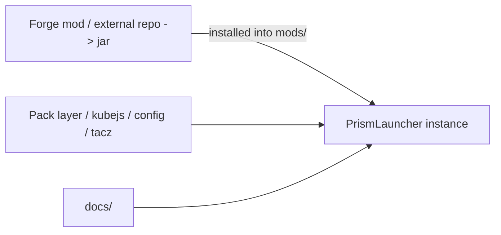

# Architecture {#architecture}

Lost Civilization has three parts: a Forge mod, a modpack, and this documentation.

The Forge mod is a separate Java project. It compiles to a jar and gets installed into `mods/` like any other dependency. Site records, runtime logic, resonance, and persistence all live there. The mod isn't developed inside this instance — it has its own repository and build pipeline.

The pack layer — kubejs scripts, config, tacz assets, resource overrides — lives here in the PrismLauncher instance. This is where integration work happens: wiring up mod behaviors through scripts, adjusting configs, building out content.

Documentation lives in `docs/` and covers the whole project: design rules, implementation contracts, the ruin loop, and contribution workflow.

## Layer responsibilities {#layer-responsibilities}

| Layer | Lives in | Owns |
| --- | --- | --- |
| Forge mod | external repo | site records, runtime, resonance, persistence, sync |
| pack | `kubejs/`, `config/`, `tacz/` | scripts, datapacks, config, resource overrides |
| docs | `docs/` | design rules, implementation contracts, change records |

The mod jar drops into `mods/` like any other mod. The pack layer talks to it through KubeJS bindings and config. Neither layer owns the other's state.

## Local directories {#local-directories}

`saves/`, `logs/`, `crash-reports/`, and `screenshots/` are playtest output. `local/kubejs/` and `tacz_backup/` are scratch space. None of these are rules sources.

## Content ownership {#content-ownership-rules}

Design rules, workflow, and contracts belong in `docs/`. Pack scripts and config stay in the instance. Java runtime logic belongs in the mod's own repository.

`kubejs/` is code, but it belongs to the pack layer — not the Forge runtime.
