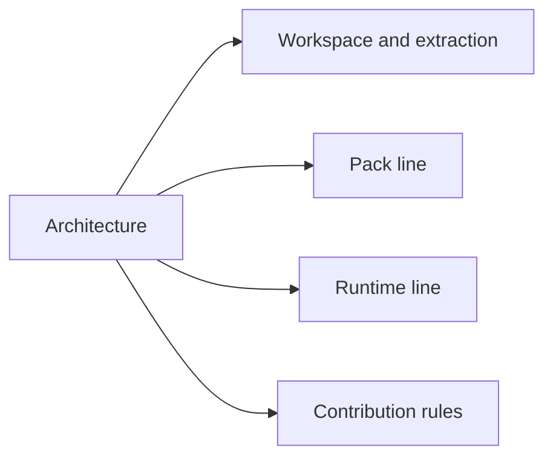

# Developing {#development}

This entry is here to answer two things: what the current workspace means, and where a given problem should go first.

## Scope {#scope}

| Question | Read first |
| --- | --- |
| Which directories in the current instance mean what | `Architecture` |
| Why the project is still one workspace | `Repositories` |
| How docs, pack, and runtime split apart | `Architecture`, then the owning entry |

## Current responsibility lines {#current-responsibility-lines}

There is only one integration workspace right now, but the responsibility split is already fixed into three lines:

| Line | Main content |
| --- | --- |
| docs line | design rules, implementation contracts, and change records |
| pack line | mod assembly, config, KubeJS, datapacks, and resource overrides |
| runtime line | Forge-side saved data, live runtime, sync, resonance, and recovery |

Directories can coexist for now. Responsibility lines cannot.

## Decision order {#decision-order}

When a problem comes up, evaluate it in this order:

1. Which directory it actually lives in now.
2. Which responsibility line should own it long-term.
3. Which entry should document it.
4. Whether the change also affects an entry page or the changelog.

If step two or step three is unclear, do not write the page yet.
