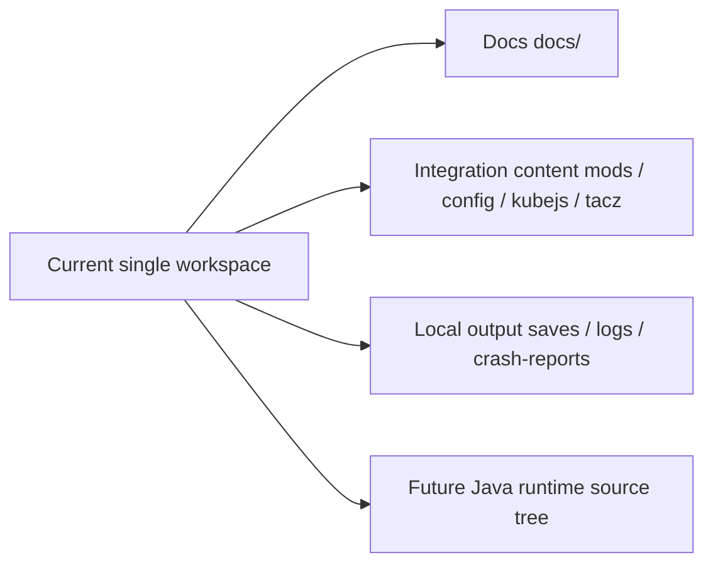

# Repositories {#repositories}

Three live repositories do not exist yet. Right now there is only one integration workspace: the Prism instance directory itself. The docs should reflect that fact rather than writing from an idealized future layout.

## Current facts {#current-facts}

| Fact | Meaning |
| --- | --- |
| the current root is not an isolated source repo | the instance directory is the working collaboration root |
| `docs/` and pack content coexist | docs and integration content live in the same workspace today |
| the Java runtime has no separate source tree yet | runtime objects are still being defined in docs first |

## Current management model {#current-management}

| Content area | Current home | Current rule |
| --- | --- | --- |
| docs layer | `docs/` | maintained as the long-term documentation source |
| pack layer | `mods/`, `config/`, `kubejs/`, `tacz/`, and similar paths | describe only what really exists in this instance |
| Java runtime | future standalone source tree | for now, define objects and contracts under `ModdingDeveloping` |

These three areas share one workspace today, but they do not share the same fact model.

## When it becomes worth splitting {#when-to-split}

If the project splits later, stable ownership comes before repo names.

| Split target | Trigger | What it should own after the split |
| --- | --- | --- |
| docs repo | docs need independent publishing, review, and versioning | `docs/` and its build config |
| pack repo | pack needs independent packaging, distribution, and regression testing | mod list, config, KubeJS, datapacks, resource overrides |
| Java mod repo | runtime classes, tests, and release cadence stabilize | `src/main/java`, `src/main/resources`, tests |

## Things we must not freeze early {#things-not-to-freeze-early}

1. Do not start by naming three repos and forcing the docs to fit them.
2. Do not write a future Java source tree as if it were a current directory fact.
3. Do not make `ModdingDeveloping` explain the current `kubejs/` directory.

## Decision rules {#decision-rules}

| Question | Check first |
| --- | --- |
| Where does this content live now | the real path inside the current workspace |
| Who should own this logic later | the docs, pack, or runtime line |
