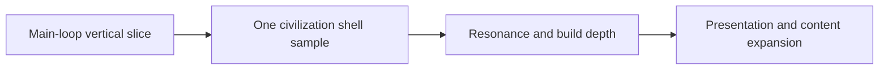

# Workflow {#workflow}

This page defines the fixed delivery order for the project. We do not develop by "whatever someone thought of next." We develop by asking whether the main loop is proven, whether it is repeatable, and whether the result can be closed back into the permanent docs.

## Fixed Order {#fixed-order}

The project advances in the following order:

| Stage | Goal | Pass condition |
| --- | --- | --- |
| main-loop vertical slice | complete early discovery -> formal survey -> activation -> site runtime -> recovery | the player can finish one full ruin action |
| one civilization shell sample | prove that the same loop can carry a distinct civilization identity | clues, activation semantics, pressure, and recovery begin to diverge in stable ways |
| resonance and build depth | make relic and site interaction actually change the handling method | the same site produces reproducible decision differences for different builds |
| presentation and content expansion | add variety and density on top of a proven loop | new content thickens the core instead of hiding a weak core |

The order cannot reverse. Before the main loop stands up, a civilization shell becomes packaging. Before resonance stands up, content expansion becomes pile-on.

## Playtest Gate {#playtest-gate}

Every stage has to pass a playtest gate first. The most important version-one gates are:

1. one full ruin flow should finish in roughly ten to twenty minutes,
2. after the session, testers should be able to name the stages they went through rather than recall isolated features,
3. the loop should expose at least one failure point, one recovery point, and one reason to keep investing,
4. if feedback is still dominated by "what is this," "what am I supposed to do," or "why is this complete," content expansion pauses.

The point of playtesting is not to prove content volume. It is to prove that the main loop is clear, readable, and repeatable.

## Documentation Sync Rules {#documentation-sync-rules}

Docs, pack content, and code implementation must close in the same iteration. Long-lived drift is not acceptable.

| Change type | Required update |
| --- | --- |
| design boundary changes | the relevant `Design` page |
| object ownership, data structures, or runtime boundary changes | the relevant `ModdingDeveloping/Implementation` page or workflow page |
| pack assembly, mod ownership, or resource organization changes | the relevant `Modpacking` page |
| delivered behavior changes public meaning | `Changelog` |

If implementation has already changed and permanent docs have not, the work is not complete. Chat history, scratch files, and task-planning files do not replace permanent pages.

## Delivery Discipline {#delivery-discipline}

Follow three rules while moving work forward:

1. Advance one main contradiction at a time. If the current problem is that the main loop is unreadable, do not expand civilization work, presentation work, and mod count in parallel.
2. Every new content block must answer which stage it belongs to, which object it serves, and which gate it passes.
3. Whenever work changes project truth, update the corresponding permanent page in the same round instead of deferring it.

## Prohibited Patterns {#prohibited-patterns}

- expanding multiple civilizations, many ruin types, or large content packs before the main loop is stable,
- leaving key decisions only in chat, temporary plans, or disposable drafts,
- using more text, more lore, or more showcase pages to cover rules that are still unclear,
- allowing docs, pack, and runtime boundaries to blur again just because implementation convenience makes that easier.
