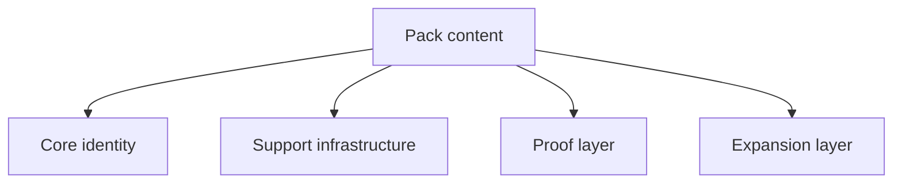

# Grouping {#grouping}

Grouping does not exist to rearrange the mod list. It exists to decide where budget goes first. Once grouping drifts, the project collapses back into a flat list of mods with no real priority.

## Group Definitions {#group-definitions}

| Group | Classification question | Typical version-one content |
| --- | --- | --- |
| core identity | Without it, does this still feel like Lost Civilization | early discovery -> formal survey -> activation -> site runtime -> resonance -> recovery |
| support infrastructure | Does it make the core loop more runnable, readable, or maintainable | host-structure tags, tooltip layers, survey and activation adapters, ledger and indices |
| proof layer | Is it the minimum sample the first vertical slice needs to prove itself | one host path, one formal ruin type, one relic family, one set of target nodes |
| expansion layer | Does it only add variants, scale, or presentation after the core already works | more civilizations, heavier worldgen, extra presentation layers, optional complexity |

Only core identity decides what the project is. The other three groups exist to support or extend it.

## Classification Order {#classification-order}

When a new system, mod group, or content set is proposed, classify it in this order:

1. Does it directly participate in the main loop. If yes, decide whether it belongs to core identity or the proof layer.
2. If not, does it make that loop more stable, readable, or easier to ship. If yes, it belongs to support infrastructure.
3. If it does neither and mainly adds variety, scale, or presentation, it belongs to the expansion layer.

Do not classify from the feeling that something "seems important." That is how expansion work gets mislabeled as core work.

## Budget Rules {#budget-rules}

Version-one budget follows this order:

1. Protect core identity first.
2. Fill in support infrastructure second.
3. Complete the minimum proof layer third.
4. Schedule expansion work last.

If an expansion item starts taking time away from the core loop or its support systems, it should move out of the first version.

## Common Misclassifications {#common-misclassifications}

- Treating "more civilization samples" as core. The core is the loop, not the number of civilizations.
- Treating heavy worldgen rewrites as proof work. What proves the loop is one playable host path, not a rewritten world.
- Treating stronger visuals as support infrastructure. Presentation belongs there only when it directly improves readability or interaction judgment.

## Usage {#usage}

Grouping is not just for this catalogue page. Use it when scheduling work, cutting scope, selecting mods, or evaluating new proposals. If the group cannot be named clearly, the priority is still unclear.
