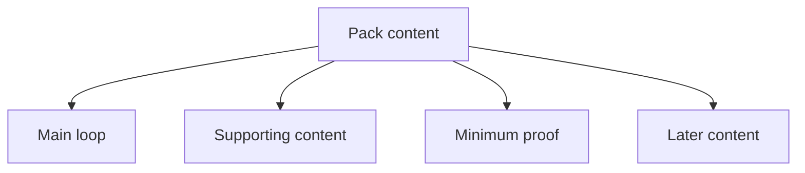

# Grouping {#grouping}

Grouping decides version-one budget and expansion order.

## Group Definitions {#group-definitions}

| Group | Classification question | Typical version-one content |
| --- | --- | --- |
| main loop | Without it, does this still feel like Lost Civilization | early discovery -> formal survey -> activation -> site runtime -> resonance -> recovery |
| supporting content | Does it make the main loop more runnable, readable, or maintainable | host-structure tags, tooltip layers, survey and activation adapters, saved data and indices |
| minimum proof | Is it the minimum content version one needs to prove itself | one host path, one formal ruin type, one relic family, one set of target nodes |
| later content | Does it only add variants, scale, or presentation after the core already works | more civilizations, heavier worldgen, extra presentation layers, optional complexity |

Only the main loop decides what the project is. The other three groups support or extend it.

## Classification Order {#classification-order}

When a new system, mod group, or content set is proposed, classify it in this order:

1. Does it directly participate in the main loop. If yes, decide whether it belongs to the main loop or the minimum proof.
2. If not, does it make that loop more stable, readable, or easier to ship. If yes, it belongs to supporting content.
3. If it does neither and mainly adds variety, scale, or presentation, it belongs to later content.

Do not classify from the feeling that something "seems important." That is how later content gets mislabeled as core work.

## Budget Rules {#budget-rules}

Version-one budget follows this order:

1. Protect the main loop first.
2. Fill in supporting content second.
3. Complete the minimum proof third.
4. Schedule later content last.

If an expansion item starts taking time away from the main loop or its supporting content, it should move out of the first version.

## Common Misclassifications {#common-misclassifications}

- Treating "more civilization samples" as core. The core is the loop, not the number of civilizations.
- Treating heavy worldgen rewrites as the minimum proof. What proves the loop is one playable host path, not a rewritten world.
- Treating stronger visuals as supporting content. Presentation belongs there only when it directly improves readability or interaction judgment.
