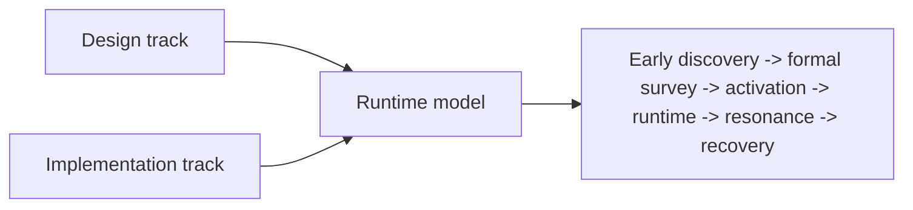

# Modding Development {#modding-development}

This subtree is only about the Forge-side Java runtime. It covers ruin types, ruin instances, the world ledger, live runtime state, resonance results, recovery snapshots, and client read boundaries. Integration scripts, datapacks, and config overrides are outside this subtree. Even though the current instance already ships `EventJS`, this subtree does not treat the KubeJS event stack as the implementation baseline.

## Verified Current Baseline {#verified-current-baseline}

| Item | Current baseline |
| --- | --- |
| game version | `Minecraft 1.20.1` |
| loader | `Forge` |
| vanilla archaeology chain | `BrushItem.useOn(...)`, `BrushItem.onUseTick(...)`, `BrushableBlockEntity.brush(...)` |
| world-level persistence | `ServerLevel.getDataStorage()` + `DimensionDataStorage.computeIfAbsent(...)` |
| world save checkpoint | `LevelEvent.Save` |
| chunk-side persistence | `ChunkDataEvent.Load` / `ChunkDataEvent.Save` |
| active chunk lifecycle | `ChunkEvent.Load` / `ChunkEvent.Unload` |
| player interaction surfaces | brush chain + `PlayerInteractEvent.RightClickItem` / `RightClickBlock` |
| long-term player data migration | `PlayerEvent.Clone` |
| client tooltip | `ItemTooltipEvent` |
| chunk sync supplement | `ChunkWatchEvent.Watch` / `UnWatch` |

## Core Object Chain {#core-object-chain}

This subtree is organized around the following object chain:

| Layer | Objects | Role |
| --- | --- | --- |
| early discovery definitions | `CivilizationShellDefinition`, `EarlyExcavationNodeDefinition` | organize environmental traces, early nodes, and exhaustion rules |
| formal ruin type | `SiteTypeDefinition` | defines host rules, anchor rules, activation, and runtime parameters for one ruin type |
| formal instance reference | `SiteRef`, `DiscoveredSiteRecord` | points to one ledger-backed ruin, not to a type |
| world truth | `SiteLedgerSavedData` | stores ruin instances, lifecycle, and covered chunks |
| live state | `SiteRuntimeRegistry`, `ActiveSiteRuntime` | stores short-lived active site state |
| resolved results | `ResonanceResult`, `RecoveredRelicSnapshot` | folds one site event into stable outputs |

This order matters. Type is not instance, instance is not runtime, and runtime is not the recovery result.

## Four Authoritative State Layers {#four-authoritative-state-layers}

In implementation terms, we recognize only four authority layers:

| State layer | Authority object | Lifecycle |
| --- | --- | --- |
| world truth | `SiteLedgerSavedData` | tied to the level save |
| live site state | `SiteRuntimeRegistry`, `ActiveSiteRuntime` | exists only while the site is running |
| long-term player knowledge | player long-term data | tied to player progression |
| item-side recovery snapshot | `RecoveredRelicSnapshot` | tied to item flow |

Every implementation question should start by answering which authority layer owns the data. If that answer is unclear, the code will eventually mix the ledger, chunk cache, tooltip, and player state together.

## What This Subtree Answers {#what-this-subtree-answers}

| Topic | Main objects | Key pages |
| --- | --- | --- |
| how early discovery and formal survey split apart | `CivilizationShellDefinition`, `EarlyExcavationNodeDefinition`, `SiteTypeDefinition` | `Design/Survey`, `Implementation/Survey` |
| how ruin instances are located and written into the ledger | `SiteLedgerSavedData`, `SiteRef` | `Design/Survey`, `Implementation/Survey` |
| how activation takes ownership | `ActivationService`, `ActivationAdapter`, `SiteRuntimeBridge`, `SiteRuntimeRegistry` | `Design/Activation`, `Implementation/Activation` |
| how world truth, chunk cache, and player short markers are layered | `SavedData`, chunk data, player persistent data | `Implementation/Catalogue`, `Implementation/SiteRuntime` |
| how resonance results are consumed | `ResonanceResolver`, `ResonanceResult` | `Design/Resonance`, `Implementation/Resonance` |
| how recovery results are stored and read | `RecoveredRelicSnapshot`, `RelicTooltipView` | `Design/Recovery`, `Implementation/Recovery` |

## Reading Order {#reading-order}

| If you need to solve... | Read first |
| --- | --- |
| early discovery nodes, formal survey boundaries, and location logic | `Design/Survey`, then `Implementation/Survey` |
| activation services, adapters, and ownership handoff | `Design/Activation`, then `Implementation/Activation` |
| world ledger, chunk cache, and tick ownership | `Design/SiteRuntime`, then `Implementation/SiteRuntime` |
| resonance evaluation and result consumption | `Design/Resonance`, then `Implementation/Resonance` |
| recovery, tooltip, and long-term knowledge | `Design/Recovery`, then `Implementation/Recovery` |

If the question is really "should this field live in the world, the player, or the item," read `Implementation/Catalogue` first, then move to the stage page.

## Writing Standard For This Subtree {#subtree-writing-standards}

1. Write only Forge lifecycle hooks and method signatures that have been verified.
2. Design pages define objects and rules. They do not perform "thinking out loud."
3. Implementation pages separate `verified`, `recommended`, and `not built yet`.
4. If a topic belongs mainly to the integration layer, it does not go here.
5. Any page that talks about state writes must say which of the four authority layers owns that state.
