# Activation {#activation}

The primary object of activation is no longer "what the player right-clicked." It is `ActivationService`. Input is the `SiteRef` produced by formal survey. Output is `ActiveSiteRuntime` registered into the runtime registry.

```mermaid
flowchart LR
    Adapter["Item / block device / machine adapter"] --> Context["Activation context ActivationContext"]
    Context --> Service["Activation service ActivationService"]
    Service --> Lookup["Lookup DiscoveredSiteRecord"]
    Lookup --> Validate["Validate ActivationRule"]
    Validate --> Bridge["Runtime bridge SiteRuntimeBridge"]
    Bridge --> Registry["Runtime registry SiteRuntimeRegistry"]
    Registry --> Clear["Clear pending reference"]
```



## What The Activation Layer Solves {#what-the-activation-layer-solves}

| Question | Answered by |
| --- | --- |
| which exact ruin this submit points at | `SiteRef` + world ledger |
| which interaction surface this submit came from | `ActivationContext` + `ActivationSource` |
| whether the site may enter runtime now | `ActivationService` |
| how runtime state is created and registered | `SiteRuntimeBridge` + `SiteRuntimeRegistry` |

## Activation Input Must Be An Instance Reference {#activation-input-must-be-instance-reference}

If activation receives only a type id such as `lost_civilization:contaminated_ruin`, it cannot answer:

- which exact ruin the player is trying to open,
- whether that ruin is already occupied,
- whether that ruin is still in a lifecycle state that allows activation.

Activation therefore consumes `SiteRef`, not a type name.

## Core Objects {#core-object}

```java
public record ActivationContext(
        ServerPlayer player,
        ServerLevel level,
        SiteRef ref,
        ActivationSource source,
        @Nullable BlockPos triggerPos
) {}

public enum ActivationSource {
    ITEM,
    BLOCK_DEVICE,
    MACHINE,
    SCRIPTED
}

public record ActivationResult(
        boolean accepted,
        @Nullable ActiveSiteRuntime runtime,
        @Nullable String rejectReason
) {}
```

The important part here is responsibility:

- `ActivationContext` carries the full submit context,
- `ActivationSource` only says which interaction family produced the submit,
- `ActivationResult` keeps success and rejection reason inside one result object.

## Adapter Layer {#adapter-layer}

The adapter layer folds different interaction surfaces into one unified context. It is not the activation logic itself.

| Adapter | Role |
| --- | --- |
| block-device adapter | handles ruin consoles, host devices, and trigger points |
| item adapter | handles detectors, activators, and key-like items |
| machine adapter | handles later machine activation or machine archaeology |
| scripted adapter | handles special scripted or event-driven entry points |

`RightClickBlock` and `RightClickItem` are only adapter entry points now. They are not the whole activation architecture.

## Minimum Activation Flow {#minimum-activation-flow}

1. The adapter builds `ActivationContext`.
2. `ActivationService` loads `DiscoveredSiteRecord` from the ledger.
3. Activation validates source, trigger position, and lifecycle state against `ActivationRule`.
4. On success, `SiteRuntimeBridge` creates and hands off `ActiveSiteRuntime`.
5. `SiteRuntimeRegistry` takes ownership and clears the pending reference.

## State And Cleanup {#state-and-cleanup}

| Situation | Handling |
| --- | --- |
| reference is missing | reject activation and clear the pending reference |
| reference points to another dimension | reject activation and clear the pending reference |
| reference already has a live runtime | do not create a second runtime |
| reference was recovered or aborted already | reject activation and clear the pending reference |
| player changes dimension or the site level unloads | run runtime teardown; do not leave live state on the player |

## Design-To-Code Mapping {#design-to-code-mapping}

| Design decision | Object |
| --- | --- |
| unify different submit surfaces | `ActivationAdapter` |
| activation logic lives in a service layer | `ActivationService` |
| activation input must carry an instance reference | `ActivationContext` |
| runtime open and runtime registration stay separate | `SiteRuntimeBridge`, `SiteRuntimeRegistry` |
| revalidate ledger state before open | `SiteLedgerSavedData` |
| player leave and level unload are teardown hooks only | `PlayerEvent.PlayerChangedDimensionEvent`, `LevelEvent.Unload` |

## Prohibited Items {#prohibited-items}

1. making activation re-run survey logic,
2. treating `RightClickBlock` or `RightClickItem` as the whole activation architecture,
3. replacing the world ledger with player short markers,
4. letting interaction events maintain the runtime master table directly.
