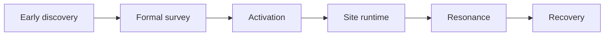

# Modding Design Catalogue {#modding-design-catalogue}

Design pages define object models, state transitions, and prohibited moves. They decide how the ruin system should be organized. They do not pretend a class or directory already exists.

## Design Focus {#design-focus}

| Page | Core question |
| --- | --- |
| `Survey` | How do we separate early discovery from formal survey, and make sure only the latter creates a formal ruin instance |
| `Activation` | How do we hand the pending reference to `ActivationService` and turn it into live runtime state |
| `SiteRuntime` | How do we separate the world ledger, live state, and chunk-side cache |
| `Resonance` | How do we collapse site input and player input into one shared result |
| `Recovery` | How do we fold one site event into a long-lived snapshot |

## Reading Order {#reading-order}

Read this subtree in the following order:

1. `Survey`
2. `Activation`
3. `SiteRuntime`
4. `Resonance`
5. `Recovery`

This order follows object dependency, not sidebar layout. Earlier stages provide stable input for later ones. Reading backward makes it easy to mistake a result object for a prerequisite object.

## Locked Design Decisions {#locked-design-decisions}

This line already locks the following:

1. Early discovery and formal survey must stay separate.
2. Ruin type and ruin instance must stay separate.
3. Activation is unified through a service layer instead of site-specific startup logic.
4. The world ledger, live runtime state, chunk cache, and item snapshots belong to different authority layers.
5. Resonance evaluates only. It does not directly advance the site and it does not generate tooltip text.
6. Recovery must fold results into a snapshot. After that, view layers only read the snapshot.

These decisions are shared assumptions for the subtree. They are not reopened page by page.

## Design Constraints {#design-constraints}

1. Early discovery and formal survey must stay separate.
2. Ruin type and ruin instance must stay separate.
3. World truth cannot hang off a player short marker.
4. An unloaded chunk does not mean the ruin no longer exists.
5. Tooltip can only read saved results. It cannot query live runtime.

## Non-Goals {#non-goals}

This subtree does not answer:

- where KubeJS, datapacks, and config should live,
- whether a class already exists in the current instance,
- exact method signatures or event subscriber syntax.

Those questions belong under `Modpacking` or `ModdingDeveloping/Implementation`. Design pages only define object boundaries and state flow.
