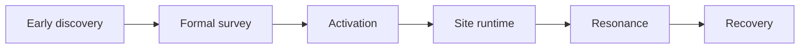

# Modding design catalogue {#modding-design-catalogue}

The design line is fixed as `early discovery -> formal survey -> activation -> site runtime -> resonance -> recovery`.

## Design focus {#design-focus}

| Page | Core question |
| --- | --- |
| `Survey` | How do we separate early discovery from formal survey, and make sure only the latter creates a formal ruin instance |
| `Activation` | How do we hand the pending reference to `ActivationService` and turn it into live runtime state |
| `SiteRuntime` | How do we separate world saved data, live state, and chunk-side cache |
| `Resonance` | How do we collapse site input and player input into one shared result |
| `Recovery` | How do we fold one site event into a long-lived snapshot |

## Fixed constraints {#design-constraints}

1. Early discovery and formal survey must stay separate.
2. Ruin type and ruin instance must stay separate.
3. Activation is unified through a service layer instead of site-specific startup logic.
4. World saved data, live runtime state, chunk cache, and item snapshots belong to different state groups.
5. Formal ruin records cannot hang off a player short marker.
6. An unloaded chunk does not mean the ruin no longer exists.
7. Resonance evaluates only. It does not directly advance the site and it does not generate tooltip text.
8. Recovery must fold results into a snapshot. After that, view layers only read the snapshot.
