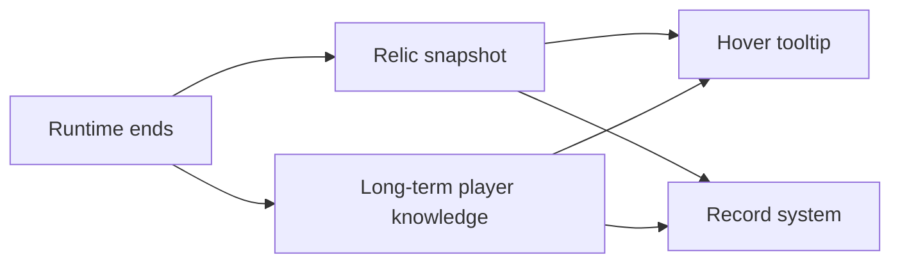

# Recovery {#recovery}

Recovery is the serialization boundary. After the site ends, only data that has been folded into a snapshot may continue into tooltip, codex, and later systems.



## Three Result Types {#three-result-types}

| Layer | Stores |
| --- | --- |
| long-term player layer | identification level, unlocked knowledge, long-term progression |
| relic snapshot layer | `siteRef`, `siteTypeId`, `ResonanceState`, `patternKey` |
| record system layer | long-term records used by codex, history review, and statistics |

Relationship between them:

- the long-term player layer answers what we learned,
- the relic snapshot layer answers what result this item carries out of the site,
- the record layer answers what this expedition leaves in the archive.

The three can reference each other, but they cannot replace each other.

## Long-Term Player Layer Rules {#player-long-term-layer-rules}

If knowledge values live on player entity data, death and respawn must copy them through `PlayerEvent.Clone`. Otherwise cross-save persistence and cross-death migration become confused with one another.

## Item Snapshot Layer Rules {#item-snapshot-layer-rules}

Recovered relic snapshots should follow the item itself, not the player. The reasons are direct:

1. relics move through inventories, containers, drops, and trades,
2. tooltip rendering may not have a player object,
3. one relic's recovered result should not disappear when the holder changes.

Recovery therefore has to fold the minimum result into the `ItemStack`, not only into player data.

## Tooltip Design Rules {#tooltip-design-rules}

`ItemTooltipEvent` may build tooltips without a player object. Tooltip is therefore limited to:

- the saved snapshot already attached to the `ItemStack`,
- optional long-term player knowledge,
- fixed view-formatting rules.

Tooltip may not depend on live runtime.

The read order should also stay fixed:

1. read the saved snapshot from `ItemStack`,
2. read optional long-term player knowledge,
3. decide reveal depth using fixed view rules.

Tooltip does not participate in evaluation.

## Minimum Snapshot Object {#minimum-snapshot-object}

```java
public record RecoveredRelicSnapshot(
        String siteTypeId,
        String siteRef,
        ResonanceState state,
        String patternKey
) {}
```

This object carries only the result that leaves the site. Current stability, guardian counts, covered chunks, and other tick-level state do not belong in the recovered relic snapshot.

## Prohibited Items {#prohibited-items}

1. putting every result back into player data,
2. letting tooltip recalculate resonance or site runtime,
3. leaving recovery as a reward screen with no durable technical result,
4. serializing per-tick site state directly into item results.
