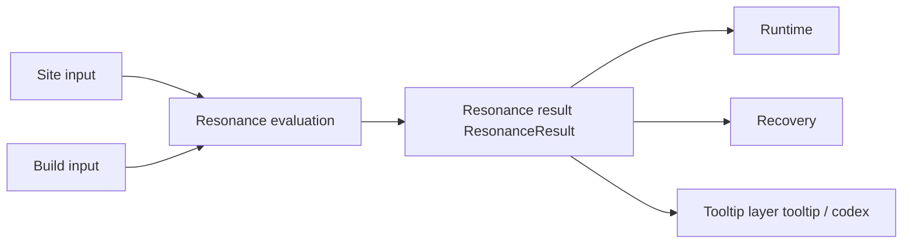

# Resonance {#resonance}

Resonance is the evaluation layer. It reads site input and player build input, then returns one short, stable result that runtime, recovery, and tooltip can all consume. Resonance does not directly advance the site and does not directly generate presentation text.

## Scope {#scope}

Resonance answers one question only: what state does this combination of `site pressure + relic tendency + build posture + civilization lean` resolve to?

| Input axis | Why it belongs in resonance | What does not belong here |
| --- | --- | --- |
| `site pressure` | it defines the main pressure family applied by the ruin | per-tick stability drain, spawning, fog, and other runtime effects |
| `relic tendency` | it defines how the relic handles that pressure | tooltip prose itself |
| `build posture` | it captures whether the player is stabilizing or breaching this run | direct weapon-stat rewrites |
| `civilization lean` | it keeps civilization difference visible in the result | standalone class trees or faction systems |

Resonance evaluates. Runtime and recovery execute consequences.

## Result contract {#result-contract}

Version one keeps resonance output compact and stores only two fields:

| Field | Role |
| --- | --- |
| `state` | shared high-level state for runtime, recovery, and tooltip |
| `patternKey` | stable pattern handle used by presentation, resolution, and text mapping |

The result stays short for good reason:

1. Runtime, recovery, and tooltip run at different times, but they all need the same result.
2. The result enters snapshots and long-term data. Extra fields raise coupling immediately.
3. If the result object grows too early, it will start absorbing runtime and UI details.

## Object layering {#object-layering}

| Layer | Objects | Role |
| --- | --- | --- |
| input layer | `SiteProfile`, `RelicLoadout` | fold site input and player input into compact objects |
| evaluation layer | `ResonanceResolver` | single evaluation entry point |
| result layer | `ResonanceResult` | carries the short result |
| consumer layer | runtime, recovery, tooltip | read the result without recalculating it |

These layers must not mix. If tooltip, runtime, or recovery all start adding their own local `if` logic, resonance has already drifted.

## Consumption rules {#consumption-rules}

Resonance results are consumed in this order:

1. Activation or site startup computes `ResonanceResult` once.
2. Runtime reads the result and uses it for phase handling and consequence routing.
3. Recovery folds the fields that must persist into the saved snapshot.
4. Tooltip and codex only read the snapshot. They do not query live runtime.

If tooltip starts recalculating resonance on the fly, the resonance logic has already leaked into the client view layer.

## Resonance and TaCZ {#shared-gun-base-boundary}

The current instance already ships TaCZ and its extensions. Resonance should build on that gun system instead of inventing another weapon system.

Resonance should:

- change the tactical meaning of the same weapon under different ruin pressure,
- make civilization lean influence build choice,
- let recovery results reflect how the player handled the site.

Resonance should not:

- split firearms into civilization-exclusive weapon stacks,
- hide all differentiation inside attachment numbers,
- replace readable state evaluation with a black-box formula.

## First slice validation {#first-slice-validation}

The first slice only needs to prove that one ruin plus different builds produces different results.

| Site profile | Loadout | Expected result |
| --- | --- | --- |
| `CONTAMINATION` | `FILTER + STABILIZE + MECHANICAL + 0` | `TUNED` + `contamination.cleanse` |
| `CONTAMINATION` | `SUNDER + BREACH + ARCANE + 1` | `OVERLOADED` + `contamination.burst` |
| fallback | any unsupported combination | `DORMANT` + `generic.idle` |

If this difference holds consistently, resonance already has version-one value.

## Design red lines {#design-red-lines}

1. runtime, recovery, and tooltip each maintaining their own resonance logic,
2. the result object absorbing per-tick runtime state,
3. tooltip requiring live runtime just to explain one recovered item,
4. resonance evolving into a second weapon or class system.
