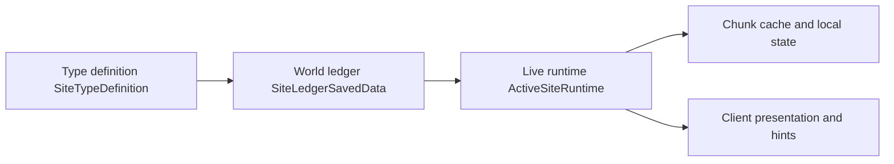

# Site runtime {#site-runtime}

Site runtime is the bridge between a ledger-backed ruin and an active field event. Four questions: what the ledger stores, what the registry stores, what the chunk layer stores, and what the client is allowed to read.



## Four-layer model {#four-layer-model}

| Layer | Authority object | Stores | Lifecycle |
| --- | --- | --- | --- |
| type definition layer | `SiteTypeDefinition` | one ruin type template, runtime parameters, resonance config entry | global static |
| world ledger layer | `SiteLedgerSavedData` | instance coordinates, lifecycle, covered chunks, stable references | tied to the world save |
| live runtime layer | `SiteRuntimeRegistry`, `ActiveSiteRuntime` | pressure, phase, owner, local events | exists only while the site is active |
| chunk and client support layer | `ChunkSiteAuxData`, sync payloads | local presentation, visibility, minimum client view | tied to chunk lifecycle and watch state |

## Identity and indexes {#identity-and-indexes}

| Identifier | Layer | Role |
| --- | --- | --- |
| `SiteRef` | cross-stage handoff | moves one ruin instance through formal survey, activation, and recovery |
| `SiteCoordinate` or `dimension + anchor` | world ledger | answers which concrete ruin this actually is |
| `primaryChunkKey`, `coveredChunkKeys` | ledger + runtime | keep chunk sync, cache, and coverage on one stable key set |
| `UUID owner` | runtime | constrains player or team ownership |

External handoff keeps using `SiteRef`. Formal records resolve back to the coordinate key. Chunk events only operate on `coveredChunkKeys`.

## Ledger fields {#ledger-fields}

The world ledger should at minimum store:

| Field | Why it exists |
| --- | --- |
| `ref` | activation, recovery, logs, and player short markers all resolve back to the same ruin |
| `anchor` and dimension | defines one stable ledger coordinate |
| `siteTypeId` | lets runtime, resonance, and recovery load the rule template |
| `coveredChunkKeys` | supports sync, local cache, and coverage checks |
| `lifecycle` | tells activation, runtime, and recovery which phase the instance is in |

The ledger does not store per-tick pressure, local enemy state, or temporary disturbances. Those belong to runtime.

## Runtime registry {#runtime-registry}

Recommended registry shape:

```java
public final class SiteRuntimeRegistry {
    private final Map<SiteCoordinate, ActiveSiteRuntime> runtimeBySite = new HashMap<>();
    private final Map<Long, Set<SiteCoordinate>> sitesByChunk = new HashMap<>();
    private final Map<UUID, SiteCoordinate> siteByOwner = new HashMap<>();
}
```

| Index | Role |
| --- | --- |
| `runtimeBySite` | answers whether one ruin is currently active |
| `sitesByChunk` | supports chunk load/unload, watch sync, and local cache lookup |
| `siteByOwner` | prevents one owner from occupying multiple formal ruins |

`ActivationService` resolves `SiteRef` into the ledger record, then normalizes it to one coordinate key before registration. Entry points can vary. The runtime master table should not.

## Recommended runtime object {#recommended-runtime-objects}

```java
public final class ActiveSiteRuntime {
    private final SiteRef ref;
    private final SiteCoordinate coordinate;
    private final RuntimeFootprint footprint;
    private final SiteTypeDefinition type;
    private int stability;
    private SitePhase phase;
}
```

```java
public record RuntimeFootprint(
        BlockPos anchor,
        Set<Long> coveredChunkKeys
) {}
```

## Coverage chunk algorithm {#coverage-chunk-algorithm}

If runtime interacts with chunk lifecycle, it needs a stable footprint rule first. Once `coveredChunkKeys` are written into the ledger, runtime should not re-identify the ruin every time a chunk enters memory.

1. The ledger stores anchor `anchor`.
2. Runtime parameters provide an event radius or active boundary.
3. Formal survey or activation computes `coveredChunkKeys`.
4. Runtime registration inserts those keys into `sitesByChunk`.
5. Chunk-side events operate only on the local state attached to those keys.

As a result:

- `ChunkEvent.Unload` may release local cache,
- it may not delete the world ledger,
- and runtime cannot be treated as a derivative of chunk loadedness.

## World ledger versus biome and structure {#world-ledger-biome-structure-relationship}

The ledger only stores resolved results. It does not preserve half-finished "structure decided one half, biome decided the other half" logic. After resolution, the ledger should contain only:

- concrete instance reference,
- anchor,
- covered chunks,
- lifecycle state,
- stable fields required by runtime and recovery.

## State transitions {#state-transitions}

| Input phase | Output phase | Allowed writes |
| --- | --- | --- |
| formal survey | world ledger | `DiscoveredSiteRecord`, `SiteRef`, coverage keys |
| activation | runtime registry | `ActiveSiteRuntime`, ownership relation, chunk index registration |
| site progression | runtime internals | pressure, phase, disturbance, local events |
| recovery | world ledger + result snapshot | lifecycle updates, recovery result, long-term knowledge |
| chunk unload / unwatch | support layer | local cache release, client subscription cleanup |

`chunk unload` and `player unwatch` are not ruin lifecycle events. They only manage the support layer.

## Client rules {#client-layer-rules}

The client may read only:

- saved values derived from runtime,
- saved recovery snapshots,
- chunk-local data that the server explicitly syncs.

The client may not infer ledger records and may not persist runtime state.

## Design no-go zones {#design-no-go-zones}

1. making runtime existence depend on chunk load state,
2. moving the world ledger into player short markers,
3. turning the client presentation layer into a second state authority.
