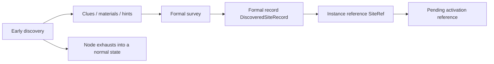

# Survey {#survey}

Survey splits into two stages that cannot be merged. Early discovery handles clues, materials, and environmental teaching. Formal survey handles ruin instances, the world ledger, and pending activation references. Collapsing them means early nodes end up carrying teaching, location, persistence, and activation preconditions all at once.



## Phase definitions {#phase-definitions}

| Phase | Input | Output | Does not do |
| --- | --- | --- | --- |
| early discovery | environmental carriers, brush interaction, explicit signal nodes | clues, fragments, materials, tooltip information, detector progress, general archaeology progress | does not create `SiteRef`, does not write `SiteLedgerSavedData`, does not enter activation |
| formal survey | host structure, author marker or explicit host, submit action | `DiscoveredSiteRecord`, `SiteRef`, pending activation reference | does not replace environmental teaching, does not create live runtime directly |

Early discovery answers "is this place worth further commitment?" Formal survey answers "has this become one formal ruin instance yet?" Different questions, different inputs, different data layers.

## Core objects {#core-objects}

| Object | Role |
| --- | --- |
| `CivilizationShellDefinition` | defines which readable signals a civilization shell leaves during early discovery |
| `EarlyExcavationNodeDefinition` | defines one early archaeology node type, its carrier, interaction, output, and exhausted state |
| `SiteTypeDefinition` | defines host rules, activation rules, runtime parameters, and resonance config for one ruin type |
| `SiteRef` | points to one concrete ruin instance, not to a ruin type |
| `DiscoveredSiteRecord` | the formal ruin record inside the world ledger |
| `SiteLedgerSavedData` | the formal ruin ledger for one `ServerLevel` |

## Early discovery nodes {#early-discovery-nodes}

Early discovery nodes do not instantiate ruins. They convert environmental civilization traces into readable clues, then exhaust after one interaction. Early discovery must not depend on the world ledger and must not require world-data participation to prove an instance.

### Carrier types {#carrier-types}

| Carrier | Use | Constraint |
| --- | --- | --- |
| environmental carrier | the main carrier for natural environments, outer host areas, and low-intensity distribution points | must be a dedicated worldgen carrier; cannot depend on placement-time tags |
| explicit node | high-signal positions, guidance points, anomaly markers | may use `BlockEntity`, but density must stay low and it cannot replace environmental carriers |

Environmental carriers provide broad distribution. Explicit nodes provide clarity at important positions. Neither enters the formal ledger.

### Unified interaction {#unified-interaction}

Early discovery uses one fixed interaction: `brush reveal -> extraction -> exhausted return`.

1. The player brushes the node continuously.
2. The node enters its revealed state.
3. The player performs one extraction interaction.
4. The node turns into a normal world state and permanently loses archaeology eligibility.

Fixed three-state sequence:

```text
hidden archaeology block -> revealed archaeology block -> normal terrain block
```

Revelation and extraction are two separate actions, which gives clean hook points for hints, audiovisual feedback, and exhaustion.

### Recommended node definition {#recommended-node-definition}

```java
public record EarlyExcavationNodeDefinition(
        ResourceLocation id,
        ResourceLocation shellId,
        CarrierType carrierType,
        ResourceLocation brushLootTable,
        BlockState revealedState,
        BlockState exhaustedState
) {}
```

These fields cover only the early interaction:

- `shellId` says which civilization trace family the node belongs to,
- `brushLootTable` only handles early-discovery output,
- `revealedState` and `exhaustedState` define the interaction state machine,
- the definition does not carry formal ruin lifecycle, ledger keys, or `SiteRef`.

### Anti-automation rules {#anti-automation-rules}

Early discovery nodes may only come from:

1. dedicated world-generated archaeology carriers,
2. dedicated archaeology carriers pre-placed by structure authors,
3. a small, controlled set of explicit signal nodes.

The following are never valid archaeology targets:

1. ordinary blocks that machines can place and recover in bulk,
2. objects that redstone can mass-produce,
3. objects that industrial chains can craft, copy, or farm,
4. objects that trading or mob farms can feed back into the world at scale.

Machines may process archaeology later, but archaeology targets themselves cannot come from mass-producible sources. Otherwise the player can industrialize archaeology and bypass world distribution and exploration entirely.

## Formal survey {#formal-survey}

Formal survey is the only entry point for `SiteRef`. It turns one valid submit into one formal ruin record and passes the stable instance reference to activation. If content has not entered a formal record yet, it still belongs to early discovery.

### Type and instance must stay separate {#type-and-instance-must-be-separated}

| Layer | Stores | Design role |
| --- | --- | --- |
| civilization shell | clue style, material families, outer traces, readable signals | organizes early discovery, not formal instances |
| ruin type | host rules, activation rules, runtime parameters, resonance config | rule template for one kind of ruin |
| ruin instance | dimension, anchor, covered chunks, lifecycle | instance record used by activation, runtime, and recovery |

If type and instance collapse into one layer, same-type ruins cannot coexist and activation or recovery can no longer point at one stable ruin.

### Fixed priority for formal survey {#fixed-priority-for-formal-survey}

Formal survey always resolves in this order:

1. author markers or explicit hosts first,
2. host structure decides whether the location even qualifies,
3. anchor resolution turns the current position into one stable instance center,
4. biome only applies a type adjustment and does not define the instance key,
5. ledger lookup or creation produces `DiscoveredSiteRecord`,
6. the stage returns `SiteRef` as the pending activation reference.

The order is fixed: host and anchor first, instance after that. Only then can activation and recovery point at something stable.

### Recommended formal record {#recommended-formal-record}

```java
public record SiteRef(
        String siteTypeId,
        long primaryChunkKey,
        int serial
) {}

public record DiscoveredSiteRecord(
        SiteRef ref,
        BlockPos anchor,
        String siteTypeId,
        Set<Long> coveredChunkKeys,
        SiteLifecycle lifecycle
) {}
```

`SiteRef` is the cross-stage handoff reference. `anchor`, together with dimension, is the stable coordinate key inside the ledger.

`coveredChunkKeys` is reserved for:

- chunk sync,
- local cache support,
- runtime coverage checks.

It does not flow back into early discovery and does not replace player short markers.

## Registration rules for new content {#registration-rules-for-new-content}

New content must declare a complete definition up front. Ruin behavior is not assembled from scattered conditions.

### Required fields for new early discovery nodes {#required-fields-for-new-early-discovery-nodes}

| Field | Required | Role |
| --- | --- | --- |
| node id | yes | stable key |
| shell id | yes | says which civilization trace family owns the node |
| carrier type | yes | distinguishes environmental carriers from explicit nodes |
| brush output | yes | early-discovery drop and progress content |
| revealed state | yes | state after brush completion |
| exhausted state | yes | normal state after extraction |

### Required fields for new formal ruin types {#required-fields-for-new-formal-site-types}

| Field | Required | Role |
| --- | --- | --- |
| type id | yes | stable key |
| host rule | yes | structure tag, author marker, or explicit host |
| anchor rule | yes | search radius, center resolution, and final verification |
| biome adjustment | optional | parameter adjustment only; does not define the instance key |
| activation rule | yes | limits which submit entry points can activate the site |
| runtime parameters | yes | read by the site runtime |
| resonance config id | yes | consumed by `ResonanceResolver` |

## Prohibited items {#prohibited-items}

1. letting early discovery create `SiteRef`,
2. letting early discovery write `SiteLedgerSavedData`,
3. making ordinary blocks archaeology targets only through placement-time tags,
4. allowing mass-producible objects to become archaeology targets,
5. letting formal survey create live runtime directly.
