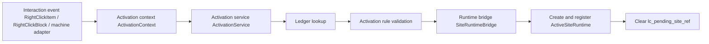

# Activation Implementation {#activation-implementation}

The implementation backbone of activation is now `ActivationService`. Events and items only build context. Ledger validation, runtime open, and short-marker cleanup all happen in the service layer.



## Verified Events And Methods {#verified-events-and-methods}

| Event or method | Verified interface | Role |
| --- | --- | --- |
| `PlayerInteractEvent.RightClickBlock` | `getPos()`, `getHitVec()`, `getItemStack()`, `getHand()` | block-device adapter |
| `PlayerInteractEvent.RightClickItem` | `getItemStack()`, `getHand()` | item adapter |
| `PlayerEvent.PlayerChangedDimensionEvent` | `getFrom()`, `getTo()` | teardown when the player leaves the site dimension |
| `LevelEvent.Unload` | event itself verified | cleanup registry state when the level unloads |

## Recommended Object Skeleton {#recommended-object-skeleton}

```java
public interface ActivationAdapter {
    Optional<ActivationContext> buildContext(ServerPlayer player, ServerLevel level);
}

public final class ActivationService {
    public ActivationResult activate(ActivationContext context) {
        // 1. load DiscoveredSiteRecord
        // 2. validate source, triggerPos, and lifecycle
        // 3. hand off to SiteRuntimeBridge
        // 4. clear lc_pending_site_ref
        return new ActivationResult(false, null, "not_implemented");
    }
}

public final class SiteRuntimeBridge {
    public Optional<ActiveSiteRuntime> open(
            ActivationContext context,
            DiscoveredSiteRecord record
    ) {
        return Optional.empty();
    }
}
```

These are three different layers:

- adapters answer where the submit came from,
- the service layer answers whether the site may open,
- `SiteRuntimeBridge` answers how to create the runtime object.

## Adapter Mapping {#adapter-mapping}

| Adapter | Current recommendation |
| --- | --- |
| `BlockActivationAdapter` | builds context from `RightClickBlock`; suitable for ruin consoles, host devices, and trigger points |
| `ItemActivationAdapter` | builds context from `RightClickItem`; suitable for activators, detectors, and key-like items |
| `MachineActivationAdapter` | reserved for later machine-based activation or machine archaeology |

MVP can start with the first two. The machine adapter should keep an interface slot, but should not freeze an event source yet.

## Minimum Activation Flow {#minimum-activation-flow}

1. An adapter builds `ActivationContext` from the player, current `ServerLevel`, and pending reference.
2. `ActivationService` reads the `SiteRef` from `lc_pending_site_ref`.
3. The service loads `DiscoveredSiteRecord` from `SiteLedgerSavedData`.
4. The service validates `ActivationRule`, dimension, trigger position, and lifecycle state.
5. On success, `SiteRuntimeBridge` creates `ActiveSiteRuntime`.
6. `SiteRuntimeRegistry` registers the live state.
7. `lc_pending_site_ref` is cleared.

## Stale Reference Handling {#stale-reference-handling}

| Situation | Handling |
| --- | --- |
| reference missing | clear short marker and reject |
| reference points to another dimension | clear short marker and reject |
| record already `ACTIVE` | do not create a second runtime |
| record already recovered or aborted | clear short marker and reject |

## Dimension Change And Unload {#dimension-change-and-unload}

`PlayerEvent.PlayerChangedDimensionEvent` and `LevelEvent.Unload` are teardown hooks, not activation entry points.

| Event | Recommendation |
| --- | --- |
| `PlayerChangedDimensionEvent` | if the player is bound to a runtime, close it, unbind it, or move it into safe teardown |
| `LevelEvent.Unload` | delete active runtimes under that level and clear invalid bindings |

## Activation Implementation Red Lines {#activation-implementation-red-lines}

1. do not maintain the runtime master table inside interaction events,
2. do not let `RightClickBlock` stand in for the whole activation architecture,
3. do not make the service layer re-run survey logic,
4. do not keep stale `lc_pending_site_ref`.
