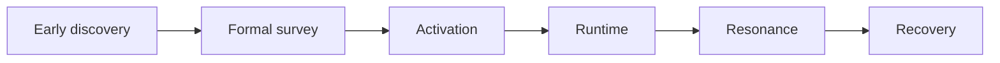

# Modding implementation catalogue {#modding-implementation-catalogue}

This subtree is the implementation contract for the Forge-side ruin system — what's verified, what's recommended, and what hasn't been built yet.

## Verified runtime facts {#verified-runtime-facts}

| Question | Verified API or event | Conclusion |
| --- | --- | --- |
| vanilla brush chain | `BrushItem.useOn(...)`, `BrushItem.onUseTick(...)`, `BrushableBlockEntity.brush(...)` | early discovery can reuse the vanilla archaeology chain directly |
| world-level persistence | `ServerLevel.getDataStorage()`, `DimensionDataStorage.computeIfAbsent(...)` | the ruin ledger should use `SavedData` |
| persistence writeback | `SavedData.setDirty()`, `LevelEvent.Save` | ledger mutations must mark dirty, then write during world save |
| chunk NBT | `ChunkDataEvent.Load` / `Save` | suitable for auxiliary data, not for level-saved records |
| chunk lifecycle | `ChunkEvent.Load` / `Unload` | valid for cache and resource release, not as a ledger substitute |
| chunk visibility | `ChunkWatchEvent.Watch` / `UnWatch` | suitable for per-player chunk sync |
| extraction interaction | `Block#use(BlockState, Level, BlockPos, Player, InteractionHand, BlockHitResult)` | revealed and extracted states can stay separate |
| player interaction | `PlayerInteractEvent.RightClickItem` / `RightClickBlock` | suitable for formal survey submits and activation adapters |
| player knowledge migration | `PlayerEvent.Clone` | long-term player knowledge must be copied on respawn if stored on the player |
| client tooltip | `ItemTooltipEvent` | the player object may be `null` |

## Data ownership summary {#data-ownership-summary}

| Data | Recommended authority | Must not live in |
| --- | --- | --- |
| whether an early node is exhausted | world block state | main world ledger table |
| whether a ruin instance exists | `SiteLedgerSavedData` | player short marker |
| whether a ruin is currently active | `SiteRuntimeRegistry` | chunk cache |
| chunk-local presentation or auxiliary info | chunk data or chunk capability | main world ledger table |
| pending ruin submit for a player | `player.getPersistentData()` | main world ledger table |
| recovered relic result | item snapshot or separate record layer | live runtime |

## Write timing matrix {#write-timing-matrix}

Where data is written matters as much as where it lives.

| Data | First write timing | Later readers |
| --- | --- | --- |
| `DiscoveredSiteRecord` | after formal survey confirms the site | activation, runtime, recovery |
| player short markers such as `lc_pending_site_ref` | after formal survey, before activation | activation layer |
| `ActiveSiteRuntime` | after activation succeeds | runtime services, resolution services |
| chunk-side auxiliary cache | after chunk load, watch, or local computation | client sync, local presentation |
| `ResonanceResult` | during activation or runtime startup | runtime, recovery |
| `RecoveredRelicSnapshot` | during recovery resolution | tooltip, codex, later processing |
| long-term player knowledge | during recovery, identification, or long-term progression nodes | tooltip, later survey gates |

Wrong write timing causes repeated initialization, stale state, or invalid writeback — even when the owning object is correct.

## First batch of recommended objects {#first-batch-of-recommended-objects}

| Object | Role | Current status |
| --- | --- | --- |
| `CivilizationShellDefinition` | defines civilization shell traces for early discovery | not built yet |
| `EarlyExcavationNodeDefinition` | defines one early archaeology node type | not built yet |
| `SiteTypeDefinition` | defines one ruin type | not built yet |
| `SiteTypeRegistry` | registers ruin types | not built yet |
| `SiteRef` | points to one concrete ruin | not built yet |
| `DiscoveredSiteRecord` | one ledger-backed ruin record | not built yet |
| `SiteLedgerSavedData` | dimension-level ledger | not built yet |
| `ActivationContext` | input object for one activation submit | not built yet |
| `ActivationResult` | activation result | not built yet |
| `ActivationService` | main activation service | not built yet |
| `ActivationAdapter` | folds multiple interaction entry points into one context | not built yet |
| `SiteRuntimeBridge` | opens runtime after validation | not built yet |
| `SiteRuntimeRegistry` | owns live runtime state | not built yet |
| `ActiveSiteRuntime` | core site runtime object | not built yet |
| `RecoveredRelicSnapshot` | recovery snapshot | not built yet |
| `RelicTooltipView` | formats saved results | not built yet |

## Minimum call chain {#minimum-call-chain}

The first playable implementation chain should stay fixed at five steps:

1. early discovery or formal survey confirms one valid ruin,
2. formal survey writes the result into `SiteLedgerSavedData` and returns `SiteRef`,
3. activation routes `SiteRef` through `ActivationAdapter -> ActivationService` into `SiteRuntimeRegistry`,
4. runtime reads `ResonanceResult` and advances `ActiveSiteRuntime`,
5. recovery folds the result into `RecoveredRelicSnapshot`, and afterward only view layers read the snapshot.

The point is to keep formal record, live runtime, and recovery result fully separate. If one step skips the previous one, later stages lose a stable reference.

## Level-saved records, chunk cache, player markers {#world-truth-chunk-cache-player-markers}

| Layer | Concrete recommendation | Lifecycle |
| --- | --- | --- |
| level-saved records | `SiteLedgerSavedData` | tied to the level save |
| chunk cache | `ChunkDataEvent` or `AttachCapabilitiesEvent<LevelChunk>` | tied to chunk load / unload |
| player short marker | `lc_pending_site_ref` | spans only formal survey and activation |

## Item snapshot versus player knowledge {#item-snapshot-vs-player-knowledge}

Recovery must separate at least two writes:

| Data | Recommended home | Why |
| --- | --- | --- |
| `RecoveredRelicSnapshot` | `ItemStack` NBT | the result must travel with the item |
| long-term knowledge such as `lc_identification_level` | player long-term data | it belongs to the player's understanding, not to the item |

These data streams cannot merge. Player knowledge follows the character. The relic snapshot follows the item.

## First batch of proofs {#first-batch-proofs}

1. early discovery produces clues and exhausts nodes into non-archaeology states,
2. formal survey can turn an interaction into `SiteRef`,
3. activation can open exactly one runtime from `SiteRef`,
4. runtime keeps the ledger consistent across `LevelEvent.Save`,
5. `ChunkEvent.Unload` does not delete the world ledger,
6. tooltip renders independently from saved results,
7. relic results travel with `ItemStack` instead of living only on player data.
