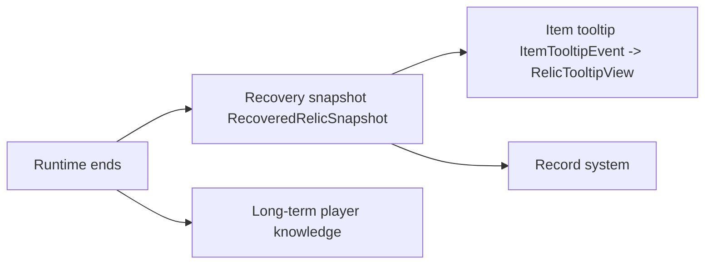

# Recovery Implementation {#recovery-implementation}

Recovery folds runtime results into long-lived readable data. We have to keep three things separate here: long-term player knowledge, relic snapshots, and client tooltip reads.



## Verified Key Boundaries {#verified-key-boundaries}

| Topic | Verified API or event | Conclusion |
| --- | --- | --- |
| player respawn migration | `PlayerEvent.Clone.getOriginal()`, `PlayerEvent.Clone.isWasDeath()` | if knowledge lives on player entity data, it must be copied on death respawn |
| tooltip read | `ItemTooltipEvent.getItemStack()`, `getToolTip()`, `getFlags()` | tooltip should only read saved results |
| null-player tooltip path | `ItemTooltipEvent.getEntity()` may be `null` | rendering cannot depend on live player |
| item NBT read | `ItemStack.getTag()`, `getOrCreateTag()` | snapshots can live directly on item NBT |
| item NBT writeback | `ItemStack.setTag(@Nullable CompoundTag)` | full-tag replacement is possible when needed |
| player initialization | `PlayerEvent.PlayerLoggedInEvent` | missing keys may be initialized on login |

## Data Layering {#data-layering}

| Data | Recommended home |
| --- | --- |
| `lc_identification_level` | long-term player data |
| `siteRef`, `siteTypeId`, `ResonanceState`, `patternKey` | relic snapshot |
| codex or statistics results | separate record layer |

## Item Snapshot Write Boundary {#item-snapshot-write-boundary}

The recovery snapshot should live under one root tag on `ItemStack`, not as scattered top-level fields.

```java
public static final String RELIC_RESULT_KEY = "lost_civilization.recovered_relic";
```

Recommended write flow:

1. read `stack.getOrCreateTag()`,
2. write `RecoveredRelicSnapshot` fields under a single root key,
3. do not overwrite unrelated item tags.

That avoids collisions with enchantments, display names, and mod-added item fields.

## Recommended `RecoveredRelicSnapshot` Shape {#recovered-relic-snapshot-structure}

```java
public record RecoveredRelicSnapshot(
        String siteRef,
        String siteTypeId,
        ResonanceState state,
        String patternKey
) {}
```

## Suggested Snapshot Codec Shape {#snapshot-codec-shape}

```java
public final class RecoveredRelicSnapshotCodec {
    private RecoveredRelicSnapshotCodec() {
    }

    public static void write(ItemStack stack, RecoveredRelicSnapshot snapshot) {
        CompoundTag root = stack.getOrCreateTag();
        CompoundTag resultTag = new CompoundTag();
        resultTag.putString("site_ref", snapshot.siteRef());
        resultTag.putString("site_type_id", snapshot.siteTypeId());
        resultTag.putString("state", snapshot.state().name());
        resultTag.putString("pattern_key", snapshot.patternKey());
        root.put(RELIC_RESULT_KEY, resultTag);
    }
}
```

The important constraint is not the field names. It is that encoding should have one entry point only. Otherwise tooltip, recovery, and debug commands will drift into separate formats.

## Long-Term Player Knowledge Migration {#player-long-term-knowledge-migration}

If `lc_identification_level` lives on player entity data, keep at least the following subscription:

```java
@SubscribeEvent
public static void onPlayerClone(PlayerEvent.Clone event) {
    if (!event.isWasDeath()) {
        return;
    }

    // copy long-term knowledge from event.getOriginal() to the new player
}
```

Copy long-term knowledge only. Do not copy pending short markers or live runtime state.

## Tooltip Read Rules {#tooltip-read-rules}

`ItemTooltipEvent` does not derive results. It only presents them.

```java
@SubscribeEvent
public static void onTooltip(ItemTooltipEvent event) {
    // 1. read RecoveredRelicSnapshot from event.getItemStack()
    // 2. read long-term player knowledge; event.getEntity() may be null
    // 3. call RelicTooltipView.build(...)
    // 4. append lines to event.getToolTip()
}
```

Recommended read rules:

1. try `event.getItemStack().getTag()` first,
2. if the tag does not exist, degrade quietly to the minimum display,
3. if `event.getEntity()` is null, skip player-knowledge enhancement.

## `RelicTooltipView` Responsibilities {#relic-tooltip-view-responsibilities}

| Should do | Must not do |
| --- | --- |
| format text from the snapshot and knowledge values | recalculate resonance |
| degrade gracefully when no player is present | access the runtime registry |
| return stable text lines | query the world ledger to decide results |

## Minimum Test Requirements {#minimum-test-requirements}

| Scenario | Expected result |
| --- | --- |
| tooltip with `player == null` | still shows the minimum information |
| item without result tag | degrades quietly without errors |
| low knowledge level | shows only coarse result information |
| high knowledge level | shows deeper state or pattern information |
| after death and respawn | long-term knowledge remains, short markers do not |

## Implementation Red Lines {#implementation-red-lines}

1. do not serialize live runtime objects as relic results,
2. do not put all recovery data back onto the player entity,
3. do not make tooltip the only source of truth,
4. do not define multiple incompatible item-snapshot formats.
