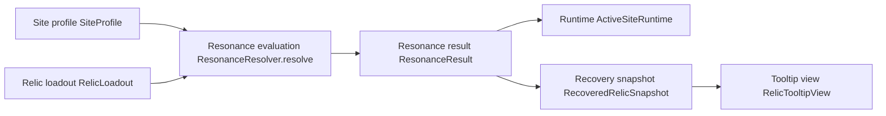

# Resonance implementation {#resonance-implementation}

On the implementation side, resonance does one thing: it folds site input and player input into `ResonanceResult`. It does not own site lifecycle, and it does not generate tooltip text directly.



## Verified Forge boundaries {#verified-forge-boundaries}

The following APIs are verified and define the implementation boundary:

| Topic | Verified API | Conclusion |
| --- | --- | --- |
| tooltip construction | `ItemTooltipEvent(@NotNull ItemStack, @Nullable Player, List<Component>, TooltipFlag)` | tooltip allows `player == null` |
| tooltip read | `ItemTooltipEvent.getItemStack()`, `getToolTip()`, `getFlags()` | tooltip can read saved snapshots directly and append text |
| null-player tooltip path | `ItemTooltipEvent.getEntity()` | startup and some client paths cannot depend on a player object |

Resonance results must enter the snapshot first; tooltip reads the snapshot. Tooltip cannot query live runtime.

## Current type contract {#type-contract}

```java
public record SiteProfile(
        String id,
        SitePressure pressure,
        int baseStability,
        float guardianMultiplier
) {}

public record RelicLoadout(
        RelicTendency tendency,
        BuildPosture posture,
        CivilizationLean lean,
        int identificationLevel
) {}

public record ResonanceResult(
        ResonanceState state,
        String patternKey
) {}
```

`SiteProfile` and `RelicLoadout` keep input compact. `ResonanceResult` keeps output compact. That prevents the resolver signature from bloating as the system expands.

## File boundaries {#file-boundaries}

| File | Minimum responsibility |
| --- | --- |
| `SitePressure` | site-pressure enum |
| `RelicTendency`, `BuildPosture`, `CivilizationLean` | player-input enums |
| `ResonanceState` | result-state enum |
| `SiteProfile` | site input object |
| `RelicLoadout` | player input object |
| `ResonanceResult` | compact output object |
| `ResonanceResolver` | single evaluation entry point |

## Pure evaluation constraints {#pure-evaluation-constraints}

`ResonanceResolver.resolve(site, loadout)` should remain a pure function.

```java
public final class ResonanceResolver {
    private ResonanceResolver() {
    }

    public static ResonanceResult resolve(SiteProfile site, RelicLoadout loadout) {
        if (site.pressure() == SitePressure.CONTAMINATION
                && loadout.tendency() == RelicTendency.FILTER) {
            return new ResonanceResult(ResonanceState.TUNED, "contamination.cleanse");
        }

        if (site.pressure() == SitePressure.CONTAMINATION
                && loadout.tendency() == RelicTendency.SUNDER
                && loadout.posture() == BuildPosture.BREACH) {
            return new ResonanceResult(ResonanceState.OVERLOADED, "contamination.burst");
        }

        return new ResonanceResult(ResonanceState.DORMANT, "generic.idle");
    }
}
```

Keeping it pure pays off: unit tests can cover it directly, runtime/recovery/tooltip all read the same result, and the client doesn't need its own resonance copy.

## Downstream consumption order {#downstream-consumption-order}

The implementation order stays fixed:

1. activation or site startup computes `ResonanceResult`,
2. `ActiveSiteRuntime` reads the result and applies site consequences,
3. recovery writes `state` and `patternKey` into `RecoveredRelicSnapshot`,
4. `RelicTooltipView` only reads the snapshot and optional long-term knowledge.

Only runtime and recovery may interpret the result. Tooltip only formats it.

## Minimum test matrix {#minimum-test-matrix}

| Site profile | Loadout | Expected result |
| --- | --- | --- |
| `CONTAMINATION` | `FILTER + STABILIZE + MECHANICAL + 0` | `TUNED` + `contamination.cleanse` |
| `CONTAMINATION` | `SUNDER + BREACH + ARCANE + 1` | `OVERLOADED` + `contamination.burst` |
| fallback | any unsupported combination | `DORMANT` + `generic.idle` |
| tooltip with `player == null` | saved snapshot | still renders minimum text |

## Constraints {#implementation-red-lines}

1. Live runtime objects must not be serialized directly into relics.
2. Tooltip must not recalculate resonance.
3. The resolver must not read players, worlds, or the runtime registry.
4. `patternKey` must not be a temporary string that only one UI page understands.
