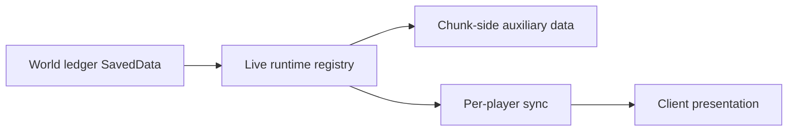

# Site runtime implementation {#site-runtime-implementation}

The real question for site runtime is not whether tick hooks exist. It is where each class of data belongs. The recommended model is three persistence layers plus one live-state layer.



## Verified persistence and lifecycle API {#verified-persistence-and-lifecycle-api}

| Topic | Verified API or event | Implementation conclusion |
| --- | --- | --- |
| world ledger entry | `ServerLevel.getDataStorage()` | ledger lives on `ServerLevel` |
| ledger create/load | `DimensionDataStorage.computeIfAbsent(Function<CompoundTag, T>, Supplier<T>, String)` | suitable for `SiteLedgerSavedData` |
| dirty mark | `SavedData.setDirty()` | required after every ledger mutation |
| save checkpoint | `LevelEvent.Save` | valid point for ledger consistency checks |
| chunk NBT | `ChunkDataEvent.Load` / `Save` | use for chunk-side auxiliary data only |
| chunk load | `ChunkEvent.Load` | do not run heavy world interaction here |
| chunk unload | `ChunkEvent.Unload` | release local cache only |
| chunk capability | `AttachCapabilitiesEvent<T>`, `IForgeLevelChunk extends ICapabilityProvider` | alternate route for chunk-local state |
| player watching | `ChunkWatchEvent.Watch` / `UnWatch` | send auxiliary chunk data to specific players |

## Four implementation layers {#four-layer-implementation-split}

| Layer | Recommended implementation | Stores |
| --- | --- | --- |
| level-saved records | `SiteLedgerSavedData` | ruin instances, anchors, lifecycle, covered chunks |
| live state | `SiteRuntimeRegistry` + `ActiveSiteRuntime` | current pressure, phase, temporary events, owner |
| chunk-side auxiliary layer | `ChunkDataEvent` or chunk capability | local presentation, cache, light indexes |
| sync layer | `ChunkWatchEvent.Watch` / `UnWatch` | minimal chunk payloads for the client |

## `SiteLedgerSavedData` skeleton {#site-ledger-saved-data-skeleton}

```java
public final class SiteLedgerSavedData extends SavedData {
    private final Map<String, DiscoveredSiteRecord> records = new HashMap<>();

    public static SiteLedgerSavedData load(CompoundTag tag) {
        SiteLedgerSavedData data = new SiteLedgerSavedData();
        // parse records
        return data;
    }

    @Override
    public CompoundTag save(CompoundTag tag) {
        // write records back
        return tag;
    }

    public DiscoveredSiteRecord put(DiscoveredSiteRecord record) {
        records.put(record.ref().toString(), record);
        setDirty();
        return record;
    }
}
```

The field names aren't what matter here. What matters: the world ledger uses `SavedData`, mutations call `setDirty()` immediately, and real disk writes happen during world save.

## `LevelEvent.Save` responsibilities {#level-event-save-responsibilities}

`LevelEvent.Save` fires on the server side only. Good uses:

- ledger consistency assertions,
- runtime-to-ledger convergence checks,
- refreshing values that must be valid before the save boundary.

It should not become the per-tick runtime loop.

## Two paths for chunk-side data {#two-paths-for-chunk-side-data}

### Path A: `ChunkDataEvent.Load` / `ChunkDataEvent.Save` {#route-a-chunk-data-event-load-save}

Suitable for:

- local ruin markers currently exposed by a chunk,
- precomputed visibility or presentation cache,
- lightweight derived values keyed by `coveredChunkKeys`.

Notes:

1. `ChunkDataEvent.Load` fires during `ChunkSerializer.read(...)` and has been verified as asynchronous.
2. Do not access heavy world logic there. Do not start runtime there. Do not query across chunks there.

### Path B: `AttachCapabilitiesEvent<LevelChunk>` {#route-b-attach-capabilities-level-chunk}

Suitable for:

- local state objects tied to `LevelChunk`,
- cache objects that should release uniformly when the chunk invalidates.

This path is useful for richer local state, but it is still not a replacement for level-saved records.

## `ChunkEvent.Load` and `ChunkEvent.Unload` {#chunk-event-load-and-unload}

| Event | Good use | Avoid |
| --- | --- | --- |
| `ChunkEvent.Load` | refill lightweight cache, prepare local sync | creating runtime, performing heavy interaction, querying across chunks |
| `ChunkEvent.Unload` | release local cache, drop weak references | deleting world-ledger records |

`ChunkEvent.Load` may fire before `LevelChunk` reaches `ChunkStatus.FULL`. It is not a site-runtime entry point.

## Coverage chunk algorithm recommendation {#coverage-chunk-algorithm-recommendation}

For each `DiscoveredSiteRecord`, store `coveredChunkKeys` in the ledger. Recommended initialization:

1. use the ruin anchor as center,
2. convert event radius into chunk radius,
3. precompute the covered chunk set,
4. let chunk events and watch events work only on that key set.

That gives stable handling for:

- sync when a player enters visible range,
- local cache release when a chunk unloads,
- tracking one large ruin across multiple chunks.

## `ChunkWatchEvent.Watch` / `UnWatch` {#chunk-watch-event-watch-unwatch}

These events handle "a player starts seeing this chunk, now send the extra ruin data." They solve sync, not persistence.

| Event | Recommended use |
| --- | --- |
| `ChunkWatchEvent.Watch` | send local ruin state or coverage markers for that chunk to the player |
| `ChunkWatchEvent.UnWatch` | tear down client cache or subscription state for that player |

## Recommended object boundaries {#current-recommended-object-boundaries}

| Object | Responsibility |
| --- | --- |
| `SiteLedgerSavedData` | level-saved records |
| `SiteRuntimeRegistry` | currently active site events |
| `ActiveSiteRuntime` | one ruin's dynamic runtime state |
| `ChunkSiteAuxData` | one chunk's auxiliary cache |
| `SiteSyncPayload` | minimum extra data sent to the client |

## Errors to avoid {#implementation-errors-to-avoid}

1. Treating `ChunkDataEvent.Load` as a safe main-thread entry point.
2. Treating `ChunkEvent.Unload` as authority to delete ruin instances.
3. Mutating `SavedData` without calling `setDirty()`.
