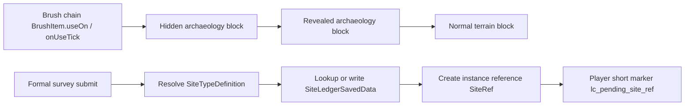

# Survey implementation {#survey-implementation}

Survey implementation has two parts:

- early discovery implementation: make environmental archaeology points actually support brush, reveal, extraction, and exhaustion;
- formal survey implementation: turn one valid submit into `SiteRef`, write it into the world ledger, then hand it to activation.



## Verified capabilities {#verified-capabilities}

| Capability | Verified method | Role |
| --- | --- | --- |
| brush start | `BrushItem.useOn(UseOnContext)` | starts continuous brushing |
| brush progress | `BrushItem.onUseTick(Level, LivingEntity, ItemStack, int)` | advances brush progress over time |
| brush completion | `BrushableBlockEntity.brush(long, Player, Direction)` | accumulates progress and resolves when finished |
| post-brush state switch | `BrushableBlock.getTurnsInto()` | turns hidden state into revealed state |
| revealed-state extraction | `Block#use(BlockState, Level, BlockPos, Player, InteractionHand, BlockHitResult)` | extracts content and exhausts the node |
| world ledger entry | `ServerLevel.getDataStorage()`, `DimensionDataStorage.computeIfAbsent(...)` | formal persistence entry point for survey |
| formal submit entry points | `PlayerInteractEvent.RightClickItem`, `PlayerInteractEvent.RightClickBlock` | collect formal survey submit context |

## Early discovery implementation {#early-discovery-implementation}

The center of early discovery is not `RightClickItem` or `RightClickBlock`. It is the vanilla brush chain.

### Recommended class shape {#recommended-class-shape}

```java
public final class EarlyExcavationBrushBlock extends BrushableBlock {
    // turns into RevealedExcavationBlock after brushing completes
}

public final class RevealedExcavationBlock extends Block {
    @Override
    public InteractionResult use(
            BlockState state,
            Level level,
            BlockPos pos,
            Player player,
            InteractionHand hand,
            BlockHitResult hitResult
    ) {
        // 1. grant extraction output
        // 2. write early-discovery progress or knowledge bits
        // 3. replace with exhaustedState
        return InteractionResult.sidedSuccess(level.isClientSide);
    }
}
```

If one high-signal node needs extra rendering, add one explicit signal branch:

```java
public final class SignalExcavationNodeBlock extends BaseEntityBlock {}
public final class SignalExcavationNodeBlockEntity extends BlockEntity {}
```

That branch is only for a small set of explicit nodes. It does not replace the environmental carrier line.

### Recommended state machine {#recommended-state-machine}

1. Worldgen places `EarlyExcavationBrushBlock`.
2. The player brushes it continuously and `BrushableBlockEntity.brush(...)` advances progress.
3. When brushing completes, the node turns into `RevealedExcavationBlock` through `getTurnsInto()`.
4. The player performs the extraction interaction on the revealed state.
5. The node becomes a normal terrain block and permanently loses archaeology eligibility.

## Formal survey implementation {#formal-survey-implementation}

Formal survey is where ruin instances, the world ledger, and pending activation references are created.

### Minimum data structure {#minimum-data-structure}

```java
public record SiteRef(
        String siteTypeId,
        long primaryChunkKey,
        int serial
) {}

public record DiscoveredSiteRecord(
        SiteRef ref,
        BlockPos anchor,
        String siteTypeId,
        Set<Long> coveredChunkKeys,
        SiteLifecycle lifecycle
) {}
```

### World ledger entry {#world-ledger-entry}

```java
SiteLedgerSavedData ledger = level.getDataStorage().computeIfAbsent(
        SiteLedgerSavedData::load,
        SiteLedgerSavedData::new,
        "lost_civilization_site_ledger"
);
```

Call `setDirty()` only after creating a new record or changing lifecycle state.

### Recommended formal survey flow {#recommended-formal-survey-flow}

1. `RightClickItem` or `RightClickBlock` collects the formal survey submit context.
2. The system resolves the candidate `SiteTypeDefinition`.
3. It looks up an existing record in `SiteLedgerSavedData` using anchor and type.
4. If no record exists, it creates a new `DiscoveredSiteRecord`.
5. It writes the string form of `SiteRef` into `lc_pending_site_ref`.

### Structures, biomes, and instances {#structures-biomes-and-instances}

| Layer | Implementation role |
| --- | --- |
| host structure or author marker | decides whether the location qualifies as a formal ruin candidate |
| biome adjustment | changes parameters only; does not define the instance key |
| ruin instance reference | generated and stored by the ledger |

## Player data boundary {#player-data-boundary}

| Data | Recommended home | Notes |
| --- | --- | --- |
| early discovery progress or knowledge bits | long-term player data | may be consumed by early discovery and recovery, but does not carry formal ruin state |
| `lc_pending_site_ref` | `player.getPersistentData()` | exists only between formal survey and activation |

Early discovery does not write:

- `SiteRef`,
- `DiscoveredSiteRecord`,
- `SiteLedgerSavedData`.

## Constraints {#implementation-red-lines}

1. Early discovery must not depend on the world ledger.
2. Early discovery targets must not require placement-time tagging.
3. `RightClickItem` / `RightClickBlock` cannot replace the brush chain at the center of early discovery.
4. The full `DiscoveredSiteRecord` must not be written back into player data.
5. Mass-producible objects must not become early archaeology targets.
