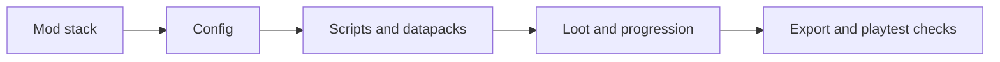

# Modpack Build {#modpack-build}

This page defines pack-side ownership. It covers mod assembly, config shaping, script and datapack placement, loot and progression structure, and local export checks. It does not own the site runtime itself.

## Workspace Snapshot {#workspace-snapshot}

The following facts are verified in the current instance:

| Item | Verified fact |
| --- | --- |
| version and loader | the current instance is `1.20.1` on `Forge` |
| KubeJS roots | both `kubejs/` and `local/kubejs/` exist, but the main authored content is under `kubejs/` |
| current script counts | `startup_scripts = 2`, `client_scripts = 1`, and `kubejs/server_scripts` is not present yet |
| current data resource count | `kubejs/data` currently contains `0` files |
| event stack | `mods/` already contains `EventJS-1.20.1-1.4.0.jar`, but there is still no project use of `NativeEvents`, `ServerEvents`, or `StartupEvents` in local scripts |
| TaCZ stack | the instance already ships `tacz`, `tacz-tweaks`, `tacz_turrets`, `taczaddon`, `taczammoquery`, and `taczjs` |

The main pack-side gap is not "choose more mods." It is turning `server_scripts` and datapack resources into real project content.

## Pack-Side Ownership {#pack-side-ownership}

Pack-side work owns only the following layers:

| Layer | Owns | Does not own |
| --- | --- | --- |
| mod stack | dependency choice and available system surface | ruin runtime rules |
| config layer | baseline behavior, feel, and default policies | long-term site truth |
| scripts and datapacks | tags, loot, progression glue, and server event entry points | formal runtime services |
| export and QA | confirming the instance starts, reloads, and plays correctly | design acceptance |

If the question is "which layer gets content into the instance," it starts here. If the question is "how does an activated site advance," it has already crossed into runtime ownership.

## KubeJS And Datapack Boundaries {#kubejs-and-datapack-boundaries}

The bundled `kubejs/README.txt` already defines the directory roles, and the first slice should follow them:

| Directory | Runtime boundary | Current state |
| --- | --- | --- |
| `kubejs/startup_scripts` | loads once during startup, suitable for startup-time registration | contains 2 files, but not formal site logic yet |
| `kubejs/server_scripts` | reloads with server resources, suitable for server events, loot, tags, and recipe changes | directory not present yet |
| `kubejs/data` | acts as a datapack directory for `loot_tables`, `tags`, `functions`, and other server resources | currently empty |
| `kubejs/client_scripts` | reloads with client resources, suitable for tooltips and client hints | currently holds 1 example-level script |

This boundary determines the first-slice landing order:

1. Content that should live as world resources goes into `kubejs/data` first.
2. Server-side glue that should iterate through `/reload` goes into `kubejs/server_scripts`.
3. Client hints can exist only after server-side truth already exists. They are not the primary logic layer.

## TaCZ Baseline And Authoring Guardrails {#tacz-baseline-and-guardrails}

The firearm baseline is already fixed. `TaCZ` is no longer an open question.

| Path or mod | Verified fact | Conclusion |
| --- | --- | --- |
| `mods/tacz-1.20.1-1.1.7-hotfix2.jar` | the main firearm base is already installed | the first slice should build directly on it |
| `mods/tacz-tweaks-2.13.1-all.jar`, `mods/tacz_turrets-1.1.2-all.jar`, `mods/taczaddon-1.20.1-1.1.7.jar`, `mods/taczammoquery-1.20.1-1.0.0.jar`, `mods/taczjs-forge-1.4.0+mc1.20.1.jar` | the current instance already layers several TaCZ extensions | the firearm surface is already wide enough; the first slice should narrow scope instead of adding more layers |
| `tacz/tacz-pre.toml` | `DefaultPackDebug = false` | editing the default pack directly should not be treated as the formal authoring path |
| `tacz/tacz_default_gun/gunpack.meta.json` | the live default gun pack namespace is `tacz` | project-owned gunpacks should not continue under that namespace |

The resulting rules are fixed:

1. The first slice keeps one shared firearm base instead of splitting into separate weapon systems.
2. A formal authoring flow should prefer a project-owned gunpack over long-term edits to `tacz_default_gun`.
3. With `DefaultPackDebug = false`, direct edits to the default pack are temporary experiments, not normal project workflow.

## First-Slice Gaps {#first-slice-gaps}

Given the current instance state, the first slice is still missing the following pack-side content:

| Gap | Current state | First landing area |
| --- | --- | --- |
| host and classification tags | `kubejs/data` has no project data yet | `kubejs/data/lost_civilization/tags/...` |
| loot and progression resources | no formal ruin resources exist yet | `loot_tables`, `advancements`, and any required `functions` |
| server-side glue | `kubejs/server_scripts` does not exist yet | activation submission, loot adjustment, progression steps, and server event bridges |
| local smoke test | no stable checklist exists yet | startup, `/reload`, instance entry, and one recovery completion |

That makes the first pack-side route short:

1. Lock the TaCZ authoring flow and namespace policy.
2. Add the minimum datapack resources.
3. Add the minimum `server_scripts` glue.
4. Only then expand client hints, additional weapon surface, or heavier presentation.

## Non-Goals {#non-goals}

- This page does not own the site runtime state machine.
- It does not own the long-term world ledger.
- It does not own site-stage advancement or resolution rules.
- It does not turn client hint layers into the source of server truth.

Pack documentation exists to get the project assembled into a playable instance, not to make runtime decisions on behalf of the runtime pages.
