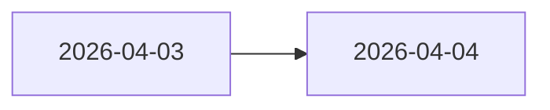

# 更新日志 {#changelog}

这里只记录会改变项目边界的变化。局部措辞、零散修字和临时试验不进入这里。

## 2026-04-04 {#2026-04-04}

### 永久文档正式化 {#documentation-formalization}

`zh-CN` 永久页面在这一天完成了一轮系统整理。重点不是新增页面数量，而是把原先分散在临时规划、展示写法和局部说明里的规则收回到正式页面。

这次整理的核心页面包括：

- 首页与顶层入口页。
- `Design` 下的主循环、伪副本、文明外壳和目录页。
- `ModdingDeveloping` 下的勘探与共鸣设计/实现页。
- `Developing`、`Grouping`、`Modpacking`、`Contribute` 的目录或规则页。

### 文档标准锁定 {#documentation-rules-locked}

同一天锁定了当前文档标准：

1. 标题统一使用显式英文锚点。
2. Mermaid 不再使用 `
` 或展示型换行技巧。
3. 正文优先写对象、阶段、数据结构和边界，不展示推导过程。
4. `ModdingDeveloping` 只写 Forge 侧运行时；pack、KubeJS 和数据包写回 `Modpacking`。
5. 文档统一使用"我们"这一人称，不再保留演示稿语气。

### 第一版方向澄清 {#first-slice-direction}

到这一天为止，第一版方向已经明确为：

- 主循环由前期发现、正式勘探、激活、现场运行、共鸣和回收组成。
- 现场模型采用本地伪副本，不采用独立地牢维度。
- 激活逻辑统一交给 `ActivationService`，不假定只有简单右键入口。
- 共鸣只做判定，tooltip 只能读取已保存快照。
- 继续使用 `TaCZ` 及其当前扩展，不拆成多套武器体系。

## 2026-04-03 {#2026-04-03}

### 文档结构建立 {#documentation-foundation}

项目在这一天完成了当前文档树的基础分区：

- `Developing`
- `Grouping`
- `Modpacking`
- `ModdingDeveloping`
- `Design`
- `Contribute`
- `Changelog`

这次分区把展示、开发、整合、运行时和贡献规则拆开，后续页面都以这些子树为固定入口。

### 核心主线收束 {#core-loop-consolidation}

同一天，项目主线被收束到一条明确链路：

- 考古负责把玩家导入遗址；
- 本地伪副本负责制造现场；
- 共鸣负责塑造处理方式；
- 回收与鉴定负责留下长期结果。

从这一天开始，考古不再承担完整遭遇表达，共鸣也不再被当成附属系统。
