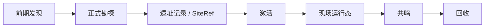

# 考古循环 {#archaeology-loop}

遗址主循环从前期发现开始，经过正式勘探、写入存档持久化数据、激活、现场运行、共鸣，最终在回收阶段闭合。每个阶段有严格的输入输出契约；前期发现与正式勘探的细节分界见 `ModdingDeveloping/Design/Survey`。



## 阶段契约 {#phase-contract}

| 阶段 | 输入 | 输出 | 边界 |
| --- | --- | --- | --- |
| 前期发现 | 环境载体、刷扫交互、线索节点 | 线索、材料、提示信息 | 不创建 `SiteRef`，不写正式记录 |
| 正式勘探 | 宿主结构、作者标记或显式宿主 | `DiscoveredSiteRecord`、待激活引用 | 不直接创建 live runtime |
| 激活 | 已记录遗址、激活提交面 | 激活上下文、实例占用关系 | 不重新判定遗址类型 |
| 现场运行态 | 激活上下文、运行态参数 | 压力、守卫、目标状态、局部同步 | 不写长期知识 |
| 共鸣 | 当前现场、遗物状态、doctrine | 状态修正、结算修正 | 不替代回收写回持久化数据 |
| 回收 | 现场结算、共鸣结果 | 遗物结果、记录、长期知识 | 不重写定位记录 |

## 阶段连接规则 {#phase-transition-rules}

1. 前期发现和正式勘探必须分离。前期发现负责教学、线索和材料，不承担正式实例化；否则环境节点会同时承担教学、定位和持久化，后续无法处理耗尽态与反自动化规则。
2. 正式勘探必须先生成正式记录，再进入激活。激活、现场运行、共鸣和回收都需要同一条实例引用；没有正式记录，后续阶段只能围绕"一个大致地点"工作。
3. 激活只负责提交与接管，不负责重新判定遗址类型。遗址类型和锚点必须在勘探阶段确定，否则道具入口、装置入口和机器入口会出现分歧。
4. 现场运行态只保存短生命周期状态。压力、守卫、阶段推进和局部同步属于运行态；遗址身份、锚点和生命周期记录属于存档持久化数据。这样区块卸载不会误删遗址。
5. 共鸣位于现场运行之后、回收之前。它读取当前现场与遗物状态，产出状态修正和结算修正；如果提前到现场之前，共鸣会退化成静态词条。
6. 回收负责把一次行动写回长期层。遗物结果、碎片、记录和 tooltip/图鉴推进都在这里写回存档持久化数据；否则主循环无法闭合。

## 遗址定位与记录 {#site-location-and-recording}

`1.20.1` 下，这条链可以直接落到已验证 API 上，顺序固定如下：

| 步骤 | 已验证 API | 作用 | 顺序理由 |
| --- | --- | --- | --- |
| 粗定位 | `ServerLevel.findNearestMapStructure(TagKey<Structure>, BlockPos, int, boolean)` | 找到最近的宿主候选 | 先确定宿主范围，避免把群系误当实例入口 |
| 结构片段验证 | `StructureManager.getStructureWithPieceAt(BlockPos, TagKey<Structure>)` | 确认命中点真的落在结构片段内 | 只有通过片段验证，锚点和实例才有意义 |
| 群系读取 | `LevelReader.getBiome(BlockPos)` | 读取 `Holder<Biome>` 参与类型修正 | 群系只做修正，不单独生成实例 |
| 区块索引 | `ChunkPos.asLong(BlockPos)` | 建立覆盖区块索引 | 用统一 chunk key 支撑同步和缓存 |
| 存档持久化数据入口 | `ServerLevel.getDataStorage()` + `DimensionDataStorage.computeIfAbsent(...)` | 创建或读取维度级 `SavedData` | 正式记录必须进入稳定持久化入口 |

结构提供宿主和空间边界；群系提供类型偏向；存档持久化数据把这次定位结果写成一条可追踪记录。这三层不能互相替代。

## 遗址存档持久化数据 {#site-ledger}

这份存档持久化数据必须能回答四个问题：这座遗址位于哪个维度和哪个锚点；它被识别成哪一种遗址类型；它当前处于发现、待激活、运行中、已完成还是已失效；哪个玩家或激活上下文正在占用它。

最小记录结构可以先定成下面这样：

```java
public record SiteCoordinate(
        ResourceKey<Level> dimension,
        BlockPos anchor
) {}

public record DiscoveredSiteRecord(
        String siteTypeId,
        SiteCoordinate coordinate,
        long discoveredGameTime,
        DiscoveryState state
) {}
```

## 存档持久化数据结构 {#ledger-structure}

存档持久化数据采用"记录表 + 索引表"的拆分方式：

```java
public final class SiteLedgerSavedData extends SavedData {
    private final Map<SiteCoordinate, DiscoveredSiteRecord> recordsByCoordinate = new HashMap<>();
    private final Map<Long, Set<SiteCoordinate>> coordinatesByChunk = new HashMap<>();
    private final Map<UUID, SiteCoordinate> activeSiteByOwner = new HashMap<>();
}
```

| 字段 | 作用 |
| --- | --- |
| `recordsByCoordinate` | 遗址记录表，回答某个锚点当前是什么状态 |
| `coordinatesByChunk` | 查询索引，服务区块同步、局部缓存和覆盖范围检查 |
| `activeSiteByOwner` | 占用索引，回答某个玩家或上下文当前绑定了哪一座遗址 |

三张表分别对应"记录""查询""运行中绑定"。混成一个 map，要么查不快，要么状态会互相覆盖。

## 不变量 {#invariants}

| 不变量 | 说明 |
| --- | --- |
| 同一维度下，同一锚点只能对应一条记录 | 保证勘探、激活和回收引用的是同一座遗址 |
| 正式记录不随区块卸载删除 | 区块生命周期不是遗址生命周期 |
| 运行态必须能反查到正式记录 | 结算阶段必须知道结束的是哪一座遗址 |
| 短标记只作为过渡入口 | 长期模型必须回到正式记录和坐标 |

## 群系与结构的优先级 {#biome-structure-priority}

优先级如下：

1. 宿主结构决定该地点是否具备遗址资格。
2. 结构片段验证决定当前点位是否命中有效范围。
3. 群系标签只负责类型修正、权重修正和文明外壳偏向。
4. 最终实例主键始终来自 `维度 + 锚点`，不是"结构名 + 群系名"的临时组合。

结构提供稳定宿主和空间边界；群系只提供环境语义。如果让群系先行，实例主键会变成软条件，后续存档持久化数据、同步和注册都不稳定。

## 新增遗迹类型的最低要求 {#minimum-requirements-for-new-ruin-types}

新增遗迹类型必须一次性声明完整定义，而不是把逻辑散落到脚本、resolver 和 tooltip。

| 项目 | 最低要求 |
| --- | --- |
| 稳定 id | 例如 `lost_civilization:contaminated_ruin` |
| 宿主规则 | 结构 tag、作者标记或显式宿主 |
| 锚点规则 | 搜索半径、锚点求解和精验证方式 |
| 运行态参数 | 压力、守卫、目标节点、覆盖区块范围 |
| 回收规则 | 遗物族、记录类型和最小结算结果 |
| 共鸣差异 | 至少一条能够影响处理或结算的差异 |

缺少任何一项，这个类型都还不是可注册条目，只是概念草案。

## 失败与部分成功 {#failure-and-partial-success}

- 撤退可以保留碎片、样本或部分记录，但不能给出完整结算。
- 现场崩盘应降低回收质量，而不是保持与完全成功相同的结果。
- 失败必须回写可学习信息，例如压力特征、共鸣反应或遗址倾向；否则失败不会形成下一次行动的准备价值。

## 第一版范围 {#first-version-scope}

第一版只要求一条可信竖切片：

- 一个宿主结构与一个群系方案。
- 一条正式勘探写入存档持久化数据的路径。
- 一条激活路径和一套现场运行态参数。
- 一类能被共鸣影响的遗物和一条回收写回路径。

只要这条切片能稳定走完"发现 -> 写入存档持久化数据 -> 激活 -> 运行 -> 共鸣 -> 回收"，主循环就算成立。
