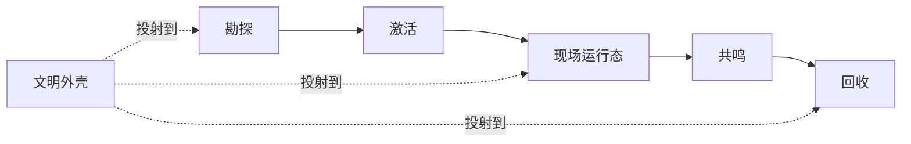

# 设计目录 {#design-catalogue}

第一版设计主线就是主循环、现场模型和文明外壳。

## 关键页面 {#scope}

| 页面 | 核心内容 |
| --- | --- |
| `ArchaeologyLoop` | 主循环阶段边界、记录链和存档持久化数据结构 |
| `PseudoInstance` | 第一版现场运行模型、覆盖范围和生命周期 |
| `CivilizationShell` | 文明身份如何投射到线索、激活、压力和回收 |
| `ModdingDeveloping/Design/Survey` | 前期发现与正式勘探的分界、节点规则和正式持久化顺序 |

## 固定前提 {#locked-decisions}

1. 考古负责把玩家导入遗址，不替代现场运行、共鸣和回收。
2. 正式勘探必须先生成正式记录，再进入激活。
3. 第一版现场模型采用伪副本，而不是独立维度。
4. 文明外壳负责投射身份，不重写主循环状态机。
5. 文明差异继续沿用 TaCZ 这一套枪械系统，不拆成多套互不兼容的战斗系统。
