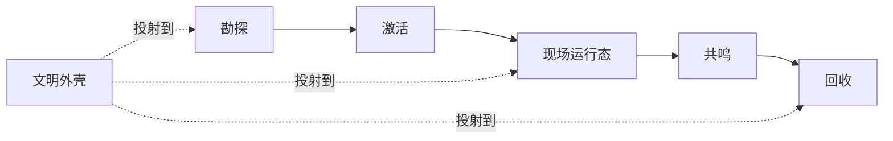

# 设计目录 {#design-catalogue}

本子树只定义对象、阶段和约束。实现位置与当前状态移交到实现页，不在这里记录。

## 子树范围 {#scope}

`Design` 子树覆盖四类问题：

| 页面 | 定义什么 | 不定义什么 |
| --- | --- | --- |
| `ArchaeologyLoop` | 主循环阶段边界、记录链和账本结构 | 具体前期节点交互 |
| `PseudoInstance` | 第一版现场运行模型、覆盖范围和生命周期 | 维度副本方案 |
| `CivilizationShell` | 文明身份如何投射到线索、激活、压力和回收 | 独立战斗系统 |
| `ModdingDeveloping/Design/Survey` | 前期发现与正式勘探的分界、节点规则和正式入账顺序 | 现场运行态内部逻辑 |

## 已锁定结论 {#locked-decisions}

第一版已经锁定的结论如下：

1. 考古负责把玩家导入遗址，不替代现场运行、共鸣和回收。
2. 正式勘探必须先生成正式记录，再进入激活。
3. 第一版现场模型采用伪副本，而不是独立维度。
4. 文明外壳负责投射身份，不重写主循环状态机。
5. 文明差异建立在共享枪械底座之上，不拆成多套互不兼容的战斗系统。

这些结论是后续设计页的共同前提，不在子页面里反复重开。

## 阅读顺序 {#reading-order}

建议按下面顺序阅读：

1. 先读 `ArchaeologyLoop`，确认主循环和账本边界。
2. 再读 `ModdingDeveloping/Design/Survey`，确认前期发现与正式勘探如何分开。
3. 然后读 `PseudoInstance`，确认第一版现场如何在原世界落地。
4. 最后读 `CivilizationShell`，确认文明差异如何挂到同一主循环上。

如果问题落在“这一步应该写进哪个对象、哪个阶段、哪个索引”，先回到 `ArchaeologyLoop`，不要直接在子页面里补局部规则。

## 本子树不做什么 {#non-goals}

`Design` 子树明确不承担以下内容：

- 不写实现状态说明。实现现状放到 `ModdingDeveloping/Implementation`。
- 不写整合包配方、模组清单和资源侧组织。那是 `Modpacking` 子树的职责。
- 不写站内展示型摘要卡片来替代正文。
- 不写只负责“显得有思路”但无法落到对象、阶段或数据结构上的段落。
- 不能回答对象、阶段或索引问题的内容，不进入本子树。
