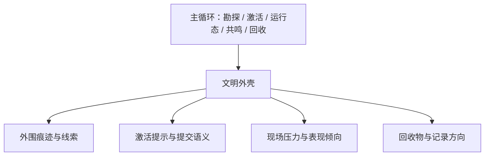

# 文明外壳 {#civilization-shell}

文明外壳是遗址的可见层。它让玩家读出"这是谁留下的遗址"，并把这种身份稳定投射到线索、激活提示、现场压力倾向和回收结果里。勘探、激活、运行态、共鸣、回收本身的逻辑由主循环负责，外壳不介入。

## 框架与外壳的分工 {#framework-and-shell-split}

| 层 | 负责什么 | 不负责什么 |
| --- | --- | --- |
| 主循环框架 | 勘探、激活、现场运行、共鸣、回收、鉴定 | 不提供文明身份 |
| 文明外壳 | 外围痕迹、线索物、激活提示、压力表现、回收方向 | 不重写主循环状态机 |

文明外壳必须建立在主循环之上，而不是与主循环并列。如果一个文明方案只能提供美术或设定词，而不能投射到规则层，它就不是外壳定义，只是叙述素材。

## 保留型与痕迹型文明 {#preserved-and-trace-based-civilizations}

文明外壳按可见度分为两类：

| 类型 | 表现特征 | 设计用途 |
| --- | --- | --- |
| 保留型文明 | 地标更完整、外围痕迹更集中、信号更清晰 | 适合作为第一批方案和入门型遗址 |
| 痕迹型文明 | 信号更弱、材料更碎、异常更分散、识别更依赖经验 | 适合作为后续内容和高阶勘探目标 |

这个分类解决的是"信息密度"问题，不是"强弱等级"问题。保留型更适合第一版，是因为它更容易验证线索、激活提示和回收方向是否形成闭环。

## 第一版方案 {#first-version-template}

第一版外壳方案应采用单一、明确、可验证的倾向，不同时追求多文明并行。

| 项目 | 第一版要求 |
| --- | --- |
| 外壳类型 | 保留型 |
| 身份倾向 | 机械倾向 |
| 宿主环境 | 干燥恶地边缘或风化高地 |
| 宿主结构 | 带标签的 `trail_ruins` 或再利用的观察点结构 |
| 外围痕迹 | 锈蚀铜桩、损坏勘探柱、坍塌观测台 |
| 线索物 | 带刻度石板碎片、校准板、损坏过滤件 |
| 激活提示 | 提交面应体现校准、对位或校验语义 |
| 压力倾向 | `Contamination` 为主，辅以少量 `Instability` |
| 回收方向 | 过滤类遗物残片、腐蚀样本、物流记录板 |

第一版方案的任务不是讲完整文明史，而是验证外壳是否能稳定映射到定位、识别、激活、运行和回收。

## 数据落点 {#data-persistence-points}

文明外壳至少要落到以下规则层：

| 层 | 该放什么 |
| --- | --- |
| 结构层 | 更容易成为宿主的结构 tag 或作者标记 |
| 群系层 | 更容易出现某类痕迹的 biome tag |
| 线索层 | 勘探前即可读的碎片、桩柱、残骸、石板 |
| 激活层 | 激活提示、提交语义和常见交互对象 |
| 运行层 | 压力分布、守卫风格、表现语气 |
| 回收层 | 记录类型、残片类型和鉴定文本方向 |

如果一个外壳定义不能同时投射到以上几层，它就无法在主循环中保持一致性。

## TaCZ 的使用方式 {#shared-gun-base}

项目继续使用 `TaCZ` 这一套枪械系统。文明差异不通过独立武器体系表达，而通过下列参数表达：

| 维度 | 机械倾向的表达方式 |
| --- | --- |
| 压力处理 | 更强调控场、抑制和现场稳定 |
| 激活语义 | 更强调校准、对位、过滤和校验 |
| 共鸣倾向 | 更偏向稳定化、导流和压制 |
| 失败形态 | 更偏向泄露、故障和结构崩坏 |
| 回收结果 | 更偏向可分类的零件、记录和污染样本 |

继续使用同一套枪械系统，能把文明差异留在主循环里，避免项目拆成多套互不兼容的战斗系统。

## 灵感边界 {#inspiration-boundary}

可借鉴的内容只包括规模感、教义感、危险机器感和高压作战氛围。不得直接复用现成作品中的名称、阵营、标识或世界观结构。

如果一个文明方案必须先完成大规模结构美术、完整设定文本和大量专属资产才能成立，它就不应排在第一条竖切片之前。

## 验收条件 {#acceptance-criteria}

- 外围线索能提升遗址识别度，并引导玩家进入正式勘探。
- 同一主循环在不同外壳下能呈现可辨识的激活、压力和回收差异。
- 外壳能通过标签、线索物和少量显式节点表达，不依赖大规模美术资产。
- 新增外壳时，新增成本明显低于它带来的可读性和玩法差异。
