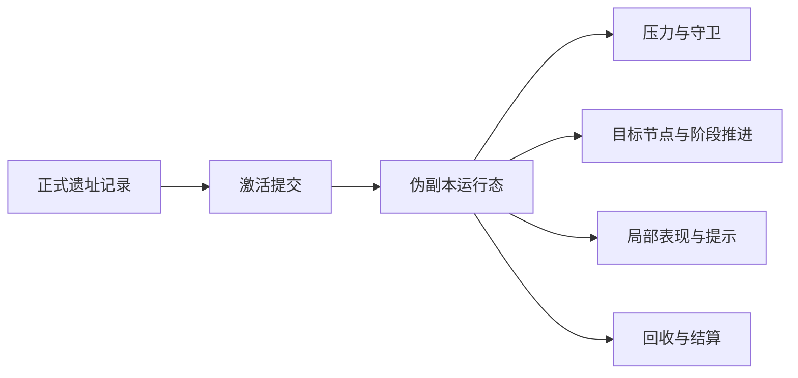

# 伪副本 {#pseudo-instance}

伪副本是第一版遗址现场的运行模型：以正式遗址记录为起点，在原世界宿主结构上建立一段受控、可回收、可清场的现场运行态。它不是独立维度，也不是某个右键动作的放大版。



## 采用边界 {#adoption-boundary}

第一版采用伪副本，而不直接采用独立维度，原因只有三条：

1. 我们已经有可复用的宿主结构，不需要先做一套新地牢地图。
2. 第一版重点是验证激活、现场压力、目标推进和回收闭环，不是验证传送与分离空间。
3. 伪副本已经足够承载一段十到二十分钟的现场行动，成本明显低于独立维度方案。

对应边界如下：

| 方案 | 第一版是否采用 | 结论 |
| --- | --- | --- |
| 本地伪副本 | 是 | 第一条正式竖切片 |
| 本地封锁遗址 | 否 | 在伪副本稳定后再加强边界感 |
| 独立地牢维度 | 否 | 留给后续扩张，不进入第一版 |

## 长期记录与短期运行态 {#ledger-and-runtime-split}

伪副本必须与存档持久化数据拆开。`SavedData` 负责长期记录，伪副本只负责短生命周期状态。

| 层 | 主键 | 保存什么 |
| --- | --- | --- |
| 跨阶段引用 | `SiteRef` | 正式勘探、激活和回收之间的统一引用 |
| 遗址正式记录 | `SiteCoordinate` | 遗址身份、锚点、生命周期、正式记录 |
| 运行态注册表 | `SiteCoordinate` | 当前是否激活、由谁占用、当前阶段、局部缓存 |
| 区块副索引 | `long chunkKey` | 这个 chunk 当前覆盖了哪些现场 |

`ActivationService` 先用 `SiteRef` 解析到对应正式记录，再归一到同一条 `SiteCoordinate`。长期记录与运行态一旦混写，区块卸载、撤退结算和重复激活就会互相污染。

推荐的运行态注册表如下：

```java
public final class SiteRuntimeRegistry {
    private final Map<SiteCoordinate, ActiveSiteRuntime> runtimeBySite = new HashMap<>();
    private final Map<Long, Set<SiteCoordinate>> sitesByChunk = new HashMap<>();
    private final Map<UUID, SiteCoordinate> siteByOwner = new HashMap<>();
}
```

- `runtimeBySite` 回答一座遗址当前是否在运行。
- `sitesByChunk` 支撑局部同步、缓存清理和覆盖范围查询。
- `siteByOwner` 保证同一玩家或队伍不会同时占用多座正式遗址。

## 覆盖范围与 chunk 索引 {#coverage-and-chunk-index}

伪副本在玩法上表现为一处现场，在实现上表现为一组被覆盖的 chunk。第一版可以直接建立在已验证 API 上：

| 作用 | 已验证 API | 用法 |
| --- | --- | --- |
| 主 chunk 键 | `ChunkPos.asLong(BlockPos)` | 以锚点生成稳定 `chunkKey` |
| 覆盖范围展开 | `ChunkPos.rangeClosed(ChunkPos, int)` | 按现场半径换算成 chunk 半径并展开 |
| 卸载清理 | `ChunkEvent.Unload` | 只清局部缓存与表现挂钩，不删正式遗址记录 |

实现顺序固定如下：

1. 用遗址锚点计算 `primaryChunkKey`。
2. 把现场半径换算成 `chunkRadius`。
3. 以 `new ChunkPos(anchor)` 为中心，用 `ChunkPos.rangeClosed(centerChunk, chunkRadius)` 展开 `coveredChunkKeys`。
4. 把 `coveredChunkKeys` 注册到 `sitesByChunk`，供同步与清理使用。

`ChunkEvent.Unload` 的职责也要限定清楚。它负责清掉某个 chunk 上的临时缓存、局部生成物索引和渲染挂钩，不负责删掉整条遗址，也不负责改写持久化数据状态。

## 激活入口与现场服务 {#activation-entry-and-runtime-services}

激活入口可以来自道具、机器或现场装置，但这些入口都不应该各自实现一套现场启动逻辑。第一版统一交给 `ActivationService`。

| 服务 | 负责什么 | 不负责什么 |
| --- | --- | --- |
| `ActivationService` | 校验 `SiteRef`、占用关系和激活条件，创建运行态 | 不重新判定遗址类型 |
| `PressureRuntimeService` | 压力、守卫和阶段性危险 | 不写长期记录 |
| `ObjectiveRuntimeService` | 目标节点、推进条件和完成判定 | 不接管回收结算 |
| `SiteFeedbackService` | 雾、音效、提示和局部表现 | 不持有正式状态 |
| `RecoveryService` | 结算、回收写回、运行态注销 | 不负责现场内的阶段推进 |

这层拆分固定两条约束：

1. 激活来源可以继续增加，但现场启动路径始终只有一条。
2. 运行态服务围绕同一个 `ActiveSiteRuntime` 协作，不各自维护第二份现场状态。

## 生命周期 {#lifecycle}

伪副本的生命周期分五步：

1. 正式勘探写入 `DiscoveredSiteRecord`，并输出 `SiteRef`。
2. 激活层把 `SiteRef` 交给 `ActivationService`，校验占用关系与现场条件。
3. 运行态注册表创建 `ActiveSiteRuntime`，并登记 `runtimeBySite`、`sitesByChunk`、`siteByOwner`。
4. 现场服务在覆盖范围内推进压力、目标和反馈，直到完成、撤退或崩盘。
5. `RecoveryService` 结算结果、写回存档持久化数据、注销运行态并清空局部索引。

运行态结束时删除的是运行态注册，不是遗址正式记录。遗址是否完成、失效或允许再次进入，必须回到存档持久化层判定。

## 第一版不做什么 {#out-of-scope}

第一版伪副本明确不包含以下能力：

- 不做传送到独立维度。
- 不做世界复制或临时地图实例。
- 不让激活入口自己决定遗址类型。
- 不让区块事件直接改写正式记录。
- 不把外围前期发现节点混入正式现场生命周期。

## 验收条件 {#acceptance-criteria}

- 我们可以在原世界宿主结构上启动一段正式现场，而不需要传送到新维度。
- 激活、运行态和回收始终围绕同一条 `SiteRef` 与 `SiteCoordinate` 工作。
- 覆盖范围、同步和缓存清理由 chunk 副索引支撑，而不是靠临时扫描整个世界。
- 现场结束后，运行态会被正确注销，正式记录仍然保留。
