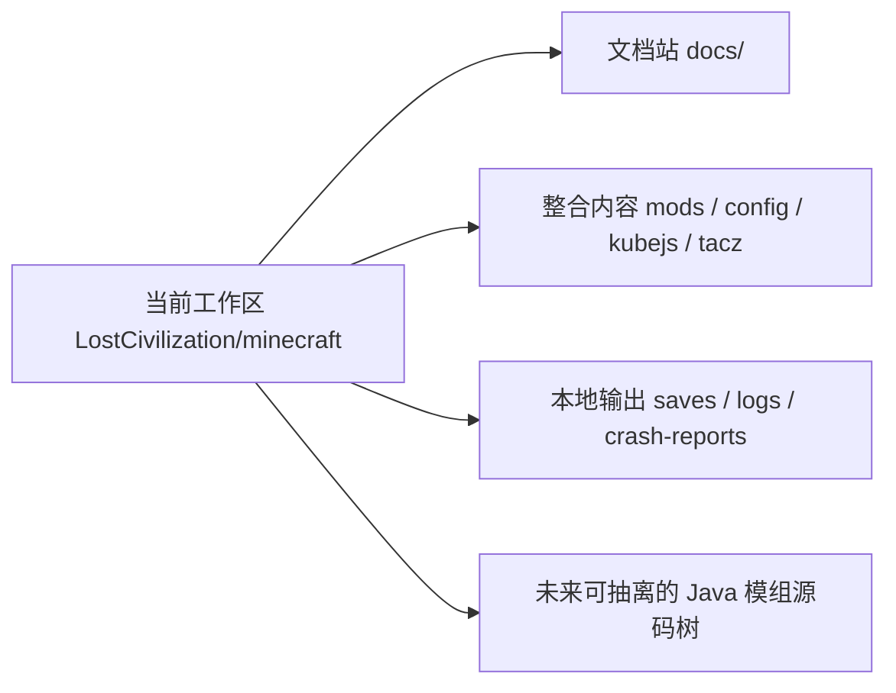

# 架构 {#architecture}

失落文明当前就在同一个 PrismLauncher 实例目录里协作。`docs/`、整合内容和本地联调输出共存，这就是现在的真实结构。我们先把这件事写清，再谈后续是否拆分。

## 当前工作区基线 {#current-workspace-baseline}

| 路径 | 当前角色 | 备注 |
| --- | --- | --- |
| `docs/` | 长期文档站点 | 这里记录设计、实现、流程和变更 |
| `mods/` | 运行时模组清单 | 用来核对当前整合包的实际依赖 |
| `config/` | 整合配置 | 属于可玩的整合层 |
| `kubejs/` | 脚本、数据包和整合胶水 | 属于 pack 工作面，不是 Forge runtime |
| `local/kubejs/` | 本地导出与局部缓存工作面 | 不作为正式项目入口 |
| `tacz/` | TaCZ 相关工作目录 | 属于整合层素材与配置 |
| `tacz_backup/` | 本地备份面 | 只说明历史留存，不代表当前激活内容 |
| `docs/notes`、`docs/specs`、`docs/plans` | 草稿与过渡文档 | 可作为输入，但不是长期真相入口 |
| `saves/`、`logs/`、`crash-reports/` | 本地联调输出 | 不是长期真相来源 |
| 未来 Java 源码树 | 自定义运行时 | 当前还没有独立源码目录 |

该表只区分两件事：目录是否存在，以及它是否是正式入口。

## 当前目录分类 {#current-directory-classification}

如果按职责而不是按文件系统看，当前目录可以先分成四类：

| 类型 | 当前目录 | 应怎么对待 |
| --- | --- | --- |
| 长期入口 | `docs/` | 直接维护、长期引用 |
| pack 主工作面 | `mods/`、`config/`、`kubejs/`、`tacz/` | 视为当前实例的正式整合内容 |
| 本地辅助与备份 | `local/`、`tacz_backup/`、`server-resource-packs/`、`resourcepacks/` | 只在需要时核对，不当成主入口 |
| 联调输出 | `saves/`、`logs/`、`crash-reports/`、`screenshots/` | 作为证据，不作为规则来源 |

目录分类的用途，是阻止文档把临时目录、备份目录和联调输出误写成正式责任面。

## 三个技术面 {#three-technical-layers}

虽然当前只有一个工作区，但技术上仍然有三类内容。我们用内容边界区分它们，不用目录名假装它们已经拆仓。

| 技术面 | 负责什么 | 不负责什么 |
| --- | --- | --- |
| 文档面 | 设计规则、实现契约、贡献流程、变更记录 | 运行时真相本身 |
| 整合面 | 模组组合、脚本、数据包、配置、资源覆盖 | 长生命周期 Java 运行态 |
| Java 运行时 | 遗址账本、活跃运行态、共鸣、持久化、同步 | 配置覆盖和脚本式整合胶水 |

这三面当前共享一个目录树，但不共享同一类事实：

- 文档面负责解释；
- 整合面负责装配；
- Java 运行时负责长期状态与行为。

把三者写成一层，会直接导致 `Modpacking` 和 `ModdingDeveloping` 互相踩边界。

## 内容归属规则 {#content-ownership-rules}

| 如果改动主要是…… | 归属到哪里 |
| --- | --- |
| 页面、术语、流程、契约 | `docs/` |
| 配置、脚本、数据包、资源覆盖 | 当前工作区中的整合内容 |
| 世界账本、运行态注册表、tick、同步、tooltip 读取模型 | 未来 Java 模组源码树 |

判断归属时，建议按下面顺序：

1. 先看它现在真实落在哪个目录。
2. 再判断它属于哪一条技术面。
3. 最后决定页面该写到 `Developing`、`Modpacking` 还是 `ModdingDeveloping`。

归属按责任判断，不按“它是不是代码”判断。`kubejs/` 虽然也是代码，但它仍然属于整合面，不属于 Forge 运行时。

## 当前文档的立场 {#document-position}

1. 当前真实形态是“同一工作区协作”，不是“三仓已经存在”。
2. 文档写路径时，应优先引用当前实例里的真实路径。
3. 如果提到未来抽离，必须明确那是后续演进，不是当前基线。
4. 草稿目录可以作为输入，但不能代替正式页面。
5. 备份目录和本地导出目录不能被写成项目主入口。

## 何时值得抽离 Java 模组 {#when-to-extract-the-java-mod}

满足下面任意两条，再考虑把 Java 运行时从当前工作区抽出去：

| 条件 | 含义 |
| --- | --- |
| 运行态类开始稳定增长 | 已经出现固定的包结构、测试和发布节奏 |
| 需要独立测试与版本管理 | 不再适合只靠整合包联调 |
| 数据所有权已经清楚 | `SavedData`、chunk 辅助数据、客户端同步边界已经固定 |
| 整合层和运行时迭代频率分离 | pack 更新与 Java 逻辑更新不再同步 |

在那之前，我们保持一个工作区，但文档中的责任边界不能混。
