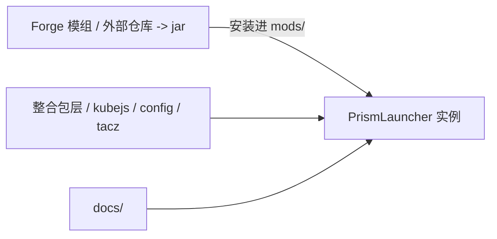

# 架构 {#architecture}

现在这套项目可以先看成三块：Forge 模组、整合包实例和文档。

Forge 模组是独立的 Java 项目。遗址数据、运行时逻辑、共鸣系统和持久化都在那边处理；开发也不在这个目录里，它有自己的仓库和构建流程。

整合包这一层就在当前 PrismLauncher 实例里。`kubejs` 脚本、配置、TaCZ 素材和资源覆盖都在这里处理。整合工作也是在这里完成：用脚本把模组行为串起来，调整配置，补资源。

文档放在 `docs/` 里，覆盖整个项目：设计规则、实现契约、遗址循环和贡献流程。

## 各层职责 {#layer-responsibilities}

| 层 | 位置 | 负责什么 |
| --- | --- | --- |
| Forge 模组 | 外部仓库 | 遗址记录、运行时、共鸣、持久化、同步 |
| 整合包 | `kubejs/`、`config/`、`tacz/` | 脚本、数据包、配置、资源覆盖 |
| 文档 | `docs/` | 设计规则、实现契约、变更记录 |

整合包层通过 KubeJS 绑定和配置与模组通信，两层都不拥有对方的状态。

## 本地目录 {#local-directories}

`saves/`、`logs/`、`crash-reports/`、`screenshots/` 是联调输出，`local/kubejs/` 和 `tacz_backup/` 是临时目录。这些目录都不是规则来源。

## 内容归属 {#content-ownership-rules}

设计规则、流程和契约的改动写进 `docs/`。脚本和配置在实例里改。运行时逻辑的改动回到模组自己的仓库里。

`kubejs/` 虽然也是代码，但归属整合包层，不是 Forge 运行时。
