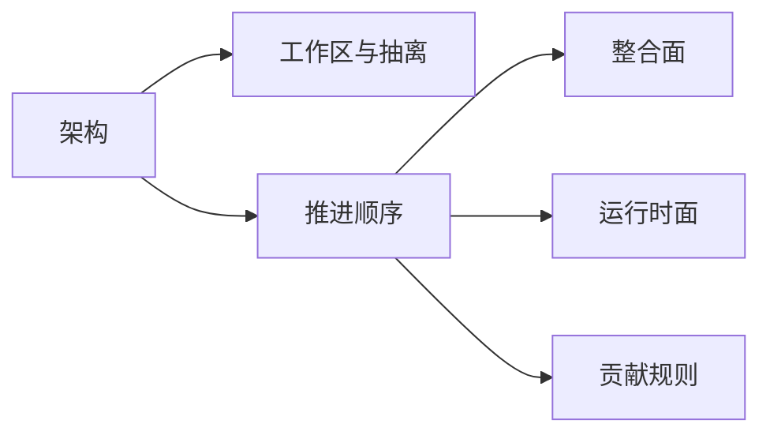

# 开发 {#development}

这个子树处理的是“当前工作区怎么组织”和“不同类型的问题该先去哪里”。它不讨论具体玩法规则，而是讨论责任线。

## 这个子树解决什么 {#scope}

| 问题 | 先读哪里 |
| --- | --- |
| 当前实例里哪些目录代表什么 | `Architecture` |
| 为什么现在还是单工作区 | `Repositories` |
| 开发顺序和阶段门槛 | `Workflow` |
| 文档、pack、runtime 该怎么分线 | `Architecture`，然后对应子树 |

## 当前责任线 {#current-responsibility-lines}

当前只有一个联调工作区，但责任线已经固定为三条：

| 责任线 | 主要内容 |
| --- | --- |
| 文档线 | 设计规则、实现契约、流程和变更记录 |
| pack 线 | 模组装配、配置、KubeJS、数据包和资源覆盖 |
| runtime 线 | Forge 侧账本、活跃运行态、同步、共鸣和回收 |

目录可以暂时共存，责任线不能混。

## 判断顺序 {#decision-order}

遇到一个问题时，建议按下面顺序判断：

1. 它现在真实落在哪个目录。
2. 它长期应该由哪条责任线拥有。
3. 它属于哪一个子树。
4. 这次改动是否会影响入口页或 changelog。

只要第二步和第三步没答清，就先不要写具体页面。
