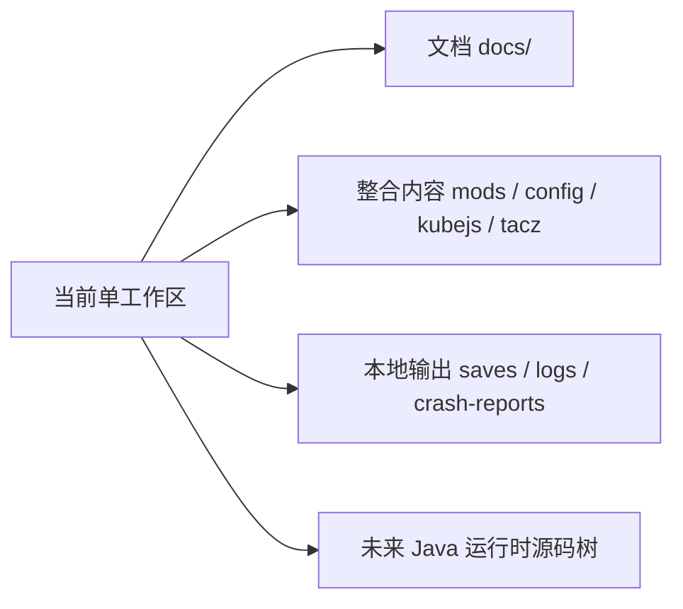

# 仓库 {#repositories}

现在还不是三个并列仓库的状态。眼下只有一个联调工作区，也就是这个 Prism 实例目录。文档也应该按这个现实来写，不用先替未来结构铺路。

## 当前事实 {#current-facts}

| 事实 | 说明 |
| --- | --- |
| 当前根目录不是独立源码仓库 | 当前以实例目录作为协作根 |
| `docs/` 与 pack 内容共存 | 文档和整合层现在就在同一工作区 |
| Java 运行时还没有独立源码树 | 所以运行时对象暂时只能先在文档里把边界写清 |

## 当前管理方式 {#current-management}

| 内容类别 | 当前承载位置 | 当前规则 |
| --- | --- | --- |
| 文档 | `docs/` | 作为长期规则和契约页面维护 |
| 整合包内容 | `mods/`、`config/`、`kubejs/`、`tacz/` 等 | 只写当前实例真实存在的内容 |
| Java 运行时 | 未来的独立源码树 | 现在先在 `ModdingDeveloping` 中定义对象和契约 |

这三块内容现在共用一个工作区，但各自描述的是不同类型的事实，别写混。

## 何时值得拆分 {#when-to-split}

如果后面要拆仓库，先看的不是名字，而是责任线有没有稳定下来。

| 拆分目标 | 触发条件 | 拆分后应拥有的内容 |
| --- | --- | --- |
| 文档仓库 | 文档需要独立发布、评审和版本线 | `docs/` 与其构建配置 |
| 整合仓库 | pack 需要独立打包、分发和回归 | 模组清单、配置、KubeJS、数据包、资源覆盖 |
| Java 模组仓库 | 运行时类、测试和发布节奏稳定 | `src/main/java`、`src/main/resources`、测试代码 |

## 现在不能提前写死的东西 {#things-not-to-freeze-early}

1. 不要先写三个仓库名，再让正文倒过来配合它们。
2. 不要把未来的 Java 源码目录写成当前目录事实。
3. 不要让 `ModdingDeveloping` 去解释当前 `kubejs/` 目录。

## 判断规则 {#decision-rules}

| 问题 | 先看哪里 |
| --- | --- |
| 这段内容现在落在哪 | 当前工作区中的真实路径 |
| 这段逻辑以后归谁负责 | 文档、整合包内容或运行时 |
