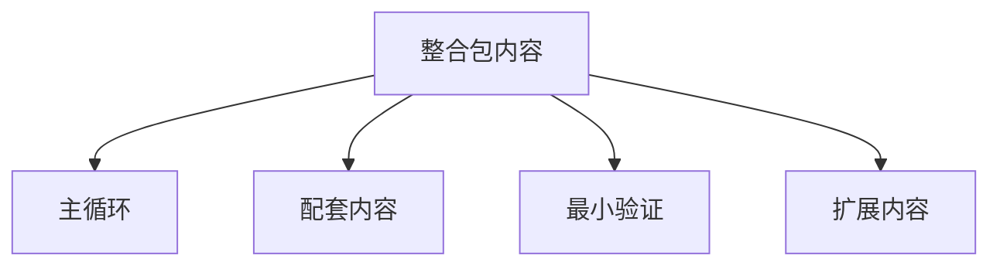

# 分组 {#grouping}

分组直接决定第一版预算和扩张顺序。

## 分组定义 {#group-definitions}

| 分组 | 判定问题 | 第一版典型内容 |
| --- | --- | --- |
| 主循环 | 没了它，项目还像不像 Lost Civilization | 前期发现 -> 正式勘探 -> 激活 -> 现场运行 -> 共鸣 -> 回收 |
| 配套内容 | 它是否让主循环更可跑、更可读、更可维护 | 宿主结构标签、tooltip 层、探测与激活适配、持久化数据与索引 |
| 最小验证 | 它是否是第一版必须具备的最小内容 | 一个宿主路径、一个正式遗址类型、一类遗物、一组目标节点 |
| 扩展内容 | 它是否只是在主循环成立后增加变体、规模或观感 | 更多文明、重 worldgen、额外表现层、可选复杂度 |

这四组里，只有主循环决定“我们在做什么”。另外三组都服务于它，不与它并列。

## 判定顺序 {#classification-order}

新增一个系统、一组模组或一批内容时，按下面顺序判断：

1. 它是否直接参与主循环闭环。如果是，先看它属于主循环还是最小验证。
2. 如果它不直接参与闭环，它是否让闭环更稳定、更可读或更容易落地。如果是，它属于配套内容。
3. 如果它既不闭环也不支撑，只是在增加种类、规模或表现，它就属于扩展内容。

判定时不要反过来。从“它看起来重要”出发，几乎一定会把扩展内容误判成主循环。

## 预算规则 {#budget-rules}

第一版预算按下面顺序分配：

1. 先保主循环。
2. 再补足配套内容。
3. 然后补最小验证。
4. 扩展内容最后进入排期。

如果某个扩展项挤压了主循环或配套内容的时间，它就应该延期，而不是硬塞进第一版。

## 常见误判 {#common-misclassifications}

- 把“更多文明条目”当成主循环。第一版真正的重点是主循环，不是文明数量。
- 把“更重的 worldgen 改造”当成最小验证。能证明主循环的，是一条可玩的宿主路径，不是整张世界都被重写。
- 把“更强的视觉表现”当成配套内容。只有当它直接提升可读性或交互判断时，它才属于配套内容；否则仍然是扩展内容。
