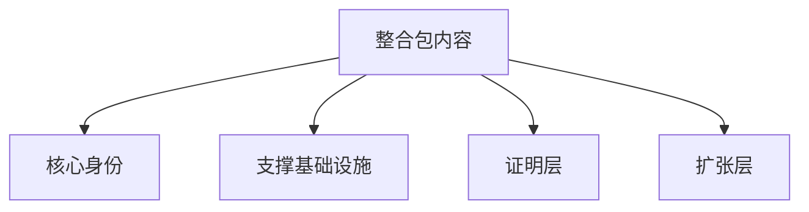

# 分组 {#grouping}

分组的作用不是把内容重新排版一次，而是决定预算先给谁。只要分组失真，项目就会重新塌成一张没有轻重缓急的 mod 清单。

## 分组定义 {#group-definitions}

| 分组 | 判定问题 | 第一版典型内容 |
| --- | --- | --- |
| 核心身份 | 没了它，项目还像不像 Lost Civilization | 前期发现 -> 正式勘探 -> 激活 -> 现场运行 -> 共鸣 -> 回收 |
| 支撑基础设施 | 它是否让核心循环更可跑、更可读、更可维护 | 宿主结构标签、tooltip 层、探测与激活适配、账本与索引 |
| 证明层 | 它是否是第一条竖切片为了证明自己必须具备的最小样板 | 一个宿主路径、一个正式遗址类型、一类遗物、一组目标节点 |
| 扩张层 | 它是否只是在核心成立后增加变体、规模或观感 | 更多文明、重 worldgen、额外表现层、可选复杂度 |

这四组里，只有核心身份决定“我们在做什么”。另外三组都服务于核心，不与核心并列。

## 判定顺序 {#classification-order}

新增一个系统、一组模组或一批内容时，按下面顺序判断：

1. 它是否直接参与主循环闭环。如果是，先看它属于核心身份还是证明层。
2. 如果它不直接参与闭环，它是否让闭环更稳定、更可读或更容易落地。如果是，它属于支撑基础设施。
3. 如果它既不闭环也不支撑，只是在增加种类、规模或表现，它就属于扩张层。

判定时不要反过来。从“它看起来重要”出发，几乎一定会把扩张项误判成核心项。

## 预算规则 {#budget-rules}

第一版预算按下面顺序分配：

1. 先保核心身份。
2. 再补足支撑基础设施。
3. 然后补最小证明层。
4. 扩张层最后进入排期。

如果某个扩张项挤压了核心或支撑基础设施的时间，它就应该延期，而不是硬塞进第一版。

## 常见误判 {#common-misclassifications}

- 把“更多文明样板”当成核心。第一版真正的核心是主循环，不是文明数量。
- 把“更重的 worldgen 改造”当成证明层。能证明主循环的，是一条可玩的宿主路径，不是整张世界都被重写。
- 把“更强的视觉表现”当成支撑基础设施。只有当它直接提升可读性或交互判断时，它才属于支撑；否则仍然是扩张。

## 使用方式 {#usage}

分组不是只给目录页看的。做排期、删需求、选模组、评估新提案时，都要先回答它属于哪一组。只要分组说不清，优先级就还没说清。
