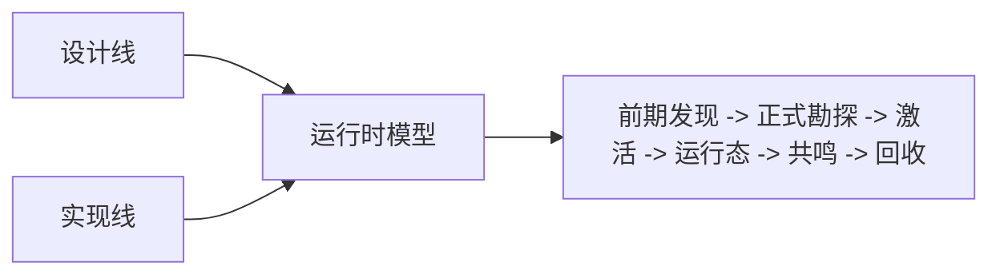

# 模组开发 {#modding-development}

Forge 侧可以先按这个顺序看：遗址类型 -> 遗址实例 -> 存档持久化数据 -> 活跃运行态 -> 共鸣结果 -> 回收快照。

## 已确认的事实 {#verified-current-baseline}

| 项目 | 结论 |
| --- | --- |
| 游戏版本 | `Minecraft 1.20.1` |
| Loader | `Forge` |
| 原版考古刷扫链路 | `BrushItem.useOn(...)`、`BrushItem.onUseTick(...)`、`BrushableBlockEntity.brush(...)` |
| 世界级持久化 | `ServerLevel.getDataStorage()` + `DimensionDataStorage.computeIfAbsent(...)` |
| 世界保存检查点 | `LevelEvent.Save` |
| 区块辅助持久化 | `ChunkDataEvent.Load` / `ChunkDataEvent.Save` |
| 活跃区块生命周期 | `ChunkEvent.Load` / `ChunkEvent.Unload` |
| 玩家交互入口 | 刷扫链路 + `PlayerInteractEvent.RightClickItem` / `RightClickBlock` |
| 玩家长期数据迁移 | `PlayerEvent.Clone` |
| 客户端 tooltip | `ItemTooltipEvent` |
| 客户端区块同步补点 | `ChunkWatchEvent.Watch` / `UnWatch` |

## 几类核心对象 {#core-object-chain}

往下读时，可以先抓住这几类对象：

| 层级 | 对象 | 作用 |
| --- | --- | --- |
| 前期发现定义 | `CivilizationShellDefinition`、`EarlyExcavationNodeDefinition` | 组织环境痕迹、前期节点和耗尽规则 |
| 正式遗址类型 | `SiteTypeDefinition` | 定义一类遗址的宿主、锚点、激活和运行态参数 |
| 正式实例引用 | `SiteRef`、`DiscoveredSiteRecord` | 指向一座已写入正式记录的遗址，而不是一种类型 |
| 遗址记录主表 | `SiteLedgerSavedData` | 保存遗址实例、生命周期和覆盖区块 |
| 运行中状态 | `SiteRuntimeRegistry`、`ActiveSiteRuntime` | 保存当前现场的短生命周期状态 |
| 结算结果 | `ResonanceResult`、`RecoveredRelicSnapshot` | 把一次现场折叠成可消费、可保存的结果 |

顺序最好别打乱。类型不是实例，实例不是运行态，运行态也不是回收结果。

## 四种状态 {#four-authoritative-state-layers}

实现里可以先把状态分成四种：

| 状态 | 对应对象 | 生命周期 |
| --- | --- | --- |
| 遗址记录主表 | `SiteLedgerSavedData` | 跟随维度存档 |
| 现场运行状态 | `SiteRuntimeRegistry`、`ActiveSiteRuntime` | 只在现场运行期间存在 |
| 玩家长期知识 | 玩家长期数据 | 跟随玩家长期进度 |
| 物品结算快照 | `RecoveredRelicSnapshot` | 跟随物品流转 |

任何实现问题，本质上都要先回答“这条数据属于哪一层”。答不清这个问题，存档持久化数据、区块缓存、tooltip 和玩家数据就一定会混在一起。

## 关键问题 {#what-this-subtree-answers}

| 主题 | 主要对象 | 关键页面 |
| --- | --- | --- |
| 前期发现和正式勘探如何分界 | `CivilizationShellDefinition`、`EarlyExcavationNodeDefinition`、`SiteTypeDefinition` | `Design/Survey`、`Implementation/Survey` |
| 遗址实例如何定位与写入存档持久化数据 | `SiteLedgerSavedData`、`SiteRef` | `Design/Survey`、`Implementation/Survey` |
| 激活如何接过这条引用 | `ActivationService`、`ActivationAdapter`、`SiteRuntimeBridge`、`SiteRuntimeRegistry` | `Design/Activation`、`Implementation/Activation` |
| 遗址记录主表、区块缓存、玩家短标记怎样分层 | `SavedData`、chunk data、player persistent data | `Implementation/Catalogue`、`Implementation/SiteRuntime` |
| 共鸣结果如何被消费 | `ResonanceResolver`、`ResonanceResult` | `Design/Resonance`、`Implementation/Resonance` |
| 回收结果如何保存与读取 | `RecoveredRelicSnapshot`、`RelicTooltipView` | `Design/Recovery`、`Implementation/Recovery` |
