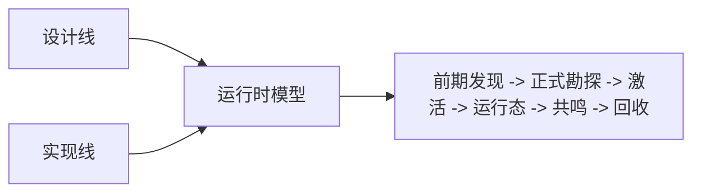

# 模组开发 {#modding-development}

本子树只讨论 Forge 侧 Java 运行时。我们在这里写遗址类型、遗址实例、世界账本、活跃运行态、共鸣结果、回收快照和客户端读取边界。整合脚本、数据包、配置覆盖不在本子树内。即使当前实例已经安装 `EventJS`，这里也不以 KubeJS 事件栈作为实现前提。

## 已验证的当前基线 {#verified-current-baseline}

| 项目 | 当前基线 |
| --- | --- |
| 游戏版本 | `Minecraft 1.20.1` |
| Loader | `Forge` |
| 原版考古主链路 | `BrushItem.useOn(...)`、`BrushItem.onUseTick(...)`、`BrushableBlockEntity.brush(...)` |
| 世界级持久化 | `ServerLevel.getDataStorage()` + `DimensionDataStorage.computeIfAbsent(...)` |
| 世界保存检查点 | `LevelEvent.Save` |
| 区块辅助持久化 | `ChunkDataEvent.Load` / `ChunkDataEvent.Save` |
| 活跃区块生命周期 | `ChunkEvent.Load` / `ChunkEvent.Unload` |
| 玩家交互面 | 刷扫链路 + `PlayerInteractEvent.RightClickItem` / `RightClickBlock` |
| 玩家长期数据迁移 | `PlayerEvent.Clone` |
| 客户端 tooltip | `ItemTooltipEvent` |
| 客户端区块同步补点 | `ChunkWatchEvent.Watch` / `UnWatch` |

## 核心对象链 {#core-object-chain}

本子树围绕下面这条对象链展开：

| 层级 | 对象 | 作用 |
| --- | --- | --- |
| 前期发现定义 | `CivilizationShellDefinition`、`EarlyExcavationNodeDefinition` | 组织环境痕迹、前期节点和耗尽规则 |
| 正式遗址类型 | `SiteTypeDefinition` | 定义一类遗址的宿主、锚点、激活和运行态参数 |
| 正式实例引用 | `SiteRef`、`DiscoveredSiteRecord` | 指向一座已入账的遗址，而不是一种类型 |
| 世界真相 | `SiteLedgerSavedData` | 保存遗址实例、生命周期和覆盖区块 |
| 运行中状态 | `SiteRuntimeRegistry`、`ActiveSiteRuntime` | 保存当前现场的短生命周期状态 |
| 结算结果 | `ResonanceResult`、`RecoveredRelicSnapshot` | 把一次现场折叠成可消费、可保存的结果 |

这条链的顺序不能乱。类型不是实例，实例不是运行态，运行态也不是回收结果。

## 四类权威状态 {#four-authoritative-state-layers}

在实现上，我们只承认四类权威状态：

| 状态层 | 权威对象 | 生命周期 |
| --- | --- | --- |
| 世界真相 | `SiteLedgerSavedData` | 跟随维度存档 |
| 现场活状态 | `SiteRuntimeRegistry`、`ActiveSiteRuntime` | 只在现场运行期间存在 |
| 玩家长期知识 | 玩家长期数据 | 跟随玩家长期进度 |
| 物品结算快照 | `RecoveredRelicSnapshot` | 跟随物品流转 |

所有实现问题，本质上都要先回答“这条数据属于哪一层”。只要这个问题答不清，后面就一定会把账本、区块缓存、tooltip 和玩家数据混在一起。

## 这个子树回答什么 {#what-this-subtree-answers}

| 主题 | 主要对象 | 关键页面 |
| --- | --- | --- |
| 前期发现和正式勘探如何分界 | `CivilizationShellDefinition`、`EarlyExcavationNodeDefinition`、`SiteTypeDefinition` | `Design/Survey`、`Implementation/Survey` |
| 遗址实例如何定位与落账 | `SiteLedgerSavedData`、`SiteRef` | `Design/Survey`、`Implementation/Survey` |
| 激活如何接手所有权 | `ActivationService`、`ActivationAdapter`、`SiteRuntimeBridge`、`SiteRuntimeRegistry` | `Design/Activation`、`Implementation/Activation` |
| 世界真相、区块缓存、玩家短标记怎样分层 | `SavedData`、chunk data、player persistent data | `Implementation/Catalogue`、`Implementation/SiteRuntime` |
| 共鸣结果如何被消费 | `ResonanceResolver`、`ResonanceResult` | `Design/Resonance`、`Implementation/Resonance` |
| 回收结果如何保存与读取 | `RecoveredRelicSnapshot`、`RelicTooltipView` | `Design/Recovery`、`Implementation/Recovery` |

## 阅读顺序 {#reading-order}

| 如果你要解决…… | 先读哪里 |
| --- | --- |
| 前期发现节点、正式勘探边界与定位算法 | `Design/Survey`，然后 `Implementation/Survey` |
| 激活服务、适配器和所有权移交 | `Design/Activation`，然后 `Implementation/Activation` |
| 世界账本、区块缓存和 tick | `Design/SiteRuntime`，然后 `Implementation/SiteRuntime` |
| 共鸣判定和结果消费 | `Design/Resonance`，然后 `Implementation/Resonance` |
| 回收、tooltip 和长期知识 | `Design/Recovery`，然后 `Implementation/Recovery` |

如果问题落在“字段到底该进世界、玩家还是物品”，先读 `Implementation/Catalogue`，再去看具体阶段页。

## 本子树的写作标准 {#subtree-writing-standards}

1. 只写已经核对过的 Forge 生命周期和方法签名。
2. 设计页定义对象和规则，不表演思路。
3. 实现页明确“已经验证”“建议实现”“当前不存在”三种状态。
4. 如果某段内容主要属于整合层，就不放进这里。
5. 任何页面只要谈到状态写入，都必须明确它属于四类权威状态中的哪一类。
