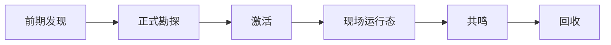

# 模组设计目录 {#modding-design-catalogue}

设计顺序是 `前期发现 -> 正式勘探 -> 激活 -> 现场运行态 -> 共鸣 -> 回收`。

## 设计关注点 {#design-focus}

| 页面 | 核心问题 |
| --- | --- |
| `Survey` | 怎样分开前期发现与正式勘探，并让正式遗址实例只在后者创建 |
| `Activation` | 怎样把待处理引用交给 `ActivationService`，再转成活跃运行态 |
| `SiteRuntime` | 怎样分开存档持久化数据、活状态和区块缓存 |
| `Resonance` | 怎样把遗址输入和玩家输入压成同一份结果 |
| `Recovery` | 怎样把现场结果折叠成长期可读的快照 |

## 固定约束 {#design-constraints}

1. 前期发现与正式勘探必须分离。
2. 遗址类型与遗址实例必须分离。
3. 激活通过统一服务接管，不让入口各自实现现场启动。
4. 存档持久化数据、活跃运行态、区块缓存和物品快照分属不同状态层。
5. 遗址正式记录不能挂在玩家短标记上。
6. 区块未加载不等于遗址不存在。
7. 共鸣只做判定，不直接推进现场，也不直接生成 tooltip。
8. 回收阶段必须把结果折叠成快照，之后视图层只读快照。
