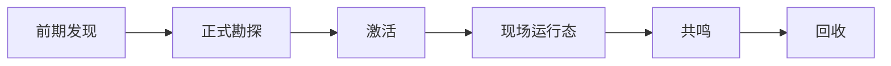

# 模组设计目录 {#modding-design-catalogue}

设计页只定义对象模型、状态转换和禁止项。我们在这里决定遗址系统应该如何组织，不在这里假装某个类或目录已经存在。

## 设计关注点 {#design-focus}

| 页面 | 核心问题 |
| --- | --- |
| `Survey` | 怎样分开前期发现与正式勘探，并让正式遗址实例只在后者创建 |
| `Activation` | 怎样把待处理引用交给 `ActivationService`，再转成活跃运行态 |
| `SiteRuntime` | 怎样分开世界账本、活状态和区块缓存 |
| `Resonance` | 怎样把遗址输入和玩家输入压成统一结果 |
| `Recovery` | 怎样把现场结果折叠成长期可读的快照 |

## 设计入口顺序 {#reading-order}

建议按下面顺序阅读本子树：

1. `Survey`
2. `Activation`
3. `SiteRuntime`
4. `Resonance`
5. `Recovery`

这条顺序对应的不是站内导航，而是对象依赖顺序。前面的阶段会给后面的阶段提供稳定输入。先读后面的页面，再回头补前面的页面，很容易把结果对象误当成前提对象。

## 当前已经锁定的设计结论 {#locked-design-decisions}

这条设计线目前已经锁定以下结论：

1. 前期发现与正式勘探必须分离。
2. 遗址类型与遗址实例必须分离。
3. 激活通过统一服务接管，不让入口各自实现现场启动。
4. 世界账本、活跃运行态、区块缓存和物品快照分属不同权威层。
5. 共鸣只做判定，不直接推进现场，也不直接生成 tooltip。
6. 回收阶段必须把结果折叠成快照，之后视图层只读快照。

这些结论是后续子页面的共同前提，不在每一页里重新开放。

## 设计约束 {#design-constraints}

1. 前期发现与正式勘探必须分离。
2. 遗址类型与遗址实例必须分离。
3. 世界真相不能挂在玩家短标记上。
4. 区块未加载不等于遗址不存在。
5. tooltip 只能读取已保存结果，不能回查 live runtime。

## 本子树不回答什么 {#non-goals}

本子树明确不回答以下问题：

- 不回答 KubeJS、数据包和配置应写到哪个目录。
- 不回答当前实例里某个类是否已经存在。
- 不回答具体方法签名和事件订阅写法。

这些问题分别属于 `Modpacking` 或 `ModdingDeveloping/Implementation`。设计页只负责把对象边界和状态流写清。
