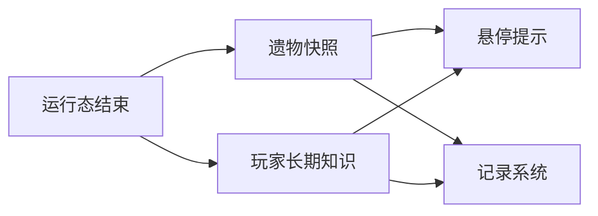

# 回收 {#recovery}

回收阶段是序列化边界。现场结束后，只有已经折叠成快照的数据才能继续被 tooltip、图鉴和后续系统读取。



## 三类结果 {#three-result-types}

| 层 | 保存什么 |
| --- | --- |
| 玩家长期层 | 鉴定等级、已解锁知识、长期进度 |
| 遗物快照层 | `siteRef`、`siteTypeId`、`ResonanceState`、`patternKey` |
| 记录系统层 | 用于图鉴、历史回看和统计的长期记录 |

这三层的关系是：

- 玩家长期层回答“我们学会了什么”；
- 遗物快照层回答“这件东西带着什么结果离场”；
- 记录系统层回答“这次行动在长期档案里留下了什么”。

三者互相引用，但不能互相替代。

## 玩家长期层的设计规则 {#player-long-term-layer-rules}

如果知识值保存在玩家实体数据里，重生时必须通过 `PlayerEvent.Clone` 从旧玩家复制到新玩家。否则“跨世界保存”和“跨死亡复制”会被混成一件事。

## 物品快照层的设计规则 {#item-snapshot-layer-rules}

遗物快照应当跟着物品本身走，而不是跟着玩家走。原因很直接：

1. 遗物会进入背包、箱子、掉落物和交易链。
2. tooltip 构建时未必拿得到玩家对象。
3. 同一件遗物的结果不应该因为持有者变化而消失。

因此，回收阶段必须把最低限度结果折叠到 `ItemStack` 自身，而不是只写进玩家数据。

## tooltip 的设计规则 {#tooltip-design-rules}

`ItemTooltipEvent` 允许在没有玩家对象时构建 tooltip。因此 tooltip 只能依赖：

- `ItemStack` 上已经保存的快照；
- 可选的玩家长期知识；
- 固定的视图格式化规则。

tooltip 不能依赖 live runtime。

tooltip 的读取顺序也应该固定：

1. 先读 `ItemStack` 上的已保存快照。
2. 再读可选的玩家长期知识。
3. 最后按固定视图规则决定显示深度。

tooltip 不应该反向参与判定。

## 最小快照对象 {#minimum-snapshot-object}

```java
public record RecoveredRelicSnapshot(
        String siteTypeId,
        String siteRef,
        ResonanceState state,
        String patternKey
) {}
```

这个对象只保留离场结果，不回写现场细节。诸如当前稳定度、守卫数、覆盖区块和 tick 级中间状态，都不属于遗物快照。

## 禁止项 {#prohibited-items}

1. 把所有结果都塞回玩家数据。
2. 让 tooltip 临时重算共鸣或现场状态。
3. 让回收阶段只剩奖励，不留下可复读的技术结果。
4. 把现场逐 tick 中间态直接序列化成物品结果。
