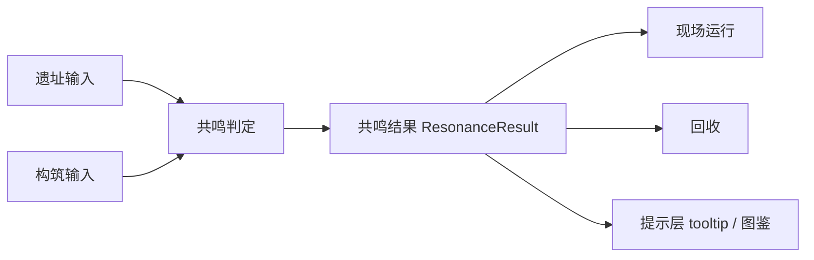

# 共鸣 {#resonance}

共鸣是判定层。它读取遗址输入和玩家构筑，输出一份短而稳定的结果，供现场运行、回收和 tooltip 共同消费。共鸣不直接推进现场，也不直接生成提示文本。

## 职责边界 {#scope}

共鸣层只回答一个问题：当前这组"遗址压力 + 遗物倾向 + 构筑姿态 + 文明偏向"会落到什么状态。

| 输入轴 | 进入共鸣的理由 | 不属于共鸣的内容 |
| --- | --- | --- |
| `site pressure` | 遗址给现场施加的主压力类型 | 逐 tick 掉稳、刷怪、雾效 |
| `relic tendency` | 遗物面对压力的处理倾向 | tooltip 文案本体 |
| `build posture` | 玩家这次是稳态处理还是突破处理 | 具体枪械数值改写 |
| `civilization lean` | 文明偏向需要在结果里留下差异 | 独立职业树或派系系统 |

判定是共鸣层的职责，执行后果归 runtime 和 recovery。

## 输出契约 {#result-contract}

第一版的共鸣结果保持紧凑，只保留两项：

| 字段 | 作用 |
| --- | --- |
| `state` | 给 runtime、recovery 和 tooltip 共享的高层状态 |
| `patternKey` | 指向一条稳定的模式键，用于后续表现、结算和文本映射 |

第一版先把结果收短，而不是把所有解释都塞进结果对象。原因很直接：

1. 运行态、回收和 tooltip 的时间点不同，但都需要同一份结果。
2. 结果会进入快照与长期数据，字段越多，耦合越高。
3. 结果对象一旦先膨胀，runtime 细节和 UI 细节几乎必然一起裹进去。

## 对象分层 {#object-layering}

| 层 | 对象 | 职责 |
| --- | --- | --- |
| 输入层 | `SiteProfile`、`RelicLoadout` | 折叠遗址输入和玩家输入 |
| 判定层 | `ResonanceResolver` | 给出唯一判定入口 |
| 结果层 | `ResonanceResult` | 承载短结果 |
| 消费层 | runtime、recovery、tooltip | 读取结果，不重算结果 |

这四层不能混。tooltip、runtime 或 recovery 只要开始各自补 if，共鸣就已经失真。

## 消费规则 {#consumption-rules}

共鸣结果按下面顺序被消费：

1. 激活或现场启动阶段计算一次 `ResonanceResult`。
2. 运行态读取结果，用于阶段推进和后果分派。
3. 回收阶段把需要长期保留的字段折叠进快照。
4. tooltip 和图鉴只读取快照，不回查 live runtime。

顺序不能反过来。tooltip 一旦开始临时重算，共鸣逻辑就会被复制到客户端视图层。

## 与 TaCZ 的关系 {#shared-gun-base-boundary}

当前实例已经安装 TaCZ 及其扩展，共鸣应建立在这套枪械系统上，而不是再造第二套武器系统。

共鸣负责：

- 让同一把武器在不同遗址压力下产生不同战术含义。
- 让文明偏向影响构筑选择。
- 让回收结果能反映这次处理方式。

共鸣不负责：

- 为不同文明拆出独立武器体系。
- 把差异全部埋进配件数值。
- 用一套黑箱公式替代清晰的状态判定。

## 第一切片验证 {#first-slice-validation}

第一切片先验证"同一遗址，不同构筑，结果不同"，不追求大而全。

| Site profile | Loadout | 期望结果 |
| --- | --- | --- |
| `CONTAMINATION` | `FILTER + STABILIZE + MECHANICAL + 0` | `TUNED` + `contamination.cleanse` |
| `CONTAMINATION` | `SUNDER + BREACH + ARCANE + 1` | `OVERLOADED` + `contamination.burst` |
| fallback | 任意不支持组合 | `DORMANT` + `generic.idle` |

这组差异能稳定成立，共鸣层就已经具备第一版价值。

## 设计红线 {#design-red-lines}

1. runtime、recovery 和 tooltip 各自维护一套"共鸣判断"。
2. 共鸣结果对象开始吸收现场逐 tick 状态。
3. Tooltip 必须回查 live runtime 才能解释遗物结果。
4. 共鸣系统逐渐演化成第二套武器或职业系统。
