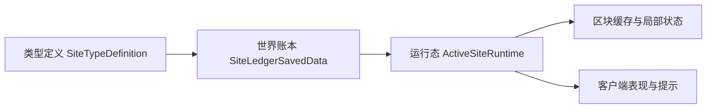

# 现场运行态 {#site-runtime}

现场运行态负责把一条已入账遗址接成一段可运行现场。本页只回答四件事：账本保存什么、registry 保存什么、chunk 层保存什么、客户端能读什么。



## 四层模型 {#four-layer-model}

| 层 | 权威对象 | 保存什么 | 生命周期 |
| --- | --- | --- | --- |
| 类型定义层 | `SiteTypeDefinition` | 一类遗址的规则模板、运行态参数、共鸣配置入口 | 全局静态 |
| 世界账本层 | `SiteLedgerSavedData` | 实例坐标、生命周期、覆盖区块、稳定引用 | 跟随 world save |
| 活跃运行态层 | `SiteRuntimeRegistry`、`ActiveSiteRuntime` | 当前压力、阶段、拥有者、局部事件 | 只在现场运行期间存在 |
| 区块与客户端辅助层 | `ChunkSiteAuxData`、同步载荷 | 区块局部表现、可见性、客户端最小视图 | 跟随 chunk 生命周期与 watch 状态 |

## 标识与索引 {#identity-and-indexes}

| 标识 | 所属层 | 用途 |
| --- | --- | --- |
| `SiteRef` | 跨阶段引用 | 在正式勘探、激活、回收之间传递同一座遗址 |
| `SiteCoordinate` 或 `维度 + 锚点` | 世界账本 | 作为实例真相键，回答“这座遗址到底是哪一座” |
| `primaryChunkKey`、`coveredChunkKeys` | 账本 + runtime | 让 chunk 同步、局部缓存和覆盖范围围绕同一组键工作 |
| `UUID owner` | runtime | 约束同一玩家或队伍的占用关系 |

对外流转继续使用 `SiteRef`；世界真相回落到坐标键；chunk 事件只围绕 `coveredChunkKeys` 处理局部状态。

## 账本字段 {#ledger-fields}

世界账本至少要稳定保存以下字段：

| 字段 | 原因 |
| --- | --- |
| `ref` | 供激活、回收、日志和玩家短标记解析到同一座遗址 |
| `anchor` 与维度 | 供账本内部建立稳定实例坐标 |
| `siteTypeId` | 供运行态、共鸣和回收读取规则模板 |
| `coveredChunkKeys` | 供同步、局部缓存和覆盖范围判断 |
| `lifecycle` | 供激活、运行、回收判断当前实例处于哪个阶段 |

账本不保存逐 tick 压力、局部敌人状态或临时扰动。那些数据属于 runtime。

## 运行态注册表 {#runtime-registry}

推荐把 registry 固定成三张索引表：

```java
public final class SiteRuntimeRegistry {
    private final Map<SiteCoordinate, ActiveSiteRuntime> runtimeBySite = new HashMap<>();
    private final Map<Long, Set<SiteCoordinate>> sitesByChunk = new HashMap<>();
    private final Map<UUID, SiteCoordinate> siteByOwner = new HashMap<>();
}
```

| 索引 | 作用 |
| --- | --- |
| `runtimeBySite` | 回答某座遗址当前是否处于 live runtime |
| `sitesByChunk` | 支撑 chunk load/unload、watch 同步和局部缓存查找 |
| `siteByOwner` | 防止同一拥有者重复占用多座正式遗址 |

`ActivationService` 的职责，是用 `SiteRef` 解析到账本记录，再把它归一到同一条坐标键后登记进 registry。这样交互入口可以变化，runtime 主表不变。

## 运行态对象建议 {#recommended-runtime-objects}

```java
public final class ActiveSiteRuntime {
    private final SiteRef ref;
    private final SiteCoordinate coordinate;
    private final RuntimeFootprint footprint;
    private final SiteTypeDefinition type;
    private int stability;
    private SitePhase phase;
}
```

```java
public record RuntimeFootprint(
        BlockPos anchor,
        Set<Long> coveredChunkKeys
) {}
```

## 覆盖区块算法 {#coverage-chunk-algorithm}

运行态如果要和 chunk 生命周期交互，必须先有稳定的 footprint 计算规则。`coveredChunkKeys` 一旦写进账本，就不在每次 chunk 进入时重新推导实例真相。

1. 账本记录一个锚点 `anchor`。
2. 运行时参数给出事件半径或活动边界。
3. 正式勘探或激活阶段生成 `coveredChunkKeys`。
4. 初始化 runtime 时，把这组键注册到 `sitesByChunk`。
5. chunk 相关事件只处理这组键覆盖到的局部状态，不直接判定遗址真相。

因此：

- `ChunkEvent.Unload` 可以释放局部缓存；
- 它不能单独删除世界账本；
- runtime 也不能被视为“区块是否已加载”的派生物。

## 世界账本和群系、结构的关系 {#world-ledger-biome-structure-relationship}

账本只记录已经解析完的结果，不重复保存“结构决定了一半、群系决定了一半”的中间判断。解析阶段结束后，账本里应当只保留：

- 具体实例引用；
- 锚点；
- 覆盖区块；
- 生命周期状态；
- 运行时和回收所需的稳定字段。

## 状态迁移 {#state-transitions}

| 输入阶段 | 输出阶段 | 允许写入什么 |
| --- | --- | --- |
| 正式勘探 | 世界账本 | `DiscoveredSiteRecord`、`SiteRef`、覆盖区块 |
| 激活 | runtime registry | `ActiveSiteRuntime`、占用关系、chunk 索引登记 |
| 现场推进 | runtime 内部 | 压力、阶段、扰动、局部事件 |
| 回收 | 世界账本 + 结果快照 | 生命周期变更、回收结果、长期知识 |
| chunk unload / unwatch | 辅助层 | 局部缓存释放、客户端订阅回收 |

`chunk unload` 和 `player unwatch` 都不是遗址生命周期事件。它们只处理辅助层。

## 客户端层的规则 {#client-layer-rules}

客户端只读取：

- 已保存的运行态派生值；
- 已保存的回收快照；
- 服务器主动同步过来的区块局部数据。

客户端不反推世界账本，也不偷偷持久化运行态。

## 设计禁区 {#design-no-go-zones}

1. 把运行态真相挂在 chunk 是否加载上。
2. 把世界账本塞进玩家短标记。
3. 让客户端提示层变成第二个状态源。
