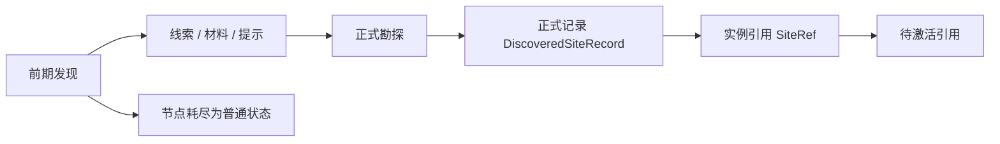

# 勘探 {#survey}

这一页把勘探拆成两段：前期发现和正式勘探。前者负责线索、材料和环境教学；后者才负责遗址实例、存档持久化数据和待激活引用。两段如果揉在一起，前期节点很快就会同时背上教学、定位、持久化和激活前置，规则也会跟着变乱。



## 阶段定义 {#phase-definitions}

| 阶段 | 输入 | 输出 | 不做什么 |
| --- | --- | --- | --- |
| 前期发现 | 环境载体、刷扫交互、显式信号节点 | 线索物、碎片、材料、tooltip 信息、探测仪推进、总体考古进度 | 不创建 `SiteRef`，不写 `SiteLedgerSavedData`，不进入激活 |
| 正式勘探 | 宿主结构、作者标记或显式宿主、提交动作 | `DiscoveredSiteRecord`、`SiteRef`、待激活引用 | 不替前期发现承担环境教学，不直接创建 live runtime |

前期发现回答的是"这里值不值得继续挖"；正式勘探回答的是"这里是不是已经落成一座正式遗址实例"。两者的输入、输出和数据层都不同，所以不要合并。

## 核心对象 {#core-objects}

| 对象 | 作用 |
| --- | --- |
| `CivilizationShellDefinition` | 定义文明外壳在前期发现中留下哪些可读信号 |
| `EarlyExcavationNodeDefinition` | 定义一种前期考古节点的载体、交互、产物和耗尽态 |
| `SiteTypeDefinition` | 定义正式遗址类型的宿主规则、激活规则、运行态参数和共鸣配置 |
| `SiteRef` | 指向一座具体遗址实例，而不是一种遗址类型 |
| `DiscoveredSiteRecord` | 存档持久化数据中的正式遗址记录 |
| `SiteLedgerSavedData` | 某个 `ServerLevel` 的正式遗址存档持久化数据 |

## 前期发现节点 {#early-discovery-nodes}

前期发现节点做的事要尽量克制：把环境里的文明痕迹转成可读线索，交互后耗尽，不承担遗址实例化职责。这一阶段不应依赖存档持久化数据，也不应要求世界数据参与实例判定。

### 载体类型 {#carrier-types}

| 载体 | 用途 | 约束 |
| --- | --- | --- |
| 环境载体 | 自然环境、宿主结构外围和低强度分布点的主力载体 | 必须是专用的世界生成载体，不依赖放置时打标记 |
| 显式节点 | 高信号位置、引导点、异常提示点 | 可以采用 `BlockEntity`，但投放密度必须低，不能替代环境载体 |

环境载体负责普遍分布，显式节点负责明确提示。前者让前期发现能融进世界，后者让重要点位更容易读懂。两者都不进入正式持久化数据。

### 统一交互 {#unified-interaction}

前期发现统一采用 `刷扫揭露 -> 提取完成 -> 耗尽归位`。

1. 玩家对刷扫节点持续使用刷子。
2. 节点进入揭露态，说明内容已经露出。
3. 玩家执行一次提取交互。
4. 节点转成普通世界状态，彻底失去考古资格。

固定三态如下：

```text
隐藏考古块 -> 揭露考古块 -> 普通地形块
```

把"揭露内容"和"提取产物"拆成两个动作，便于挂载提示信息、音画反馈和耗尽态。

### 推荐的节点定义 {#recommended-node-definition}

```java
public record EarlyExcavationNodeDefinition(
        ResourceLocation id,
        ResourceLocation shellId,
        CarrierType carrierType,
        ResourceLocation brushLootTable,
        BlockState revealedState,
        BlockState exhaustedState
) {}
```

这组字段只管前期交互本身：

- `shellId` 说明它属于哪个文明外壳的痕迹族；
- `brushLootTable` 只负责前期发现产物；
- `revealedState` 和 `exhaustedState` 固定交互状态机；
- 不包含正式遗址生命周期、持久化数据键或 `SiteRef`。

### 反自动化规则 {#anti-automation-rules}

前期发现节点只能来自：

1. 世界生成的专用考古载体。
2. 结构作者预放置的专用考古载体。
3. 少量克制投放的显式节点。

以下对象一律不允许定义为合法考古目标：

1. 可由机器批量放置和回收的普通方块。
2. 可由生电稳定量产的对象。
3. 可由工业链合成、复制或刷取的对象。
4. 可由交易链或刷怪塔大规模回灌世界的对象。

后续机器可以接手考古流程，但考古目标本身不能来自可批量制造的来源。否则玩家会直接绕过世界分布和环境探索，把考古对象工业化。

## 正式勘探 {#formal-survey}

`SiteRef` 只有一个入口：正式勘探。它把一次有效提交转成一条正式遗址记录，并把后续阶段需要的实例引用交给激活层。只要一条内容还没有进入正式记录，它就仍然属于前期发现，不属于正式遗址。

### 类型和实例必须分离 {#type-and-instance-must-be-separated}

| 层 | 保存什么 | 设计作用 |
| --- | --- | --- |
| 文明外壳 | 线索风格、材料族、外围痕迹和可读信号 | 组织前期发现，不代表正式实例 |
| 遗址类型 | 宿主规则、激活规则、运行态参数、共鸣配置 | 定义一类遗址的规则模板 |
| 遗址实例 | 维度、锚点、覆盖区块、生命周期状态 | 供激活、运行态和回收引用的实例记录 |

类型和实例一旦混用，同类遗址无法并存，激活和回收也无法稳定指向同一座遗址。

### 正式勘探的固定优先级 {#fixed-priority-for-formal-survey}

正式勘探建议按这个顺序走：

1. 作者标记或显式宿主优先。
2. 宿主结构决定该位置是否具备正式候选资格。
3. 锚点求解把当前位置转成稳定实例中心。
4. 群系只做类型修正，不单独决定实例主键。
5. 在存档持久化数据中查找或创建 `DiscoveredSiteRecord`。
6. 输出 `SiteRef` 作为待激活引用。

先有宿主和锚点，再有实例。只有实例稳定下来，激活和回收才会有稳定引用。

### 推荐的正式记录 {#recommended-formal-record}

```java
public record SiteRef(
        String siteTypeId,
        long primaryChunkKey,
        int serial
) {}

public record DiscoveredSiteRecord(
        SiteRef ref,
        BlockPos anchor,
        String siteTypeId,
        Set<Long> coveredChunkKeys,
        SiteLifecycle lifecycle
) {}
```

`SiteRef` 是跨阶段 hand-off 引用；`anchor` 连同维度一起构成存档持久化数据内部的稳定坐标主键。

`coveredChunkKeys` 固定用于：

- 支撑区块同步；
- 支撑局部缓存；
- 支撑运行态覆盖范围判断。

它不回流到前期发现阶段，也不替代玩家短标记。

## 新增内容时的注册规则 {#registration-rules-for-new-content}

新增内容最好一次把定义写全，不要靠零散的条件分支去拼行为。

### 新增前期发现节点时必须声明 {#required-fields-for-new-early-discovery-nodes}

| 字段 | 是否必须 | 用途 |
| --- | --- | --- |
| 节点 id | 必须 | 稳定主键 |
| 归属外壳 id | 必须 | 说明它属于哪个文明痕迹族 |
| 载体类型 | 必须 | 环境载体还是显式节点 |
| 刷扫产物 | 必须 | 前期发现阶段的掉落与推进内容 |
| 揭露态 | 必须 | 刷扫完成后进入什么状态 |
| 耗尽态 | 必须 | 提取完成后回到什么普通状态 |

### 新增正式遗址类型时必须声明 {#required-fields-for-new-formal-site-types}

| 字段 | 是否必须 | 用途 |
| --- | --- | --- |
| 类型 id | 必须 | 稳定主键 |
| 宿主规则 | 必须 | 宿主结构、作者标记或显式宿主 |
| 锚点规则 | 必须 | 搜索半径、中心点求解和精验证方式 |
| 群系修正 | 可选 | 只做参数修正，不决定实例主键 |
| 激活规则 | 必须 | 限定哪些提交面可以激活 |
| 运行态参数 | 必须 | 供现场运行态读取 |
| 共鸣配置 id | 必须 | 供 `ResonanceResolver` 消费 |

## 禁止项 {#prohibited-items}

1. 让前期发现创建 `SiteRef`。
2. 让前期发现写 `SiteLedgerSavedData`。
3. 让普通方块依赖"放置时打标记"才变成考古目标。
4. 让可自动化批量制造的对象成为考古目标。
5. 让正式勘探直接创建 live runtime。
