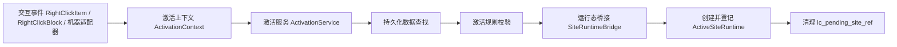

# 激活实现 {#activation-implementation}

激活实现的核心是 `ActivationService`。事件和道具只负责构造上下文，持久化数据校验、运行态打开和短标记清理都在服务层完成，不散落到事件处理器里。



## 已验证的事件与方法 {#verified-events-and-methods}

| 事件或方法 | 已验证的接口 | 用途 |
| --- | --- | --- |
| `PlayerInteractEvent.RightClickBlock` | `getPos()`、`getHitVec()`、`getItemStack()`、`getHand()` | 方块装置适配器 |
| `PlayerInteractEvent.RightClickItem` | `getItemStack()`、`getHand()` | 道具适配器 |
| `PlayerEvent.PlayerChangedDimensionEvent` | `getFrom()`、`getTo()` | 玩家离场时做收尾 |
| `LevelEvent.Unload` | 事件本体已验证 | 维度卸载时清理 registry |

## 推荐对象结构 {#recommended-object-skeleton}

```java
public interface ActivationAdapter {
    Optional<ActivationContext> buildContext(ServerPlayer player, ServerLevel level);
}

public final class ActivationService {
    public ActivationResult activate(ActivationContext context) {
        // 1. 读取 DiscoveredSiteRecord
        // 2. 校验 source、triggerPos 和 lifecycle
        // 3. 交给 SiteRuntimeBridge 打开 runtime
        // 4. 清理 lc_pending_site_ref
        return new ActivationResult(false, null, "not_implemented");
    }
}

public final class SiteRuntimeBridge {
    public Optional<ActiveSiteRuntime> open(
            ActivationContext context,
            DiscoveredSiteRecord record
    ) {
        return Optional.empty();
    }
}
```

三层职责要分清：

- 适配器负责“从哪里来”。
- 服务层负责“能不能开”。
- `SiteRuntimeBridge` 负责“怎么把 runtime 打开”。

## 适配器映射 {#adapter-mapping}

| 适配器 | 当前建议 |
| --- | --- |
| `BlockActivationAdapter` | 由 `RightClickBlock` 构造上下文，适合遗址控制台、宿主装置、触发点 |
| `ItemActivationAdapter` | 由 `RightClickItem` 构造上下文，适合激活器、探测器、密钥类道具 |
| `MachineActivationAdapter` | 预留给后续机器或机器考古流程 |

当前 MVP 先实现前两类即可。机器适配器预留接口位置，不提前写死事件来源。

## 激活的最小流程 {#minimum-activation-flow}

1. 适配器从玩家、当前 `ServerLevel` 和待处理引用构造 `ActivationContext`。
2. `ActivationService` 读取 `lc_pending_site_ref` 对应的 `SiteRef`。
3. 服务层在 `SiteLedgerSavedData` 中查找 `DiscoveredSiteRecord`。
4. 服务层校验 `ActivationRule`、维度、触发点和生命周期状态。
5. 通过后，`SiteRuntimeBridge` 创建 `ActiveSiteRuntime`。
6. `SiteRuntimeRegistry` 登记活状态。
7. 清理 `lc_pending_site_ref`。

## 陈旧引用处理 {#stale-reference-handling}

| 情况 | 处理 |
| --- | --- |
| 引用不存在 | 清短标记并拒绝 |
| 引用在别的维度 | 清短标记并拒绝 |
| 记录已处于 `ACTIVE` | 不重复创建 runtime |
| 记录已回收或已中止 | 清短标记并拒绝 |

## 维度切换和卸载 {#dimension-change-and-unload}

`PlayerEvent.PlayerChangedDimensionEvent` 和 `LevelEvent.Unload` 是收尾钩子，不是激活入口，职责不能混用。

| 事件 | 处理建议 |
| --- | --- |
| `PlayerChangedDimensionEvent` | 如果玩家绑定了 runtime，则关闭、解绑或转入安全收尾 |
| `LevelEvent.Unload` | 删除该 level 下的活跃 runtime，并清掉不再有效的绑定 |

## 激活阶段的实现红线 {#activation-implementation-red-lines}

1. 不在交互事件里维护 runtime 主表。
2. 不让 `RightClickBlock` 代表整个激活架构。
3. 不让服务层回头重做勘探判定。
4. 不保留陈旧 `lc_pending_site_ref`。
